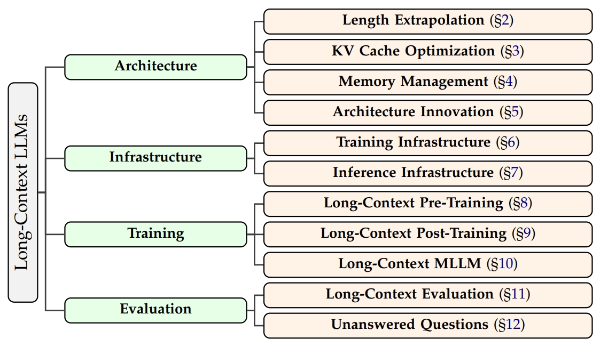

# Thus Spake Long-Context Large Language Model

<div align="center">
 <p align="center">

   <a href="https://arxiv.org/abs/2502.17129">📝 Paper</a> | <a href="#paper-list">📄 List</a> | <a href="https://huggingface.co/papers/2502.17129">🤗HF</a>

</p>
</div>

阅读[中文](./README_zh.md)版本

> This repository provides a collection of papers and resources focused on long-context LLMs, including architecture, infrastructure, training, and evaluation. For a clear taxonomy and more insights about the methodology, you can refer to our survey: [Thus Spake Long-Context Large Language Model](https://arxiv.org/abs/2502.17129). 
> 
> In this survey, we give a global picture of the lifecycle of long-context LLMs from four perspectives: **architecture**, **infrastructure**, **training**, and **evaluation**, including **length extrapolation**, **cache optimization**, **memory management**, **architecture innovation**, **training infrastructure**, **inference infrastructure**, **long-context pre-training**, **long-context post-training**, **long-context MLLM (mainly long VideoLLM)**, and **long-context evaluation**, showcasing the full spectrum of long-context technologies. At the end of this survey, we present 10 **unanswered questions** currently faced by long-context LLMs.
>
> This survey is inspired by the symphonic poem, **Thus Spake Zarathustra**. *We draw an analogy between the journey of extending the context of LLM and the attempts of humans to transcend its mortality*. *We also try to combine this survey and the symphonic poem*, and make **a 36-minute video with music** to show the development of the long-context-related work. Please enjoy it in [Bilibili](https://www.bilibili.com/video/BV11h9AYoEY) or YouTube (soon).
> 
> We appreciate any useful suggestions for improvement of this paper list or survey from peers and commit to regularly updating the repository. If you would like to include your paper or any modifications in this survey and repository, please feel free to raise issues or send an email to xrliu24@m.fudan.edu.cn. We sincerely appreciate your collaboration!
>
> We would also like to mention [A Comprehensive Survey on Long Context Language Modeling](https://github.com/LCLM-Horizon/A-Comprehensive-Survey-For-Long-Context-Language-Modeling/blob/main/assets/lclm-survey.pdf) ([Github](https://github.com/LCLM-Horizon/A-Comprehensive-Survey-For-Long-Context-Language-Modeling)), a concurrent survey that provides a collection of papers and resources focused on Long Context Language Modeling. They also provide a clear taxonomy and valuable insights about long-context LLMs. More reference can also been found at [Awesome-LLM-Long-Context-Modeling](https://github.com/Xnhyacinth/Awesome-LLM-Long-Context-Modeling).
> 
> If you find our survey useful for your research, please consider citing the following paper:

```bibtex
@misc{liu2025spakelongcontextlargelanguage,
      title={Thus Spake Long-Context Large Language Model}, 
      author={Xiaoran Liu and Ruixiao Li and Mianqiu Huang and Zhigeng Liu and Yuerong Song and Qipeng Guo and Siyang He and Qiqi Wang and Linlin Li and Qun Liu and Yaqian Zhou and Xuanjing Huang and Xipeng Qiu},
      year={2025},
      eprint={2502.17129},
      archivePrefix={arXiv},
      primaryClass={cs.CL},
      url={https://arxiv.org/abs/2502.17129}, 
}
```

## News

- [2025.03.27] 🎉🔥🎉 We make a talk in wisemodel on our long-context survey and related work in FNLP. See slide in [github](https://github.com/OpenMOSS/Thus-Spake-Long-Context-LLM/blob/main/slide-talk-250327-wisemodel-zh.pdf).
- [2025.03.23] 🎉⚡🎉 We release the split video version in Chinese of our survey on [RedNote](https://www.xiaohongshu.com/discovery/item/67e2bda1000000001c003195?source=webshare&xhsshare=pc_web&xsec_token=ABUqyw0xwQpT9ZwtXRSRpcMQ1OKI7zswGCEYsPl3Ku4KM=&xsec_source=pc_share) .
- [2025.03.13] 🎉🤝🎉 We have a good communication with the authors of [concurrent work](https://github.com/LCLM-Horizon/A-Comprehensive-Survey-For-Long-Context-Language-Modeling), and will promote work of both parties in the future.
- [2025.03.12] 🎉🚀🎉 We collect papers and blogs mentioned in the survey and update it in [GitHub](https://github.com/OpenMOSS/Thus-Spake-Long-Context-LLM/).
- [2025.02.27] 🎉⚡🎉 We release the complete video version in Chinese of our survey on [Bilibili](https://www.bilibili.com/video/BV11h9AYoEYj/).
- [2025.02.26] 🎉🚀🎉 We release our slide on [GitHub](https://github.com/OpenMOSS/Thus-Spake-Long-Context-LLM/blob/main/slide-survey-zh.pdf).
- [2025.02.25] 🎉🔥🎉 Our paper reveices the **#1 paper of the day** on [HuggingFace](https://huggingface.co/papers/2502.17129).
- [2025.02.24] 🎉🚀🎉 We release the first version of the paper on [arXiv](https://arxiv.org/pdf/2502.17129).
- [2025.01.29] 🎉🎉🎉 We release the first version of the paper on [GitHub](https://github.com/OpenMOSS/Thus-Spake-Long-Context-LLM/blob/main/Thus_Spake_Long_Context_LLM-v1.pdf).

## Table of Contents

- [Thus Spake Long-Context Large Language Model](#thus-spake-long-context-large-language-model)
  - [News](#news)
  - [Table of Contents](#table-of-contents)
  - [Paper List](#paper-list)
    - [Survey \& Technical Report](#survey--technical-report)
    - [Architecture](#architecture)
      - [Length Extrapolation](#length-extrapolation)
      - [KV Cache Optimization](#kv-cache-optimization)
      - [Memory Management](#memory-management)
      - [Architecture Innovation](#architecture-innovation)
    - [Infrastructure](#infrastructure)
      - [Training Infrastructure](#training-infrastructure)
      - [Inference Infrastructure](#inference-infrastructure)
    - [Training](#training)
      - [Long-Context Pre-Training](#long-context-pre-training)
      - [Long-Context Post-Training](#long-context-post-training)
      - [Long-Context MLLM](#long-context-mllm)
    - [Evaluation](#evaluation)
      - [Long-Context Evaluation](#long-context-evaluation)
      - [Unanswered Question](#unanswered-question)
  
<p align="center">
     <br>
</p>

## Paper List

### Survey & Technical Report
* **[Advancing transformer architecture in long-context large language models: A comprehensive survey.](https://arxiv.org/abs/2311.12351)** Yunpeng Huang, Jingwei Xu, Junyu Lai, Zixu Jiang, Taolue Chen, Zenan Li, Yuan Yao, Xiaoxing Ma, Lijuan Yang, Hao Chen, others. arXiv preprint arXiv:2311.12351, 2023

* **[Length extrapolation of transformers: A survey from the perspective of position encoding.](https://arxiv.org/abs/2312.17044)** Liang Zhao, Xiaocheng Feng, Xiachong Feng, Bin Qin, Ting Liu. arXiv preprint arXiv:2312.17044, 2023

* **[The What, Why, and How of Context Length Extension Techniques in Large Language Models--A Detailed Survey.](https://arxiv.org/abs/2401.07872)** Saurav Pawar, SM Tonmoy, SM Zaman, Vinija Jain, Aman Chadha, Amitava Das. arXiv preprint arXiv:2401.07872, 2024

* **[MOSS: An Open Conversational Large Language Model.](https://github.com/OpenMOSS/MOSS)** Tianxiang Sun, Xiaotian Zhang, Zhengfu He, Peng Li, Qinyuan Cheng, Xiangyang Liu, Hang Yan, Yunfan Shao, Qiong Tang, Shiduo Zhang, Xingjian Zhao, Ke Chen, Yining Zheng, Zhejian Zhou, Ruixiao Li, Jun Zhan, Yunhua Zhou, Linyang Li, Xiaogui Yang, Lingling Wu, Zhangyue Yin, Xuanjing Huang, Yu-Gang Jiang, Xipeng Qiu. Machine Intelligence Research, 2024

* **[Language models are few-shot learners.](https://proceedings.neurips.cc/paper_files/paper/2020/file/1457c0d6bfcb4967418bfb8ac142f64a-Paper.pdf)** Tom Brown, Benjamin Mann, Nick Ryder, Melanie Subbiah, Jared D Kaplan, Prafulla Dhariwal, Arvind Neelakantan, Pranav Shyam, Girish Sastry, Amanda Askell, others. Advances in neural information processing systems, 33, 1877--1901, 2020

* **[GPT-4 Technical Report.](https://arxiv.org/abs/2303.08774)** OpenAI. arXiv preprint arXiv:2303.08774, 2023

* **[Introducing Claude.](https://www.anthropic.com/news/introducing-claude)** Anthropic. 2023

* **[Model Card and Evaluations for Claude Models.](https://www-cdn.anthropic.com/bd2a28d2535bfb0494cc8e2a3bf135d2e7523226/Model-Card-Claude-2.pdf)** Anthropic. 2024

* **[Introducing the next generation of Claude.](https://www.anthropic.com/news/claude-3-family)** Anthropic. 2024

* **[Gemini: a family of highly capable multimodal models.](https://arxiv.org/abs/2312.11805)** Gemini Team, Rohan Anil, Sebastian Borgeaud, Jean-Baptiste Alayrac, Jiahui Yu, Radu Soricut, Johan Schalkwyk, Andrew M Dai, Anja Hauth, Katie Millican, others. arXiv preprint arXiv:2312.11805, 2023

* **[Gemma: Open models based on gemini research and technology.](https://arxiv.org/abs/2403.08295)** Gemma Team, Thomas Mesnard, Cassidy Hardin, Robert Dadashi, Surya Bhupatiraju, Shreya Pathak, Laurent Sifre, Morgane Rivi{\\\`e}re, Mihir Sanjay Kale, Juliette Love, others. arXiv preprint arXiv:2403.08295, 2024

* **[Gemma 2: Improving open language models at a practical size.](https://arxiv.org/abs/2408.00118)** Gemma Team, Morgane Riviere, Shreya Pathak, Pier Giuseppe Sessa, Cassidy Hardin, Surya Bhupatiraju, L{\\'e}onard Hussenot, Thomas Mesnard, Bobak Shahriari, Alexandre Ram{\\'e}, others. arXiv preprint arXiv:2408.00118, 2024

* **[LLaMA 3.3 - 70B Instruct.](https://huggingface.co/meta-llama/Llama-3.3-70B-Instruct)** Meta AI. 2024

* **[tiktoken: A fast BPE tokeniser for use with OpenAI's models.](https://github.com/openai/tiktoken)** OpenAI. 2023

* **[Gemini 1.5: Unlocking multimodal understanding across millions of tokens of context.](https://arxiv.org/abs/2403.05530)** Machel Reid, Nikolay Savinov, Denis Teplyashin, Dmitry Lepikhin, Timothy Lillicrap, Jean-baptiste Alayrac, Radu Soricut, Angeliki Lazaridou, Orhan Firat, Julian Schrittwieser, others. arXiv preprint arXiv:2403.05530, 2024

* **[Introducing Gemini 2.0: our new AI model for the agentic era.](https://blog.google/technology/google-deepmind/google-gemini-ai-update-december-2024/)** Demis Hassabis, Koray Kavukcuoglu. 2024

* **[DeepSeek-R1-Lite-Preview is now live: unleashing supercharged reasoning power!](https://api-docs.deepseek.com/news/news1120)** DeepSeek. 2024

* **[The falcon series of open language models.](https://arxiv.org/abs/2311.16867)** Ebtesam Almazrouei, Hamza Alobeidli, Abdulaziz Alshamsi, Alessandro Cappelli, Ruxandra Cojocaru, M{\\'e}rouane Debbah, {\\'E}tienne Goffinet, Daniel Hesslow, Julien Launay, Quentin Malartic, others. arXiv preprint arXiv:2311.16867, 2023

* **[Baichuan-7B: An Open-Source Large-Scale Pre-trained Model.](https://huggingface.co/baichuan-inc/Baichuan-7B)** Baichuan Intelligent Technology. 2023

* **[Falcon2-11B Technical Report.](https://arxiv.org/abs/2407.14885)** Quentin Malartic, Nilabhra Roy Chowdhury, Ruxandra Cojocaru, Mugariya Farooq, Giulia Campesan, Yasser Abdelaziz Dahou Djilali, Sanath Narayan, Ankit Singh, Maksim Velikanov, Basma El Amel Boussaha, others. arXiv preprint arXiv:2407.14885, 2024

* **[The Falcon 3 family of Open Models.](https://huggingface.co/blog/falcon3)** TII Team. 2024

* **[How long can open-source llms truly promise on context length?.](https://lmsys.org/blog/2023-06-29-longchat/)** Dacheng Li, Rulin Shao, Anze Xie, Ying Sheng, Lianmin Zheng, Joseph E. Gonzalez, Ion Stoica, Xuezhe Ma, Hao Zhang. 2023

* **[Llama: Open and efficient foundation language models.](https://arxiv.org/abs/2302.13971)** Hugo Touvron, Thibaut Lavril, Gautier Izacard, Xavier Martinet, Marie-Anne Lachaux, Timoth{\\'e}e Lacroix, Baptiste Rozi{\\\`e}re, Naman Goyal, Eric Hambro, Faisal Azhar, others. arXiv preprint arXiv:2302.13971, 2023

* **[Llama 2: Open foundation and fine-tuned chat models.](https://arxiv.org/abs/2307.09288)** Hugo Touvron, Louis Martin, Kevin Stone, Peter Albert, Amjad Almahairi, Yasmine Babaei, Nikolay Bashlykov, Soumya Batra, Prajjwal Bhargava, Shruti Bhosale, others. arXiv preprint arXiv:2307.09288, 2023

* **[Code llama: Open foundation models for code.](https://arxiv.org/abs/2308.12950)** Baptiste Roziere, Jonas Gehring, Fabian Gloeckle, Sten Sootla, Itai Gat, Xiaoqing Ellen Tan, Yossi Adi, Jingyu Liu, Romain Sauvestre, Tal Remez, others. arXiv preprint arXiv:2308.12950, 2023

* **[Effective Long-Context Scaling of Foundation Models.](https://arxiv.org/abs/2309.16039)** Wenhan Xiong, Jingyu Liu, Igor Molybog, Hejia Zhang, Prajjwal Bhargava, Rui Hou, Louis Martin, Rashi Rungta, Karthik Abinav Sankararaman, Barlas Oguz, others. Proceedings of the 2024 Conference of the North American Chapter of the Association for Computational Linguistics: Human Language Technologies (Volume 1: Long Papers), 4643--4663, 2024

* **[Introducing meta llama 3: The most capable openly available llm to date.](https://ai.meta.com/blog/meta-llama-3/)** AI Meta. Meta AI., 2024

* **[The llama 3 herd of models.](https://arxiv.org/abs/2407.21783)** Abhimanyu Dubey, Abhinav Jauhri, Abhinav Pandey, Abhishek Kadian, Ahmad Al-Dahle, Aiesha Letman, Akhil Mathur, Alan Schelten, Amy Yang, Angela Fan, others. arXiv preprint arXiv:2407.21783, 2024

* **[Llama 3.2: Revolutionizing edge AI and vision with open, customizable models.](https://ai.meta.com/blog/llama-3-2-connect-2024-vision-edge-mobile-devices/)** AI Meta. Meta AI., 2024

* **[Minicpm: Unveiling the potential of small language models with scalable training strategies.](https://arxiv.org/abs/2404.06395)** Shengding Hu, Yuge Tu, Xu Han, Chaoqun He, Ganqu Cui, Xiang Long, Zhi Zheng, Yewei Fang, Yuxiang Huang, Weilin Zhao, others. arXiv preprint arXiv:2404.06395, 2024

* **[World model on million-length video and language with ringattention.](https://ui.adsabs.harvard.edu/abs/2024arXiv240208268L/abstract)** Hao Liu, Wilson Yan, Matei Zaharia, Pieter Abbeel. arXiv e-prints, arXiv--2402, 2024

* **[MoonshotAI Kimi.](https://mp.weixin.qq.com/s/V4FUdkqUm2erGNliQt9WuA)** MoonshotAI. 2023

* **[Kimi k1. 5: Scaling reinforcement learning with llms.](https://arxiv.org/abs/2501.12599)** Kimi Team, Angang Du, Bofei Gao, Bowei Xing, Changjiu Jiang, Cheng Chen, Cheng Li, Chenjun Xiao, Chenzhuang Du, Chonghua Liao, others. arXiv preprint arXiv:2501.12599, 2025

* **[Deepseek-r1: Incentivizing reasoning capability in llms via reinforcement learning.](https://arxiv.org/abs/2501.12948)** Daya Guo, Dejian Yang, Haowei Zhang, Junxiao Song, Ruoyu Zhang, Runxin Xu, Qihao Zhu, Shirong Ma, Peiyi Wang, Xiao Bi, others. arXiv preprint arXiv:2501.12948, 2025

* **[Step-1V.](https://www.stepfun.com/#step1v)** Step Team. 2024

* **[Step-2.](https://www.stepfun.com/#step2)** Step Team. 2024

* **[ChatGPT: Advanced Language Model by OpenAI.](https://openai.com/index/chatgpt/)** OpenAI. 2022

* **[MiniMax-01: Scaling Foundation Models with Lightning Attention.](https://arxiv.org/abs/2501.08313)** MiniMax, Aonian Li, Bangwei Gong, Bo Yang, Boji Shan, Chang Liu, Cheng Zhu, Chunhao Zhang, Congchao Guo, Da Chen, Dong Li, Enwei Jiao, Gengxin Li, Guojun Zhang, Haohai Sun, Houze Dong, Jiadai Zhu, Jiaqi Zhuang, Jiayuan Song, Jin Zhu, Jingtao Han, Jingyang Li, Junbin Xie, Junhao Xu, Junjie Yan, Kaishun Zhang, Kecheng Xiao, Kexi Kang, Le Han, Leyang Wang, Lianfei Yu, Liheng Feng, Lin Zheng, Linbo Chai, Long Xing, Meizhi Ju, Mingyuan Chi, Mozhi Zhang, Peikai Huang, Pengcheng Niu, Pengfei Li, Pengyu Zhao, Qi Yang, Qidi Xu, Qiexiang Wang, Qin Wang, Qiuhui Li, Ruitao Leng, Shengmin Shi, Shuqi Yu, Sichen Li, Songquan Zhu, Tao Huang, Tianrun Liang, Weigao Sun, Weixuan Sun, Weiyu Cheng, Wenkai Li, Xiangjun Song, Xiao Su, Xiaodong Han, Xinjie Zhang, Xinzhu Hou, Xu Min, Xun Zou, Xuyang Shen, Yan Gong, Yingjie Zhu, Yipeng Zhou, Yiran Zhong, Yongyi Hu, Yuanxiang Fan, Yue Yu, Yufeng Yang, Yuhao Li, Yunan Huang, Yunji Li, Yunpeng Huang, Yunzhi Xu, Yuxin Mao, Zehan Li, Zekang Li, Zewei Tao, Zewen Ying, Zhaoyang Cong, Zhen Qin, Zhenhua Fan, Zhihang Yu, Zhuo Jiang, Zijia Wu. 2025

* **[InternLM2 Technical Report.](https://arxiv.org/abs/2403.17297)** Zheng Cai, Maosong Cao, Haojiong Chen, Kai Chen, Keyu Chen, Xin Chen, Xun Chen, Zehui Chen, Zhi Chen, Pei Chu, Xiaoyi Dong, Haodong Duan, Qi Fan, Zhaoye Fei, Yang Gao, Jiaye Ge, Chenya Gu, Yuzhe Gu, Tao Gui, Aijia Guo, Qipeng Guo, Conghui He, Yingfan Hu, Ting Huang, Tao Jiang, Penglong Jiao, Zhenjiang Jin, Zhikai Lei, Jiaxing Li, Jingwen Li, Linyang Li, Shuaibin Li, Wei Li, Yining Li, Hongwei Liu, Jiangning Liu, Jiawei Hong, Kaiwen Liu, Kuikun Liu, Xiaoran Liu, Chengqi Lv, Haijun Lv, Kai Lv, Li Ma, Runyuan Ma, Zerun Ma, Wenchang Ning, Linke Ouyang, Jiantao Qiu, Yuan Qu, Fukai Shang, Yunfan Shao, Demin Song, Zifan Song, Zhihao Sui, Peng Sun, Yu Sun, Huanze Tang, Bin Wang, Guoteng Wang, Jiaqi Wang, Jiayu Wang, Rui Wang, Yudong Wang, Ziyi Wang, Xingjian Wei, Qizhen Weng, Fan Wu, Yingtong Xiong, Chao Xu, Ruiliang Xu, Hang Yan, Yirong Yan, Xiaogui Yang, Haochen Ye, Huaiyuan Ying, Jia Yu, Jing Yu, Yuhang Zang, Chuyu Zhang, Li Zhang, Pan Zhang, Peng Zhang, Ruijie Zhang, Shuo Zhang, Songyang Zhang, Wenjian Zhang, Wenwei Zhang, Xingcheng Zhang, Xinyue Zhang, Hui Zhao, Qian Zhao, Xiaomeng Zhao, Fengzhe Zhou, Zaida Zhou, Jingming Zhuo, Yicheng Zou, Xipeng Qiu, Yu Qiao, Dahua Lin. 2024

* **[Index1.9B Technical Report.](https://github.com/bilibili/Index-1.9B)** 2024

* **[abab7-preview.](https://www.minimaxi.com/news/abab7-preview%E5%8F%91%E5%B8%83)** MiniMax. 2024

* **[Apple intelligence foundation language models.](https://arxiv.org/abs/2407.21075)** Tom Gunter, Zirui Wang, Chong Wang, Ruoming Pang, Andy Narayanan, Aonan Zhang, Bowen Zhang, Chen Chen, Chung-Cheng Chiu, David Qiu, others. arXiv preprint arXiv:2407.21075, 2024

* **[Phi-3 technical report: A highly capable language model locally on your phone.](https://arxiv.org/abs/2404.14219)** Marah Abdin, Jyoti Aneja, Hany Awadalla, Ahmed Awadallah, Ammar Ahmad Awan, Nguyen Bach, Amit Bahree, Arash Bakhtiari, Jianmin Bao, Harkirat Behl, others. arXiv preprint arXiv:2404.14219, 2024

* **[QwQ: Reflect Deeply on the Boundaries of the Unknown.](https://qwenlm.github.io/blog/qwq-32b-preview/)** Qwen Team. 2024

* **[Phi-4 Technical Report.](https://arxiv.org/abs/2412.08905)** Marah Abdin, Jyoti Aneja, Harkirat Behl, S{\\'e}bastien Bubeck, Ronen Eldan, Suriya Gunasekar, Michael Harrison, Russell J Hewett, Mojan Javaheripi, Piero Kauffmann, others. arXiv preprint arXiv:2412.08905, 2024

* **[Yi: Open foundation models by 01. ai.](https://arxiv.org/abs/2403.04652)** Alex Young, Bei Chen, Chao Li, Chengen Huang, Ge Zhang, Guanwei Zhang, Heng Li, Jiangcheng Zhu, Jianqun Chen, Jing Chang, others. arXiv preprint arXiv:2403.04652, 2024

* **[Baichuan 2: Open large-scale language models.](https://arxiv.org/abs/2309.10305)** Aiyuan Yang, Bin Xiao, Bingning Wang, Borong Zhang, Ce Bian, Chao Yin, Chenxu Lv, Da Pan, Dian Wang, Dong Yan, others. arXiv preprint arXiv:2309.10305, 2023

* **[Pythia: A suite for analyzing large language models across training and scaling.](https://proceedings.mlr.press/v202/biderman23a.html)** Stella Biderman, Hailey Schoelkopf, Quentin Gregory Anthony, Herbie Bradley, Kyle O’Brien, Eric Hallahan, Mohammad Aflah Khan, Shivanshu Purohit, USVSN Sai Prashanth, Edward Raff, others. International Conference on Machine Learning, 2397--2430, 2023

### Architecture

#### Length Extrapolation

* **[Self-attention with relative position representations.](https://arxiv.org/abs/1803.02155)** Peter Shaw, Jakob Uszkoreit, Ashish Vaswani. arXiv preprint arXiv:1803.02155, 2018
* **[Exploring the limits of transfer learning with a unified text-to-text transformer.](https://www.jmlr.org/papers/volume21/20-074/20-074.pdf)** Colin Raffel, Noam Shazeer, Adam Roberts, Katherine Lee, Sharan Narang, Michael Matena, Yanqi Zhou, Wei Li, Peter J Liu. Journal of machine learning research, 21(140), 1--67, 2020
* **[TENER: adapting transformer encoder for named entity recognition.](https://arxiv.org/abs/1911.04474)** Hang Yan, Bocao Deng, Xiaonan Li, Xipeng Qiu. arXiv preprint arXiv:1911.04474, 2019
* **[Transformer-xl: Attentive language models beyond a fixed-length context.](https://arxiv.org/abs/1901.02860)** Zihang Dai, Zhilin Yang, Yiming Yang, Jaime Carbonell, Quoc V Le, Ruslan Salakhutdinov. arXiv preprint arXiv:1901.02860, 2019
* **[Roformer: Enhanced transformer with rotary position embedding.](https://www.sciencedirect.com/science/article/abs/pii/S0925231223011864)** Jianlin Su, Murtadha Ahmed, Yu Lu, Shengfeng Pan, Wen Bo, Yunfeng Liu. Neurocomputing, 568, 127063, Elsevier, 2024
* **[Palm: Scaling language modeling with pathways.](https://www.jmlr.org/papers/v24/22-1144.html)** Aakanksha Chowdhery, Sharan Narang, Jacob Devlin, Maarten Bosma, Gaurav Mishra, Adam Roberts, Paul Barham, Hyung Won Chung, Charles Sutton, Sebastian Gehrmann, others. Journal of Machine Learning Research, 24(240), 1--113, 2023
* **[Train Short, Test Long: Attention with Linear Biases Enables Input Length Extrapolation.](https://arxiv.org/abs/2108.12409)** Ofir Press, Noah Smith, Mike Lewis. International Conference on Learning Representations, 2022
* **[A length-extrapolatable transformer.](https://arxiv.org/abs/2212.10554)** Yutao Sun, Li Dong, Barun Patra, Shuming Ma, Shaohan Huang, Alon Benhaim, Vishrav Chaudhary, Xia Song, Furu Wei. arXiv preprint arXiv:2212.10554, 2022
* **[Retentive network: A successor to transformer for large language models.](https://arxiv.org/abs/2307.08621)** Yutao Sun, Li Dong, Shaohan Huang, Shuming Ma, Yuqing Xia, Jilong Xue, Jianyong Wang, Furu Wei. arXiv preprint arXiv:2307.08621, 2023
* **[Llm maybe longlm: Self-extend llm context window without tuning.](https://arxiv.org/abs/2401.01325)** Hongye Jin, Xiaotian Han, Jingfeng Yang, Zhimeng Jiang, Zirui Liu, Chia-Yuan Chang, Huiyuan Chen, Xia Hu. arXiv preprint arXiv:2401.01325, 2024
* **[Longnet: Scaling transformers to 1,000,000,000 tokens.](https://arxiv.org/abs/2307.02486)** Jiayu Ding, Shuming Ma, Li Dong, Xingxing Zhang, Shaohan Huang, Wenhui Wang, Nanning Zheng, Furu Wei. arXiv preprint arXiv:2307.02486, 2023
* **[Infllm: Training-free long-context extrapolation for llms with an efficient context memory.](https://arxiv.org/abs/2402.04617)** Chaojun Xiao, Pengle Zhang, Xu Han, Guangxuan Xiao, Yankai Lin, Zhengyan Zhang, Zhiyuan Liu, Maosong Sun. The Thirty-eighth Annual Conference on Neural Information Processing Systems, 2024
* **[LongHeads: Multi-Head Attention is Secretly a Long Context Processor.](https://arxiv.org/abs/2402.10685)** Yi Lu, Xin Zhou, Wei He, Jun Zhao, Tao Ji, Tao Gui, Qi Zhang, Xuanjing Huang. arXiv preprint arXiv:2402.10685, 2024
* **[ReAttention: Training-Free Infinite Context with Finite Attention Scope.](https://arxiv.org/abs/2407.15176)** Xiaoran Liu, Ruixiao Li, Qipeng Guo, Zhigeng Liu, Yuerong Song, Kai Lv, Hang Yan, Linlin Li, Qun Liu, Xipeng Qiu. arXiv preprint arXiv:2407.15176, 2024
* **[Training-free long-context scaling of large language models.](https://arxiv.org/abs/2402.17463)** Chenxin An, Fei Huang, Jun Zhang, Shansan Gong, Xipeng Qiu, Chang Zhou, Lingpeng Kong. arXiv preprint arXiv:2402.17463, 2024
* **[Why Does the Effective Context Length of LLMs Fall Short?.](https://arxiv.org/abs/2410.18745)** Chenxin An, Jun Zhang, Ming Zhong, Lei Li, Shansan Gong, Yao Luo, Jingjing Xu, Lingpeng Kong. arXiv preprint arXiv:2410.18745, 2024
* **[Parallel context windows for large language models.](https://arxiv.org/abs/2212.10947)** Nir Ratner, Yoav Levine, Yonatan Belinkov, Ori Ram, Inbal Magar, Omri Abend, Ehud Karpas, Amnon Shashua, Kevin Leyton-Brown, Yoav Shoham. arXiv preprint arXiv:2212.10947, 2022
* **[Scaling transformer to 1m tokens and beyond with rmt.](https://arxiv.org/abs/2304.11062)** Aydar Bulatov, Yuri Kuratov, Yermek Kapushev, Mikhail S Burtsev. arXiv preprint arXiv:2304.11062, 2023
* **[XL3M: A Training-free Framework for LLM Length Extension Based on Segment-wise Inference.](https://arxiv.org/abs/2405.17755)** Shengnan Wang, Youhui Bai, Lin Zhang, Pingyi Zhou, Shixiong Zhao, Gong Zhang, Sen Wang, Renhai Chen, Hua Xu, Hongwei Sun. arXiv preprint arXiv:2405.17755, 2024
* **[LLMxMapReduce: Simplified Long-Sequence Processing using Large Language Models.](https://arxiv.org/abs/2410.09342)** Zihan Zhou, Chong Li, Xinyi Chen, Shuo Wang, Yu Chao, Zhili Li, Haoyu Wang, Rongqiao An, Qi Shi, Zhixing Tan, others. arXiv preprint arXiv:2410.09342, 2024
* **[LongAgent: Scaling Language Models to 128k Context through Multi-Agent Collaboration.](https://arxiv.org/abs/2402.11550)** Jun Zhao, Can Zu, Hao Xu, Yi Lu, Wei He, Yiwen Ding, Tao Gui, Qi Zhang, Xuanjing Huang. arXiv preprint arXiv:2402.11550, 2024
* **[Scaling laws of rope-based extrapolation.](https://arxiv.org/abs/2310.05209)** Xiaoran Liu, Hang Yan, Chenxin An, Xipeng Qiu, Dahua Lin. The Twelfth International Conference on Learning Representations, 2024
* **[Extending context window of large language models via positional interpolation.](https://arxiv.org/abs/2306.15595)** Shouyuan Chen, Sherman Wong, Liangjian Chen, Yuandong Tian. arXiv preprint arXiv:2306.15595, 2023
* **[YaRN: Efficient Context Window Extension of Large Language Models.](https://arxiv.org/abs/2309.00071)** Bowen Peng, Jeffrey Quesnelle, Honglu Fan, Enrico Shippole. The Twelfth International Conference on Learning Representations, 2024
* **[Giraffe: Adventures in expanding context lengths in llms.](https://arxiv.org/abs/2308.10882)** Arka Pal, Deep Karkhanis, Manley Roberts, Samuel Dooley, Arvind Sundararajan, Siddartha Naidu. arXiv preprint arXiv:2308.10882, 2023
* **[Longrope: Extending llm context window beyond 2 million tokens.](https://arxiv.org/abs/2402.13753)** Yiran Ding, Li Lyna Zhang, Chengruidong Zhang, Yuanyuan Xu, Ning Shang, Jiahang Xu, Fan Yang, Mao Yang. arXiv preprint arXiv:2402.13753, 2024
* **[Extending Context Window of Large Language Models from a Distributional Perspective.](https://arxiv.org/abs/2410.01490)** Yingsheng Wu, Yuxuan Gu, Xiaocheng Feng, Weihong Zhong, Dongliang Xu, Qing Yang, Hongtao Liu, Bing Qin. arXiv preprint arXiv:2410.01490, 2024
* **[LongLoRA: Efficient Fine-tuning of Long-Context Large Language Models.](https://arxiv.org/abs/2309.12307)** Yukang Chen, Shengju Qian, Haotian Tang, Xin Lai, Zhijian Liu, Song Han, Jiaya Jia. The Twelfth International Conference on Learning Representations, 2024
* **[Zebra: Extending context window with layerwise grouped local-global attention.](https://arxiv.org/abs/2312.08618)** Kaiqiang Song, Xiaoyang Wang, Sangwoo Cho, Xiaoman Pan, Dong Yu. arXiv preprint arXiv:2312.08618, 2023
* **[Random-access infinite context length for transformers.](https://proceedings.neurips.cc/paper_files/paper/2023/hash/ab05dc8bf36a9f66edbff6992ec86f56-Abstract-Conference.html)** Amirkeivan Mohtashami, Martin Jaggi. Advances in Neural Information Processing Systems, 36, 54567--54585, 2023
* **[An Efficient Recipe for Long Context Extension via Middle-Focused Positional Encoding.](https://arxiv.org/abs/2406.07138)** Tong Wu, Yanpeng Zhao, Zilong Zheng. The Thirty-eighth Annual Conference on Neural Information Processing Systems, 2024
* **[LongRecipe: Recipe for Efficient Long Context Generalization in Large Language Models.](https://arxiv.org/abs/2409.00509)** Zhiyuan Hu, Yuliang Liu, Jinman Zhao, Suyuchen Wang, Yan Wang, Wei Shen, Qing Gu, Anh Tuan Luu, See-Kiong Ng, Zhiwei Jiang, others. arXiv preprint arXiv:2409.00509, 2024
* **[Focused transformer: Contrastive training for context scaling.](https://proceedings.neurips.cc/paper_files/paper/2023/hash/8511d06d5590f4bda24d42087802cc81-Abstract-Conference.html)** Szymon Tworkowski, Konrad Staniszewski, Miko{\\l}aj Pacek, Yuhuai Wu, Henryk Michalewski, Piotr Mi{\\l}o{\\'s}. Advances in Neural Information Processing Systems, 36, 2024
* **[Growlength: Accelerating llms pretraining by progressively growing training length.](https://arxiv.org/abs/2310.00576)** Hongye Jin, Xiaotian Han, Jingfeng Yang, Zhimeng Jiang, Chia-Yuan Chang, Xia Hu. arXiv preprint arXiv:2310.00576, 2023
* **[E2-LLM: Efficient and Extreme Length Extension of Large Language Models.](https://arxiv.org/abs/2401.06951)** Jiaheng Liu, Zhiqi Bai, Yuanxing Zhang, Chenchen Zhang, Yu Zhang, Ge Zhang, Jiakai Wang, Haoran Que, Yukang Chen, Wenbo Su, others. arXiv preprint arXiv:2401.06951, 2024
* **[FocusLLM: Scaling LLM's Context by Parallel Decoding.](https://arxiv.org/abs/2408.11745)** Zhenyu Li, Yike Zhang, Tengyu Pan, Yutao Sun, Zhichao Duan, Junjie Fang, Rong Han, Zixuan Wang, Jianyong Wang. arXiv preprint arXiv:2408.11745, 2024
* **[Pose: Efficient context window extension of llms via positional skip-wise training.](https://arxiv.org/abs/2309.10400)** Dawei Zhu, Nan Yang, Liang Wang, Yifan Song, Wenhao Wu, Furu Wei, Sujian Li. arXiv preprint arXiv:2309.10400, 2023
* **[Randomized positional encodings boost length generalization of transformers.](https://arxiv.org/abs/2305.16843)** Anian Ruoss, Gr{\\'e}goire Del{\\'e}tang, Tim Genewein, Jordi Grau-Moya, R{\\'o}bert Csord{\\'a}s, Mehdi Bennani, Shane Legg, Joel Veness. arXiv preprint arXiv:2305.16843, 2023
* **[CD-Pos: Long Context Generalization in LLMs Through Continuous and Discrete Position Synthesis. ](https://proceedings.neurips.cc/paper_files/paper/2023/hash/8511d06d5590f4bda24d42087802cc81-Abstract-Conference.html)** Zhiyuan Hu, Yuliang Liu, Jinman Zhao, Suyuchen Wang, Wei Shen, Chao Yin, Bryan Hooi, others. First Workshop on Long-Context Foundation Models@ ICML 2024, 2024
* **[Transformer language models without positional encodings still learn positional information.](https://arxiv.org/abs/2203.16634)** Adi Haviv, Ori Ram, Ofir Press, Peter Izsak, Omer Levy. arXiv preprint arXiv:2203.16634, 2022
* **[Latent positional information is in the self-attention variance of transformer language models without positional embeddings.](https://arxiv.org/abs/2305.13571)** Ta-Chung Chi, Ting-Han Fan, Li-Wei Chen, Alexander I Rudnicky, Peter J Ramadge. arXiv preprint arXiv:2305.13571, 2023
* **[The impact of positional encoding on length generalization in transformers.](https://proceedings.neurips.cc/paper_files/paper/2023/hash/4e85362c02172c0c6567ce593122d31c-Abstract-Conference.html)** Amirhossein Kazemnejad, Inkit Padhi, Karthikeyan Natesan Ramamurthy, Payel Das, Siva Reddy. Advances in Neural Information Processing Systems, 36, 2024
* **[Length Generalization of Causal Transformers without Position Encoding.](https://arxiv.org/abs/2404.12224)** Jie Wang, Tao Ji, Yuanbin Wu, Hang Yan, Tao Gui, Qi Zhang, Xuanjing Huang, Xiaoling Wang. arXiv preprint arXiv:2404.12224, 2024
* **[Kerple: Kernelized relative positional embedding for length extrapolation.](https://proceedings.neurips.cc/paper_files/paper/2022/hash/37a413841a614b5414b333585e7613b8-Abstract-Conference.html)** Ta-Chung Chi, Ting-Han Fan, Peter J Ramadge, Alexander Rudnicky. Advances in Neural Information Processing Systems, 35, 8386--8399, 2022
* **[Functional Interpolation for Relative Positions improves Long Context Transformers.](https://arxiv.org/abs/2310.04418)** Shanda Li, Chong You, Guru Guruganesh, Joshua Ainslie, Santiago Ontanon, Manzil Zaheer, Sumit Sanghai, Yiming Yang, Sanjiv Kumar, Srinadh Bhojanapalli. The Twelfth International Conference on Learning Representations, 2024
* **[Dape: Data-adaptive positional encoding for length extrapolation.](https://proceedings.neurips.cc/paper_files/paper/2024/hash/2f050fa9f0d898e3f265d515f50ae8f9-Abstract-Conference.html)** Chuanyang Zheng, Yihang Gao, Han Shi, Minbin Huang, Jingyao Li, Jing Xiong, Xiaozhe Ren, Michael Ng, Xin Jiang, Zhenguo Li, others. The Thirty-eighth Annual Conference on Neural Information Processing Systems, 2024
* **[DAPE V2: Process Attention Score as Feature Map for Length Extrapolation.](https://arxiv.org/abs/2410.04798)** Chuanyang Zheng, Yihang Gao, Han Shi, Jing Xiong, Jiankai Sun, Jingyao Li, Minbin Huang, Xiaozhe Ren, Michael Ng, Xin Jiang, others. arXiv preprint arXiv:2410.04798, 2024
* **[CLEX: Continuous Length Extrapolation for Large Language Models.](https://arxiv.org/abs/2310.16450)** Guanzheng Chen, Xin Li, Zaiqiao Meng, Shangsong Liang, Lidong Bing. The Twelfth International Conference on Learning Representations, 2024
* **[Contextual Position Encoding: Learning to Count What's Important.](https://arxiv.org/abs/2405.18719)** Olga Golovneva, Tianlu Wang, Jason Weston, Sainbayar Sukhbaatar. arXiv preprint arXiv:2405.18719, 2024
* **[Extending LLMs' Context Window with 100 Samples.](https://arxiv.org/abs/2401.07004)** Yikai Zhang, Junlong Li, Pengfei Liu. arXiv preprint arXiv:2401.07004, 2024
* **[Exploring Context Window of Large Language Models via Decomposed Positional Vectors.](https://arxiv.org/abs/2405.18009)** Zican Dong, Junyi Li, Xin Men, Wayne Xin Zhao, Bingbing Wang, Zhen Tian, Weipeng Chen, Ji-Rong Wen. arXiv preprint arXiv:2405.18009, 2024
* **[HiRoPE: Length Extrapolation for Code Models Using Hierarchical Position.](https://arxiv.org/abs/2403.19115)** Kechi Zhang, Ge Li, Huangzhao Zhang, Zhi Jin. Proceedings of the 62nd Annual Meeting of the Association for Computational Linguistics (Volume 1: Long Papers), 13615--13627, 2024
* **[NTK-Aware Scaled RoPE allows LLaMA models to have extended (8k+) context size without any fine-tuning and minimal perplexity degradation..](https://www.reddit.com/r/LocalLLaMA/comments/14lz7j5/ntkaware_scaled_rope_allows_llama_models_to_have/)** bloc97. 2023
* **[Dynamically Scaled RoPE further increases performance of long context LLaMA with zero fine-tuning.](https://www.reddit.com/r/LocalLLaMA/comments/14mrgpr/dynamically_scaled_rope_further_increases/)** bloc97. 2023
* **[Base of RoPE Bounds Context Length.](https://arxiv.org/abs/2405.14591)** Xin Men, Mingyu Xu, Bingning Wang, Qingyu Zhang, Hongyu Lin, Xianpei Han, Weipeng Chen. arXiv preprint arXiv:2405.14591, 2024
* **[Can Perplexity Reflect Large Language Model's Ability in Long Text Understanding?](https://arxiv.org/abs/2405.06105)** Yutong Hu, Quzhe Huang, Mingxu Tao, Chen Zhang, Yansong Feng. The Second Tiny Papers Track at ICLR 2024, 2024
* **[What is Wrong with Perplexity for Long-context Language Modeling?.](https://arxiv.org/abs/2410.23771)** Lizhe Fang, Yifei Wang, Zhaoyang Liu, Chenheng Zhang, Stefanie Jegelka, Jinyang Gao, Bolin Ding, Yisen Wang. arXiv preprint arXiv:2410.23771, 2024
* **[Chatglm: A family of large language models from glm-130b to glm-4 all tools.](https://arxiv.org/abs/2406.12793)** Team GLM, Aohan Zeng, Bin Xu, Bowen Wang, Chenhui Zhang, Da Yin, Dan Zhang, Diego Rojas, Guanyu Feng, Hanlin Zhao, others. arXiv preprint arXiv:2406.12793, 2024

#### KV Cache Optimization

* **[Keep the Cost Down: A Review on Methods to Optimize LLM’s KV-Cache Consumption.](https://arxiv.org/abs/2407.18003)** Shi Luohe, Hongyi Zhang, Yao Yao, Zuchao Li, others. First Conference on Language Modeling, 2024
* **[Challenges in Deploying Long-Context Transformers: A Theoretical Peak Performance Analysis.](https://arxiv.org/abs/2405.08944)** Yao Fu. arXiv preprint arXiv:2405.08944, 2024
* **[Scissorhands: Exploiting the persistence of importance hypothesis for llm kv cache compression at test time.](https://proceedings.neurips.cc/paper_files/paper/2023/hash/a452a7c6c463e4ae8fbdc614c6e983e6-Abstract-Conference.html)** Zichang Liu, Aditya Desai, Fangshuo Liao, Weitao Wang, Victor Xie, Zhaozhuo Xu, Anastasios Kyrillidis, Anshumali Shrivastava. Advances in Neural Information Processing Systems, 36, 2024
* **[Mistral 7B.](https://arxiv.org/abs/2310.06825)** Albert Q Jiang, Alexandre Sablayrolles, Arthur Mensch, Chris Bamford, Devendra Singh Chaplot, Diego de las Casas, Florian Bressand, Gianna Lengyel, Guillaume Lample, Lucile Saulnier, others. arXiv preprint arXiv:2310.06825, 2023
* **[Qwen technical report.](https://arxiv.org/abs/2309.16609)** Jinze Bai, Shuai Bai, Yunfei Chu, Zeyu Cui, Kai Dang, Xiaodong Deng, Yang Fan, Wenbin Ge, Yu Han, Fei Huang, others. arXiv preprint arXiv:2309.16609, 2023
* **[Efficient Streaming Language Models with Attention Sinks.](https://arxiv.org/abs/2309.17453)** Guangxuan Xiao, Yuandong Tian, Beidi Chen, Song Han, Mike Lewis. The Twelfth International Conference on Learning Representations, 2024
* **[LM-Infinite: Zero-Shot Extreme Length Generalization for Large Language Models.](https://arxiv.org/abs/2308.16137)** Chi Han, Qifan Wang, Hao Peng, Wenhan Xiong, Yu Chen, Heng Ji, Sinong Wang. Proceedings of the 2024 Conference of the North American Chapter of the Association for Computational Linguistics: Human Language Technologies (Volume 1: Long Papers), 3991--4008, 2024
* **[H2o: Heavy-hitter oracle for efficient generative inference of large language models.](https://proceedings.neurips.cc/paper_files/paper/2023/hash/6ceefa7b15572587b78ecfcebb2827f8-Abstract-Conference.html)** Zhenyu Zhang, Ying Sheng, Tianyi Zhou, Tianlong Chen, Lianmin Zheng, Ruisi Cai, Zhao Song, Yuandong Tian, Christopher R{\\'e}, Clark Barrett, others. Advances in Neural Information Processing Systems, 36, 34661--34710, 2023
* **[Get More with LESS: Synthesizing Recurrence with KV Cache Compression for Efficient LLM Inference.](https://arxiv.org/abs/2402.09398)** Harry Dong, Xinyu Yang, Zhenyu Zhang, Zhangyang Wang, Yuejie Chi, Beidi Chen. arXiv preprint arXiv:2402.09398, 2024
* **[Model tells you what to discard: Adaptive kv cache compression for llms.](https://arxiv.org/abs/2310.01801)** Suyu Ge, Yunan Zhang, Liyuan Liu, Minjia Zhang, Jiawei Han, Jianfeng Gao. arXiv preprint arXiv:2310.01801, 2023
* **[Transformers are multi-state rnns.](https://arxiv.org/abs/2401.06104)** Matanel Oren, Michael Hassid, Nir Yarden, Yossi Adi, Roy Schwartz. arXiv preprint arXiv:2401.06104, 2024
* **[Snapkv: Llm knows what you are looking for before generation.](https://arxiv.org/abs/2404.14469)** Yuhong Li, Yingbing Huang, Bowen Yang, Bharat Venkitesh, Acyr Locatelli, Hanchen Ye, Tianle Cai, Patrick Lewis, Deming Chen. arXiv preprint arXiv:2404.14469, 2024
* **[Razorattention: Efficient kv cache compression through retrieval heads.](https://arxiv.org/abs/2407.15891)** Hanlin Tang, Yang Lin, Jing Lin, Qingsen Han, Shikuan Hong, Yiwu Yao, Gongyi Wang. arXiv preprint arXiv:2407.15891, 2024
* **[Duoattention: Efficient long-context llm inference with retrieval and streaming heads.](https://arxiv.org/abs/2410.10819)** Guangxuan Xiao, Jiaming Tang, Jingwei Zuo, Junxian Guo, Shang Yang, Haotian Tang, Yao Fu, Song Han. arXiv preprint arXiv:2410.10819, 2024
* **[KV-Compress: Paged KV-Cache Compression with Variable Compression Rates per Attention Head.](https://arxiv.org/abs/2410.00161)** Isaac Rehg. arXiv preprint arXiv:2410.00161, 2024
* **[Pyramidkv: Dynamic kv cache compression based on pyramidal information funneling.](https://arxiv.org/abs/2406.02069)** Zefan Cai, Yichi Zhang, Bofei Gao, Yuliang Liu, Tianyu Liu, Keming Lu, Wayne Xiong, Yue Dong, Baobao Chang, Junjie Hu, others. arXiv preprint arXiv:2406.02069, 2024
* **[PyramidInfer: Pyramid KV Cache Compression for High-throughput LLM Inference.](https://arxiv.org/abs/2405.12532)** Dongjie Yang, XiaoDong Han, Yan Gao, Yao Hu, Shilin Zhang, Hai Zhao. arXiv preprint arXiv:2405.12532, 2024
* **[SimLayerKV: A Simple Framework for Layer-Level KV Cache Reduction.](https://arxiv.org/abs/2410.13846)** Xuan Zhang, Cunxiao Du, Chao Du, Tianyu Pang, Wei Gao, Min Lin. arXiv preprint arXiv:2410.13846, 2024
* **[SCOPE: Optimizing Key-Value Cache Compression in Long-context Generation.](https://arxiv.org/abs/2412.13649)** Jialong Wu, Zhenglin Wang, Linhai Zhang, Yilong Lai, Yulan He, Deyu Zhou. arXiv preprint arXiv:2412.13649, 2024
* **[Dynamic context pruning for efficient and interpretable autoregressive transformers.](https://proceedings.neurips.cc/paper_files/paper/2023/hash/cdaac2a02c4fdcae77ba083b110efcc3-Abstract-Conference.html)** Sotiris Anagnostidis, Dario Pavllo, Luca Biggio, Lorenzo Noci, Aurelien Lucchi, Thomas Hofmann. Advances in Neural Information Processing Systems, 36, 2024
* **[Locret: Enhancing Eviction in Long-Context LLM Inference with Trained Retaining Heads.](https://arxiv.org/abs/2410.01805)** Yuxiang Huang, Binhang Yuan, Xu Han, Chaojun Xiao, Zhiyuan Liu. arXiv preprint arXiv:2410.01805, 2024
* **[SirLLM: Streaming infinite retentive LLM.](https://arxiv.org/abs/2405.12528)** Yao Yao, Zuchao Li, Hai Zhao. arXiv preprint arXiv:2405.12528, 2024
* **[A Simple and Effective L/2 Norm-Based Strategy for KV Cache Compression.](https://arxiv.org/abs/2406.11430)** Alessio Devoto, Yu Zhao, Simone Scardapane, Pasquale Minervini. arXiv preprint arXiv:2406.11430, 2024
* **[On the efficacy of eviction policy for key-value constrained generative language model inference.](https://arxiv.org/abs/2402.06262)** Siyu Ren, Kenny Q Zhu. arXiv preprint arXiv:2402.06262, 2024
* **[Attention Score is not All You Need for Token Importance Indicator in KV Cache Reduction: Value Also Matters.](https://arxiv.org/abs/2406.12335)** Zhiyu Guo, Hidetaka Kamigaito, Taro Watanabe. arXiv preprint arXiv:2406.12335, 2024
* **[Infinipot: Infinite context processing on memory-constrained llms.](https://arxiv.org/abs/2410.01518)** Minsoo Kim, Kyuhong Shim, Jungwook Choi, Simyung Chang. arXiv preprint arXiv:2410.01518, 2024
* **[Context compression for auto-regressive transformers with sentinel tokens.](https://arxiv.org/abs/2310.08152)** Siyu Ren, Qi Jia, Kenny Q Zhu. arXiv preprint arXiv:2310.08152, 2023
* **[Long Context Compression with Activation Beacon.](https://arxiv.org/abs/2401.03462)** Peitian Zhang, Zheng Liu, Shitao Xiao, Ninglu Shao, Qiwei Ye, Zhicheng Dou. arXiv preprint arXiv:2401.03462, 2024
* **[Anchor-based large language models.](https://arxiv.org/abs/2402.07616)** Jianhui Pang, Fanghua Ye, Derek Fai Wong, Xin He, Wanshun Chen, Longyue Wang. arXiv preprint arXiv:2402.07616, 2024
* **[Dynamic memory compression: Retrofitting llms for accelerated inference.](https://arxiv.org/abs/2403.09636)** Piotr Nawrot, Adrian {\\L}a{\\'n}cucki, Marcin Chochowski, David Tarjan, Edoardo M Ponti. arXiv preprint arXiv:2403.09636, 2024
* **[Model tells you where to merge: Adaptive kv cache merging for llms on long-context tasks.](https://arxiv.org/abs/2407.08454)** Zheng Wang, Boxiao Jin, Zhongzhi Yu, Minjia Zhang. arXiv preprint arXiv:2407.08454, 2024
* **[CaM: Cache Merging for Memory-efficient LLMs Inference.](https://openreview.net/forum?id=LCTmppB165)** Yuxin Zhang, Yuxuan Du, Gen Luo, Yunshan Zhong, Zhenyu Zhang, Shiwei Liu, Rongrong Ji. Forty-first International Conference on Machine Learning, 2024
* **[Long-context language modeling with parallel context encoding.](https://arxiv.org/abs/2402.16617)** Howard Yen, Tianyu Gao, Danqi Chen. arXiv preprint arXiv:2402.16617, 2024
* **[You only cache once: Decoder-decoder architectures for language models.](https://arxiv.org/abs/2405.05254)** Yutao Sun, Li Dong, Yi Zhu, Shaohan Huang, Wenhui Wang, Shuming Ma, Quanlu Zhang, Jianyong Wang, Furu Wei. arXiv preprint arXiv:2405.05254, 2024
* **[Goldfinch: High performance rwkv/transformer hybrid with linear pre-fill and extreme kv-cache compression.](https://arxiv.org/abs/2407.12077)** Daniel Goldstein, Fares Obeid, Eric Alcaide, Guangyu Song, Eugene Cheah. arXiv preprint arXiv:2407.12077, 2024
* **[Reducing Transformer Key-Value Cache Size with Cross-Layer Attention.](https://arxiv.org/abs/2405.12981)** William Brandon, Mayank Mishra, Aniruddha Nrusimha, Rameswar Panda, Jonathan Ragan Kelly. arXiv preprint arXiv:2405.12981, 2024
* **[MiniCache: KV Cache Compression in Depth Dimension for Large Language Models.](https://arxiv.org/abs/2405.14366)** Akide Liu, Jing Liu, Zizheng Pan, Yefei He, Gholamreza Haffari, Bohan Zhuang. arXiv preprint arXiv:2405.14366, 2024
* **[Layer-Condensed KV Cache for Efficient Inference of Large Language Models.](https://arxiv.org/abs/2405.10637)** Haoyi Wu, Kewei Tu. arXiv preprint arXiv:2405.10637, 2024
* **[KVSharer: Efficient Inference via Layer-Wise Dissimilar KV Cache Sharing.](https://arxiv.org/abs/2410.18517)** Yifei Yang, Zouying Cao, Qiguang Chen, Libo Qin, Dongjie Yang, Hai Zhao, Zhi Chen. arXiv preprint arXiv:2410.18517, 2024
* **[SwiftKV: Fast Prefill-Optimized Inference with Knowledge-Preserving Model Transformation.](https://arxiv.org/abs/2410.03960)** Aurick Qiao, Zhewei Yao, Samyam Rajbhandari, Yuxiong He. arXiv preprint arXiv:2410.03960, 2024
* **[MLKV: Multi-Layer Key-Value Heads for Memory Efficient Transformer Decoding.](https://arxiv.org/abs/2406.09297)** Zayd Muhammad Kawakibi Zuhri, Muhammad Farid Adilazuarda, Ayu Purwarianti, Alham Fikri Aji. arXiv preprint arXiv:2406.09297, 2024
* **[Lossless KV Cache Compression to 2\\%.](https://arxiv.org/abs/2410.15252)** Zhen Yang, JN Han, Kan Wu, Ruobing Xie, An Wang, Xingwu Sun, Zhanhui Kang. arXiv preprint arXiv:2410.15252, 2024
* **[Beyond kv caching: Shared attention for efficient llms.](https://arxiv.org/abs/2407.12866)** Bingli Liao, Danilo Vasconcellos Vargas. arXiv preprint arXiv:2407.12866, 2024
* **[Gqa: Training generalized multi-query transformer models from multi-head checkpoints.](https://arxiv.org/abs/2305.13245)** Joshua Ainslie, James Lee-Thorp, Michiel de Jong, Yury Zemlyanskiy, Federico Lebr{\\'o}n, Sumit Sanghai. arXiv preprint arXiv:2305.13245, 2023
* **[Fast transformer decoding: One write-head is all you need.](https://arxiv.org/abs/1911.02150)** Noam Shazeer. arXiv preprint arXiv:1911.02150, 2019
* **[Head-wise Shareable Attention for Large Language Models.](https://arxiv.org/abs/2402.11819)** Zouying Cao, Yifei Yang, Hai Zhao. arXiv preprint arXiv:2402.11819, 2024
* **[DHA: Learning Decoupled-Head Attention from Transformer Checkpoints via Adaptive Heads Fusion.](https://arxiv.org/abs/2406.06567)** Yilong Chen, Linhao Zhang, Junyuan Shang, Zhenyu Zhang, Tingwen Liu, Shuohuan Wang, Yu Sun. arXiv preprint arXiv:2406.06567, 2024
* **[Deepseek-v2: A strong, economical, and efficient mixture-of-experts language model.](https://arxiv.org/abs/2405.04434)** Aixin Liu, Bei Feng, Bin Wang, Bingxuan Wang, Bo Liu, Chenggang Zhao, Chengqi Dengr, Chong Ruan, Damai Dai, Daya Guo, others. arXiv preprint arXiv:2405.04434, 2024
* **[Effectively Compress KV Heads for LLM.](https://arxiv.org/abs/2406.07056)** Hao Yu, Zelan Yang, Shen Li, Yong Li, Jianxin Wu. arXiv preprint arXiv:2406.07056, 2024
* **Neurocache: Efficient Vector Retrieval for Long-range Language Modeling.** Ali Safaya, Deniz Yuret. Proceedings of the 2024 Conference of the North American Chapter of the Association for Computational Linguistics: Human Language Technologies (Volume 1: Long Papers), 870--883, 2024
* **[Palu: Compressing KV-Cache with Low-Rank Projection.](https://arxiv.org/abs/2407.21118)** Chi-Chih Chang, Wei-Cheng Lin, Chien-Yu Lin, Chong-Yan Chen, Yu-Fang Hu, Pei-Shuo Wang, Ning-Chi Huang, Luis Ceze, Mohamed S Abdelfattah, Kai-Chiang Wu. arXiv preprint arXiv:2407.21118, 2024
* **[Eigen Attention: Attention in Low-Rank Space for KV Cache Compression.](https://arxiv.org/abs/2408.05646)** Utkarsh Saxena, Gobinda Saha, Sakshi Choudhary, Kaushik Roy. arXiv preprint arXiv:2408.05646, 2024
* **[MatryoshkaKV: Adaptive KV Compression via Trainable Orthogonal Projection.](https://arxiv.org/abs/2410.14731)** Bokai Lin, Zihao Zeng, Zipeng Xiao, Siqi Kou, Tianqi Hou, Xiaofeng Gao, Hao Zhang, Zhijie Deng. arXiv preprint arXiv:2410.14731, 2024
* **[LORC: Low-Rank Compression for LLMs KV Cache with a Progressive Compression Strategy.](https://arxiv.org/abs/2410.03111)** Rongzhi Zhang, Kuang Wang, Liyuan Liu, Shuohang Wang, Hao Cheng, Chao Zhang, Yelong Shen. arXiv preprint arXiv:2410.03111, 2024
* **[Scalable Efficient Training of Large Language Models with Low-dimensional Projected Attention.](https://arxiv.org/abs/2411.02063)** Xingtai Lv, Ning Ding, Kaiyan Zhang, Ermo Hua, Ganqu Cui, Bowen Zhou. arXiv preprint arXiv:2411.02063, 2024
* **[Think: Thinner key cache by query-driven pruning.](https://arxiv.org/abs/2407.21018)** Yuhui Xu, Zhanming Jie, Hanze Dong, Lei Wang, Xudong Lu, Aojun Zhou, Amrita Saha, Caiming Xiong, Doyen Sahoo. arXiv preprint arXiv:2407.21018, 2024
* **[Kvquant: Towards 10 million context length llm inference with kv cache quantization.](https://arxiv.org/abs/2401.18079)** Coleman Hooper, Sehoon Kim, Hiva Mohammadzadeh, Michael W Mahoney, Yakun Sophia Shao, Kurt Keutzer, Amir Gholami. arXiv preprint arXiv:2401.18079, 2024
* **[Kivi: A tuning-free asymmetric 2bit quantization for kv cache.](https://arxiv.org/abs/2402.02750)** Zirui Liu, Jiayi Yuan, Hongye Jin, Shaochen Zhong, Zhaozhuo Xu, Vladimir Braverman, Beidi Chen, Xia Hu. arXiv preprint arXiv:2402.02750, 2024
* **[No token left behind: Reliable kv cache compression via importance-aware mixed precision quantization.](https://arxiv.org/abs/2402.18096)** June Yong Yang, Byeongwook Kim, Jeongin Bae, Beomseok Kwon, Gunho Park, Eunho Yang, Se Jung Kwon, Dongsoo Lee. arXiv preprint arXiv:2402.18096, 2024
* **[SKVQ: Sliding-window Key and Value Cache Quantization for Large Language Models.](https://arxiv.org/abs/2405.06219)** Haojie Duanmu, Zhihang Yuan, Xiuhong Li, Jiangfei Duan, Xingcheng Zhang, Dahua Lin. arXiv preprint arXiv:2405.06219, 2024
* **[ZipCache: Accurate and Efficient KV Cache Quantization with Salient Token Identification.](https://arxiv.org/abs/2405.14256)** Yefei He, Luoming Zhang, Weijia Wu, Jing Liu, Hong Zhou, Bohan Zhuang. arXiv preprint arXiv:2405.14256, 2024
* **[Pqcache: Product quantization-based kvcache for long context llm inference.](https://arxiv.org/abs/2407.12820)** Hailin Zhang, Xiaodong Ji, Yilin Chen, Fangcheng Fu, Xupeng Miao, Xiaonan Nie, Weipeng Chen, Bin Cui. arXiv preprint arXiv:2407.12820, 2024
* **[Gear: An efficient kv cache compression recipefor near-lossless generative inference of llm.](https://arxiv.org/abs/2403.05527)** Hao Kang, Qingru Zhang, Souvik Kundu, Geonhwa Jeong, Zaoxing Liu, Tushar Krishna, Tuo Zhao. arXiv preprint arXiv:2403.05527, 2024
* **[QJL: 1-Bit Quantized JL Transform for KV Cache Quantization with Zero Overhead.](https://arxiv.org/abs/2406.03482)** Amir Zandieh, Majid Daliri, Insu Han. arXiv preprint arXiv:2406.03482, 2024
* **[AsymKV: Enabling 1-Bit Quantization of KV Cache with Layer-Wise Asymmetric Quantization Configurations.](https://arxiv.org/abs/2410.13212)** Qian Tao, Wenyuan Yu, Jingren Zhou. arXiv preprint arXiv:2410.13212, 2024

#### Memory Management

* **[Memorizing transformers.](https://arxiv.org/abs/2203.08913)** Yuhuai Wu, Markus N Rabe, DeLesley Hutchins, Christian Szegedy. arXiv preprint arXiv:2203.08913, 2022
* **[Titans: Learning to memorize at test time.](https://arxiv.org/abs/2501.00663)** Ali Behrouz, Peilin Zhong, Vahab Mirrokni. arXiv preprint arXiv:2501.00663, 2024
* **[Memlong: Memory-augmented retrieval for long text modeling.](https://arxiv.org/abs/2408.16967)** Weijie Liu, Zecheng Tang, Juntao Li, Kehai Chen, Min Zhang. arXiv preprint arXiv:2408.16967, 2024
* **[Adapting language models to compress contexts.](https://arxiv.org/abs/2305.14788)** Alexis Chevalier, Alexander Wettig, Anirudh Ajith, Danqi Chen. arXiv preprint arXiv:2305.14788, 2023
* **[LLoCO: Learning Long Contexts Offline.](https://arxiv.org/abs/2404.07979)** Sijun Tan, Xiuyu Li, Shishir Patil, Ziyang Wu, Tianjun Zhang, Kurt Keutzer, Joseph E Gonzalez, Raluca Ada Popa. arXiv preprint arXiv:2404.07979, 2024
* **[E2LLM: Encoder Elongated Large Language Models for Long-Context Understanding and Reasoning.](https://arxiv.org/abs/2409.06679)** Zihan Liao, Jun Wang, Hang Yu, Lingxiao Wei, Jianguo Li, Wei Zhang. arXiv preprint arXiv:2409.06679, 2024
* **[UIO-LLMs: Unbiased Incremental Optimization for Long-Context LLMs.](https://arxiv.org/abs/2406.18173)** Wenhao Li, Mingbao Lin, Yunshan Zhong, Shuicheng Yan, Rongrong Ji. arXiv preprint arXiv:2406.18173, 2024
* **[Efficient memory management for large language model serving with pagedattention.](https://dl.acm.org/doi/abs/10.1145/3600006.3613165)** Woosuk Kwon, Zhuohan Li, Siyuan Zhuang, Ying Sheng, Lianmin Zheng, Cody Hao Yu, Joseph Gonzalez, Hao Zhang, Ion Stoica. Proceedings of the 29th Symposium on Operating Systems Principles, 611--626, 2023
* **[Prompt cache: Modular attention reuse for low-latency inference.](https://proceedings.mlsys.org/paper_files/paper/2024/hash/a66caa1703fe34705a4368c3014c1966-Abstract-Conference.html)** In Gim, Guojun Chen, Seung-seob Lee, Nikhil Sarda, Anurag Khandelwal, Lin Zhong. Proceedings of Machine Learning and Systems, 6, 325--338, 2024
* **[Sglang: Efficient execution of structured language model programs.](https://arxiv.org/abs/2312.07104)** Lianmin Zheng, Liangsheng Yin, Zhiqiang Xie, Chuyue Sun, Jeff Huang, Cody Hao Yu, Shiyi Cao, Christos Kozyrakis, Ion Stoica, Joseph E Gonzalez, others. arXiv preprint arXiv:2312.07104, 2024
* **[Recurrent memory transformer.](https://proceedings.neurips.cc/paper_files/paper/2022/hash/47e288629a6996a17ce50b90a056a0e1-Abstract-Conference.html)** Aydar Bulatov, Yury Kuratov, Mikhail Burtsev. Advances in Neural Information Processing Systems, 35, 11079--11091, 2022
* **[CAMELoT: Towards Large Language Models with Training-Free Consolidated Associative Memory.](https://arxiv.org/abs/2402.13449)** Zexue He, Leonid Karlinsky, Donghyun Kim, Julian McAuley, Dmitry Krotov, Rogerio Feris. arXiv preprint arXiv:2402.13449, 2024
* **[Memory3: Language modeling with explicit memory.](https://arxiv.org/abs/2407.01178)** Hongkang Yang, Zehao Lin, Wenjin Wang, Hao Wu, Zhiyu Li, Bo Tang, Wenqiang Wei, Jinbo Wang, Zeyun Tang, Shichao Song, others. arXiv preprint arXiv:2407.01178, 2024
* **[Unimem: Towards a unified view of long-context large language models.](https://arxiv.org/abs/2402.03009)** Junjie Fang, Likai Tang, Hongzhe Bi, Yujia Qin, Si Sun, Zhenyu Li, Haolun Li, Yongjian Li, Xin Cong, Yankai Lin, others. arXiv preprint arXiv:2402.03009, 2024
* **[Memoryllm: Towards self-updatable large language models.](https://arxiv.org/abs/2402.04624)** Yu Wang, Yifan Gao, Xiusi Chen, Haoming Jiang, Shiyang Li, Jingfeng Yang, Qingyu Yin, Zheng Li, Xian Li, Bing Yin, others. arXiv preprint arXiv:2402.04624, 2024
* **[Walking down the memory maze: Beyond context limit through interactive reading.](https://arxiv.org/abs/2310.05029)** Howard Chen, Ramakanth Pasunuru, Jason Weston, Asli Celikyilmaz. arXiv preprint arXiv:2310.05029, 2023
* **[Retrieval-augmented generation for knowledge-intensive nlp tasks.](https://proceedings.neurips.cc/paper/2020/hash/6b493230205f780e1bc26945df7481e5-Abstract.html)** Patrick Lewis, Ethan Perez, Aleksandra Piktus, Fabio Petroni, Vladimir Karpukhin, Naman Goyal, Heinrich K{\\"u}ttler, Mike Lewis, Wen-tau Yih, Tim Rockt{\\"a}schel, others. Advances in Neural Information Processing Systems, 33, 9459--9474, 2020
* **[Retrieval Meets Reasoning: Dynamic In-Context Editing for Long-Text Understanding.](https://arxiv.org/abs/2406.12331)** Weizhi Fei, Xueyan Niu, Guoqing Xie, Yanhua Zhang, Bo Bai, Lei Deng, Wei Han. arXiv preprint arXiv:2406.12331, 2024
* **[BGE Landmark Embedding: A Chunking-Free Embedding Method For Retrieval Augmented Long-Context Large Language Models.](https://arxiv.org/abs/2402.11573)** Kun Luo, Zheng Liu, Shitao Xiao, Kang Liu. arXiv preprint arXiv:2402.11573, 2024
* **[LongRAG: A Dual-Perspective Retrieval-Augmented Generation Paradigm for Long-Context Question Answering.](https://arxiv.org/abs/2410.18050)** Qingfei Zhao, Ruobing Wang, Yukuo Cen, Daren Zha, Shicheng Tan, Yuxiao Dong, Jie Tang. arXiv preprint arXiv:2410.18050, 2024
* **[Longrag: Enhancing retrieval-augmented generation with long-context llms.](https://arxiv.org/abs/2406.15319)** Ziyan Jiang, Xueguang Ma, Wenhu Chen. arXiv preprint arXiv:2406.15319, 2024
* **[Long Context vs. RAG for LLMs: An Evaluation and Revisits.](https://arxiv.org/abs/2501.01880)** Xinze Li, Yixin Cao, Yubo Ma, Aixin Sun. arXiv preprint arXiv:2501.01880, 2024
* **[Retrieval augmented generation or long-context llms? a comprehensive study and hybrid approach.](https://aclanthology.org/2024.emnlp-industry.66/)** Zhuowan Li, Cheng Li, Mingyang Zhang, Qiaozhu Mei, Michael Bendersky. Proceedings of the 2024 Conference on Empirical Methods in Natural Language Processing: Industry Track, 881--893, 2024
* **[Introducing RAG2.](https://contextual.ai/introducing-rag2/)** ContextualAI. 2024
* **[You Only Use Reactive Attention Slice For Long Context Retrieval.](https://arxiv.org/abs/2409.13695)** Yun Joon Soh, Hanxian Huang, Yuandong Tian, Jishen Zhao. arXiv preprint arXiv:2409.13695, 2024
* **[Retrieval meets long context large language models.](https://arxiv.org/abs/2310.03025)** Peng Xu, Wei Ping, Xianchao Wu, Lawrence McAfee, Chen Zhu, Zihan Liu, Sandeep Subramanian, Evelina Bakhturina, Mohammad Shoeybi, Bryan Catanzaro. arXiv preprint arXiv:2310.03025, 2023
* **[Memorybank: Enhancing large language models with long-term memory.](https://ojs.aaai.org/index.php/AAAI/article/view/29946)** Wanjun Zhong, Lianghong Guo, Qiqi Gao, He Ye, Yanlin Wang. Proceedings of the AAAI Conference on Artificial Intelligence, 19724--19731, 2024
* **[Recurrentgpt: Interactive generation of (arbitrarily) long text.](https://arxiv.org/abs/2305.13304)** Wangchunshu Zhou, Yuchen Eleanor Jiang, Peng Cui, Tiannan Wang, Zhenxin Xiao, Yifan Hou, Ryan Cotterell, Mrinmaya Sachan. arXiv preprint arXiv:2305.13304, 2023
* **[Explicit Memory Learning with Expectation Maximization.](https://aclanthology.org/2024.emnlp-main.927.pdf)** Zhangyue Yin, Qiushi Sun, Qipeng Guo, Zhiyuan Zeng, Qinyuan Cheng, Xipeng Qiu, Xuan-Jing Huang. Proceedings of the 2024 Conference on Empirical Methods in Natural Language Processing, 16618--16635, 2024
* **[Memgpt: Towards llms as operating systems.](https://arxiv.org/abs/2310.08560)** Charles Packer, Sarah Wooders, Kevin Lin, Vivian Fang, Shishir G Patil, Ion Stoica, Joseph E Gonzalez. arXiv preprint arXiv:2310.08560, 2023
* **[Compact: Compressing retrieved documents actively for question answering.](https://arxiv.org/abs/2407.09014)** Chanwoong Yoon, Taewhoo Lee, Hyeon Hwang, Minbyul Jeong, Jaewoo Kang. arXiv preprint arXiv:2407.09014, 2024
* **[From Reading to Compressing: Exploring the Multi-document Reader for Prompt Compression.](https://arxiv.org/abs/2410.04139)** Eunseong Choi, Sunkyung Lee, Minjin Choi, June Park, Jongwuk Lee. arXiv preprint arXiv:2410.04139, 2024
* **[Perception Compressor: A training-free prompt compression method in long context scenarios.](https://arxiv.org/abs/2409.19272)** Jiwei Tang, Jin Xu, Tingwei Lu, Zhicheng Zhang, Yiming Zhao, Lin Hai, Hai-Tao Zheng. arXiv preprint arXiv:2409.19272, 2024
* **[Selection-p: Self-Supervised Task-Agnostic Prompt Compression for Faithfulness and Transferability.](https://arxiv.org/abs/2410.11786)** Tsz Ting Chung, Leyang Cui, Lemao Liu, Xinting Huang, Shuming Shi, Dit-Yan Yeung. arXiv preprint arXiv:2410.11786, 2024
* **[Longllmlingua: Accelerating and enhancing llms in long context scenarios via prompt compression.](https://arxiv.org/abs/2310.06839)** Huiqiang Jiang, Qianhui Wu, Xufang Luo, Dongsheng Li, Chin-Yew Lin, Yuqing Yang, Lili Qiu. arXiv preprint arXiv:2310.06839, 2023
* **[Extending context window of large language models via semantic compression.](https://arxiv.org/abs/2312.09571)** Weizhi Fei, Xueyan Niu, Pingyi Zhou, Lu Hou, Bo Bai, Lei Deng, Wei Han. arXiv preprint arXiv:2312.09571, 2023
* **[In-context autoencoder for context compression in a large language model.](https://arxiv.org/abs/2307.06945)** Tao Ge, Jing Hu, Lei Wang, Xun Wang, Si-Qing Chen, Furu Wei. arXiv preprint arXiv:2307.06945, 2023

#### Architecture Innovation

* **[Efficient Attention: Attention with Linear Complexities.](https://openaccess.thecvf.com/content/WACV2021/html/Shen_Efficient_Attention_Attention_With_Linear_Complexities_WACV_2021_paper.html)** Shen Zhuoran, Zhang Mingyuan, Zhao Haiyu, Yi Shuai, Li Hongsheng. 2021 IEEE Winter Conference on Applications of Computer Vision (WACV), 3530--3538, 2021
* **[MoBA: Mixture of Block Attention for Long-Context LLMs.](https://arxiv.org/abs/2502.13189)** Enzhe Lu, Zhejun Jiang, Jingyuan Liu, Yulun Du, Tao Jiang, Chao Hong, Shaowei Liu, Weiran He, Enming Yuan, Yuzhi Wang, Zhiqi Huang, Huan Yuan, Suting Xu, Xinran Xu, Guokun Lai, Yanru Chen, Huabin Zheng, Junjie Yan, Jianlin Su, Yuxin Wu, Neo Y. Zhang, Zhilin Yang, Xinyu Zhou, Mingxing Zhang, Jiezhong Qiu. 2025
* **[Native Sparse Attention: Hardware-Aligned and Natively Trainable Sparse Attention.](https://arxiv.org/abs/2502.11089)** Jingyang Yuan, Huazuo Gao, Damai Dai, Junyu Luo, Liang Zhao, Zhengyan Zhang, Zhenda Xie, Y. X. Wei, Lean Wang, Zhiping Xiao, Yuqing Wang, Chong Ruan, Ming Zhang, Wenfeng Liang, Wangding Zeng. arXiv preprint arXiv:2502.11089, 2025
* **[Transformers are rnns: Fast autoregressive transformers with linear attention.](https://proceedings.mlr.press/v119/katharopoulos20a.html?ref=mackenziemorehead.com)** Angelos Katharopoulos, Apoorv Vyas, Nikolaos Pappas, Fran{\\c{c}}ois Fleuret. International conference on machine learning, 5156--5165, 2020
* **[Linformer: Self-attention with linear complexity.](https://arxiv.org/abs/2006.04768)** Sinong Wang, Belinda Z Li, Madian Khabsa, Han Fang, Hao Ma. arXiv preprint arXiv:2006.04768, 2020
* **[Rethinking Attention with Performers.](https://arxiv.org/abs/2009.14794)** Krzysztof Marcin Choromanski, Valerii Likhosherstov, David Dohan, Xingyou Song, Andreea Gane, Tamas Sarlos, Peter Hawkins, Jared Quincy Davis, Afroz Mohiuddin, Lukasz Kaiser, others. International Conference on Learning Representations, 2020
* **[Reformer: The Efficient Transformer.](https://arxiv.org/abs/2001.04451)** Nikita Kitaev, Lukasz Kaiser, Anselm Levskaya. International Conference on Learning Representations, 2019
* **[Generating long sequences with sparse transformers.](https://arxiv.org/abs/1904.10509)** Rewon Child, Scott Gray, Alec Radford, Ilya Sutskever. arXiv preprint arXiv:1904.10509, 2019
* **[ABC: Attention with Bounded-memory Control.](https://arxiv.org/abs/2110.02488)** Hao Peng, Jungo Kasai, Nikolaos Pappas, Dani Yogatama, Zhaofeng Wu, Lingpeng Kong, Roy Schwartz, Noah A Smith. Proceedings of the 60th Annual Meeting of the Association for Computational Linguistics, 2022
* **[Gated Linear Attention Transformers with Hardware-Efficient Training.](https://arxiv.org/abs/2312.06635)** Songlin Yang, Bailin Wang, Yikang Shen, Rameswar Panda, Yoon Kim. Forty-first International Conference on Machine Learning, 2024
* **[Gated Slot Attention for Efficient Linear-Time Sequence Modeling. ](https://proceedings.neurips.cc/paper_files/paper/2024/hash/d3f39e51f5f634fb16cc3e658f8512b9-Abstract-Conference.html)** Yu Zhang, Songlin Yang, Rui-Jie Zhu, Yue Zhang, Leyang Cui, Yiqiao Wang, Bolun Wang, Freda Shi, Bailin Wang, Wei Bi, others. The Thirty-eighth Annual Conference on Neural Information Processing Systems, 2024
* **[Differential transformer.](https://arxiv.org/abs/2410.05258)** Tianzhu Ye, Li Dong, Yuqing Xia, Yutao Sun, Yi Zhu, Gao Huang, Furu Wei. arXiv preprint arXiv:2410.05258, 2024
* **[SLAB: Efficient Transformers with Simplified Linear Attention and Progressive Re-parameterized Batch Normalization.](https://arxiv.org/abs/2405.11582)** Jialong Guo, Xinghao Chen, Yehui Tang, Yunhe Wang. arXiv preprint arXiv:2405.11582, 2024
* **[Various Lengths, Constant Speed: Efficient Language Modeling with Lightning Attention.](https://arxiv.org/abs/2405.17381)** Zhen Qin, Weigao Sun, Dong Li, Xuyang Shen, Weixuan Sun, Yiran Zhong. arXiv preprint arXiv:2405.17381, 2024
* **[Lightning attention-2: A free lunch for handling unlimited sequence lengths in large language models.](https://arxiv.org/abs/2401.04658)** Zhen Qin, Weigao Sun, Dong Li, Xuyang Shen, Weixuan Sun, Yiran Zhong. arXiv preprint arXiv:2401.04658, 2024
* **[SparQ Attention: Bandwidth-Efficient LLM Inference.(2023).](https://arxiv.org/abs/2312.04985)** Luka Ribar, Ivan Chelombiev, Luke Hudlass-Galley, Charlie Blake, Carlo Luschi, Douglas Orr. arXiv preprint cs.LG/2312.04985, 2023
* **[SampleAttention: Near-Lossless Acceleration of Long Context LLM Inference with Adaptive Structured Sparse Attention.](https://arxiv.org/abs/2406.15486)** Qianchao Zhu, Jiangfei Duan, Chang Chen, Siran Liu, Xiuhong Li, Guanyu Feng, Xin Lv, Huanqi Cao, Xiao Chuanfu, Xingcheng Zhang, others. arXiv preprint arXiv:2406.15486, 2024
* **[Minference 1.0: Accelerating pre-filling for long-context llms via dynamic sparse attention.](https://arxiv.org/abs/2407.02490)** Huiqiang Jiang, Yucheng Li, Chengruidong Zhang, Qianhui Wu, Xufang Luo, Surin Ahn, Zhenhua Han, Amir H Abdi, Dongsheng Li, Chin-Yew Lin, others. arXiv preprint arXiv:2407.02490, 2024
* **[Post-Training Sparse Attention with Double Sparsity.](https://arxiv.org/abs/2408.07092)** Shuo Yang, Ying Sheng, Joseph E Gonzalez, Ion Stoica, Lianmin Zheng. arXiv preprint arXiv:2408.07092, 2024
* **[Retrievalattention: Accelerating long-context llm inference via vector retrieval.](https://arxiv.org/abs/2409.10516)** Di Liu, Meng Chen, Baotong Lu, Huiqiang Jiang, Zhenhua Han, Qianxi Zhang, Qi Chen, Chengruidong Zhang, Bailu Ding, Kai Zhang, others. arXiv preprint arXiv:2409.10516, 2024
* **[Loki: Low-Rank Keys for Efficient Sparse Attention.](https://arxiv.org/abs/2406.02542)** Prajwal Singhania, Siddharth Singh, Shwai He, Soheil Feizi, Abhinav Bhatele. arXiv preprint arXiv:2406.02542, 2024
* **[Squeezed Attention: Accelerating Long Context Length LLM Inference.](https://arxiv.org/abs/2411.09688)** Coleman Hooper, Sehoon Kim, Hiva Mohammadzadeh, Monishwaran Maheswaran, June Paik, Michael W Mahoney, Kurt Keutzer, Amir Gholami. arXiv preprint arXiv:2411.09688, 2024
* **[Selective Attention: Enhancing Transformer through Principled Context Control.](https://arxiv.org/abs/2411.12892)** Xuechen Zhang, Xiangyu Chang, Mingchen Li, Amit Roy-Chowdhury, Jiasi Chen, Samet Oymak. arXiv preprint arXiv:2411.12892, 2024
* **[Star attention: Efficient llm inference over long sequences.](https://arxiv.org/abs/2411.17116)** Shantanu Acharya, Fei Jia, Boris Ginsburg. arXiv preprint arXiv:2411.17116, 2024
* **[Longformer: The long-document transformer.](https://arxiv.org/abs/2004.05150)** Iz Beltagy, Matthew E Peters, Arman Cohan. arXiv preprint arXiv:2004.05150, 2020
* **[Big bidirectional insertion representations for documents.](https://arxiv.org/abs/1910.13034)** Lala Li, William Chan. arXiv preprint arXiv:1910.13034, 2019
* **[ETC: Encoding long and structured inputs in transformers.](https://arxiv.org/abs/2004.08483)** Joshua Ainslie, Santiago Ontanon, Chris Alberti, Vaclav Cvicek, Zachary Fisher, Philip Pham, Anirudh Ravula, Sumit Sanghai, Qifan Wang, Li Yang. arXiv preprint arXiv:2004.08483, 2020
* **[Do Efficient Transformers Really Save Computation?.](https://arxiv.org/abs/2402.13934)** Kai Yang, Jan Ackermann, Zhenyu He, Guhao Feng, Bohang Zhang, Yunzhen Feng, Qiwei Ye, Di He, Liwei Wang. arXiv preprint arXiv:2402.13934, 2024
* **[Gated slot attention for efficient linear-time sequence modeling.](https://arxiv.org/abs/2409.07146)** Yu Zhang, Songlin Yang, Ruijie Zhu, Yue Zhang, Leyang Cui, Yiqiao Wang, Bolun Wang, Freda Shi, Bailin Wang, Wei Bi, others. arXiv preprint arXiv:2409.07146, 2024
* **[Fourier transformer: Fast long range modeling by removing sequence redundancy with fft operator.](https://arxiv.org/abs/2305.15099)** Ziwei He, Meng Yang, Minwei Feng, Jingcheng Yin, Xinbing Wang, Jingwen Leng, Zhouhan Lin. arXiv preprint arXiv:2305.15099, 2023
* **[Magicpig: Lsh sampling for efficient llm generation.](https://arxiv.org/abs/2410.16179)** Zhuoming Chen, Ranajoy Sadhukhan, Zihao Ye, Yang Zhou, Jianyu Zhang, Niklas Nolte, Yuandong Tian, Matthijs Douze, Leon Bottou, Zhihao Jia, others. arXiv preprint arXiv:2410.16179, 2024
* **[Long short-term memory.](https://link.springer.com/chapter/10.1007/978-3-642-24797-2_4)** Alex Graves, Alex Graves. Supervised sequence labelling with recurrent neural networks, 37--45, Springer, 2012
* **[xLSTM: Extended Long Short-Term Memory.](https://arxiv.org/abs/2405.04517)** Maximilian Beck, Korbinian P{\\"o}ppel, Markus Spanring, Andreas Auer, Oleksandra Prudnikova, Michael Kopp, G{\\"u}nter Klambauer, Johannes Brandstetter, Sepp Hochreiter. arXiv preprint arXiv:2405.04517, 2024
* **[xLSTM-Mixer: Multivariate Time Series Forecasting by Mixing via Scalar Memories.](https://arxiv.org/abs/2410.16928)** Maurice Kraus, Felix Divo, Devendra Singh Dhami, Kristian Kersting. arXiv preprint arXiv:2410.16928, 2024
* **[Hierarchically gated recurrent neural network for sequence modeling.](https://proceedings.neurips.cc/paper_files/paper/2023/hash/694be3548697e9cc8999d45e8d16fe1e-Abstract-Conference.html)** Zhen Qin, Songlin Yang, Yiran Zhong. Advances in Neural Information Processing Systems, 36, 2024
* **[Hgrn2: Gated linear rnns with state expansion.](https://arxiv.org/abs/2404.07904)** Zhen Qin, Songlin Yang, Weixuan Sun, Xuyang Shen, Dong Li, Weigao Sun, Yiran Zhong. arXiv preprint arXiv:2404.07904, 2024
* **[Convolutional LSTM network: A machine learning approach for precipitation nowcasting.](https://proceedings.neurips.cc/paper/2015/hash/07563a3fe3bbe7e3ba84431ad9d055af-Abstract.html)** Xingjian Shi, Zhourong Chen, Hao Wang, Dit-Yan Yeung, Wai-Kin Wong, Wang-chun Woo. Advances in neural information processing systems, 28, 2015
* **[Predrnn: A recurrent neural network for spatiotemporal predictive learning.](https://ieeexplore.ieee.org/abstract/document/9749915)** Yunbo Wang, Haixu Wu, Jianjin Zhang, Zhifeng Gao, Jianmin Wang, S Yu Philip, Mingsheng Long. IEEE Transactions on Pattern Analysis and Machine Intelligence, 45(2), 2208--2225, IEEE, 2022
* **[Predrnn++: Towards a resolution of the deep-in-time dilemma in spatiotemporal predictive learning.](https://proceedings.mlr.press/v80/wang18b)** Yunbo Wang, Zhifeng Gao, Mingsheng Long, Jianmin Wang, S Yu Philip. International conference on machine learning, 5123--5132, 2018
* **[Memory in memory: A predictive neural network for learning higher-order non-stationarity from spatiotemporal dynamics.](https://openaccess.thecvf.com/content_CVPR_2019/html/Wang_Memory_in_Memory_A_Predictive_Neural_Network_for_Learning_Higher-Order_CVPR_2019_paper.html)** Yunbo Wang, Jianjin Zhang, Hongyu Zhu, Mingsheng Long, Jianmin Wang, Philip S Yu. Proceedings of the IEEE/CVF conference on computer vision and pattern recognition, 9154--9162, 2019
* **[Self-attention convlstm for spatiotemporal prediction.](https://ojs.aaai.org/index.php/AAAI/article/view/6819)** Zhihui Lin, Maomao Li, Zhuobin Zheng, Yangyang Cheng, Chun Yuan. Proceedings of the AAAI conference on artificial intelligence, 11531--11538, 2020
* **[Were RNNs All We Needed?.](https://arxiv.org/abs/2410.01201)** Leo Feng, Frederick Tung, Mohamed Osama Ahmed, Yoshua Bengio, Hossein Hajimirsadegh. arXiv preprint arXiv:2410.01201, 2024
* **[Rwkv: Reinventing rnns for the transformer era.](https://arxiv.org/abs/2305.13048)** Bo Peng, Eric Alcaide, Quentin Anthony, Alon Albalak, Samuel Arcadinho, Stella Biderman, Huanqi Cao, Xin Cheng, Michael Chung, Matteo Grella, others. arXiv preprint arXiv:2305.13048, 2023
* **[Eagle and finch: Rwkv with matrix-valued states and dynamic recurrence.](https://arxiv.org/abs/2404.05892)** Bo Peng, Daniel Goldstein, Quentin Anthony, Alon Albalak, Eric Alcaide, Stella Biderman, Eugene Cheah, Xingjian Du, Teddy Ferdinan, Haowen Hou, others. arXiv preprint arXiv:2404.05892, 2024
* **[HiPPO: Recurrent Memory with Optimal Polynomial Projections.](https://proceedings.neurips.cc/paper_files/paper/2020/hash/102f0bb6efb3a6128a3c750dd16729be-Abstract.html)** Albert Gu, Tri Dao, Stefano Ermon, Atri Rudra, Christopher R{\\'e}. Advances in Neural Information Processing Systems, 33, 1474--1487, 2020
* **[Combining recurrent, convolutional, and continuous-time models with linear state space layers.](https://proceedings.neurips.cc/paper_files/paper/2021/hash/05546b0e38ab9175cd905eebcc6ebb76-Abstract.html)** Albert Gu, Isys Johnson, Karan Goel, Khaled Saab, Tri Dao, Atri Rudra, Christopher R{\\'e}. Advances in neural information processing systems, 34, 572--585, 2021
* **[Efficiently modeling long sequences with structured state spaces.](https://arxiv.org/abs/2111.00396)** Albert Gu, Karan Goel, Christopher R{\\'e}. arXiv preprint arXiv:2111.00396, 2021
* **[On the parameterization and initialization of diagonal state space models.](https://proceedings.neurips.cc/paper_files/paper/2022/hash/e9a32fade47b906de908431991440f7c-Abstract-Conference.html)** Albert Gu, Karan Goel, Ankit Gupta, Christopher R{\\'e}. Advances in Neural Information Processing Systems, 35, 35971--35983, 2022
* **[Hungry hungry hippos: Towards language modeling with state space models.](https://arxiv.org/abs/2212.14052)** Daniel Y Fu, Tri Dao, Khaled K Saab, Armin W Thomas, Atri Rudra, Christopher R{\\'e}. arXiv preprint arXiv:2212.14052, 2022
* **[Mamba: Linear-time sequence modeling with selective state spaces.](https://arxiv.org/abs/2312.00752)** Albert Gu, Tri Dao. arXiv preprint arXiv:2312.00752, 2023
* **[Transformers are SSMs: Generalized Models and Efficient Algorithms Through Structured State Space Duality.](https://arxiv.org/abs/2405.21060)** Tri Dao, Albert Gu. Forty-first International Conference on Machine Learning, 2024
* **[DeciMamba: Exploring the Length Extrapolation Potential of Mamba.](https://arxiv.org/abs/2406.14528)** Assaf Ben-Kish, Itamar Zimerman, Shady Abu-Hussein, Nadav Cohen, Amir Globerson, Lior Wolf, Raja Giryes. arXiv preprint arXiv:2406.14528, 2024
* **[ReMamba: Equip Mamba with Effective Long-Sequence Modeling.](https://arxiv.org/abs/2408.15496)** Danlong Yuan, Jiahao Liu, Bei Li, Huishuai Zhang, Jingang Wang, Xunliang Cai, Dongyan Zhao. arXiv preprint arXiv:2408.15496, 2024
* **[Stuffed mamba: State collapse and state capacity of rnn-based long-context modeling.](https://arxiv.org/abs/2410.07145)** Yingfa Chen, Xinrong Zhang, Shengding Hu, Xu Han, Zhiyuan Liu, Maosong Sun. arXiv preprint arXiv:2410.07145, 2024
* **[SMR: State Memory Replay for Long Sequence Modeling.](https://arxiv.org/abs/2405.17534)** Biqing Qi, Junqi Gao, Kaiyan Zhang, Dong Li, Jianxing Liu, Ligang Wu, Bowen Zhou. arXiv preprint arXiv:2405.17534, 2024
* **[Mamba-ptq: Outlier channels in recurrent large language models.](https://arxiv.org/abs/2407.12397)** Alessandro Pierro, Steven Abreu. arXiv preprint arXiv:2407.12397, 2024
* **[The mamba in the llama: Distilling and accelerating hybrid models.](https://arxiv.org/abs/2408.15237)** Junxiong Wang, Daniele Paliotta, Avner May, Alexander M Rush, Tri Dao. arXiv preprint arXiv:2408.15237, 2024
* **[Falcon mamba: The first competitive attention-free 7b language model.](https://arxiv.org/abs/2410.05355)** Jingwei Zuo, Maksim Velikanov, Dhia Eddine Rhaiem, Ilyas Chahed, Younes Belkada, Guillaume Kunsch, Hakim Hacid. arXiv preprint arXiv:2410.05355, 2024
* **[Jamba: A hybrid transformer-mamba language model.](https://arxiv.org/abs/2403.19887)** Opher Lieber, Barak Lenz, Hofit Bata, Gal Cohen, Jhonathan Osin, Itay Dalmedigos, Erez Safahi, Shaked Meirom, Yonatan Belinkov, Shai Shalev-Shwartz, others. arXiv preprint arXiv:2403.19887, 2024
* **[Jamba-1.5: Hybrid transformer-mamba models at scale.](https://arxiv.org/abs/2408.12570)** Jamba Team, Barak Lenz, Alan Arazi, Amir Bergman, Avshalom Manevich, Barak Peleg, Ben Aviram, Chen Almagor, Clara Fridman, Dan Padnos, others. arXiv preprint arXiv:2408.12570, 2024
* **[RecurFormer: Not All Transformer Heads Need Self-Attention.](https://arxiv.org/abs/2410.12850)** Ruiqing Yan, Linghan Zheng, Xingbo Du, Han Zou, Yufeng Guo, Jianfei Yang. arXiv preprint arXiv:2410.12850, 2024
* **[Hymba: A Hybrid-head Architecture for Small Language Models.](https://arxiv.org/abs/2411.13676)** Xin Dong, Yonggan Fu, Shizhe Diao, Wonmin Byeon, Zijia Chen, Ameya Sunil Mahabaleshwarkar, Shih-Yang Liu, Matthijs Van Keirsbilck, Min-Hung Chen, Yoshi Suhara, others. arXiv preprint arXiv:2411.13676, 2024
* **[Attamba: Attending To Multi-Token States.](https://arxiv.org/abs/2411.17685)** Yash Akhauri, Safeen Huda, Mohamed S Abdelfattah. arXiv preprint arXiv:2411.17685, 2024
* **[Neural ordinary differential equations.](https://proceedings.neurips.cc/paper/2018/hash/69386f6bb1dfed68692a24c8686939b9-Abstract.html)** Ricky TQ Chen, Yulia Rubanova, Jesse Bettencourt, David K Duvenaud. Advances in neural information processing systems, 31, 2018
* **[Liquid time-constant networks.](https://ojs.aaai.org/index.php/AAAI/article/view/16936)** Ramin Hasani, Mathias Lechner, Alexander Amini, Daniela Rus, Radu Grosu. Proceedings of the AAAI Conference on Artificial Intelligence, 7657--7666, 2021
* **[Closed-form continuous-time neural networks.](https://www.nature.com/articles/s42256-022-00556-7)** Ramin Hasani, Mathias Lechner, Alexander Amini, Lucas Liebenwein, Aaron Ray, Max Tschaikowski, Gerald Teschl, Daniela Rus. Nature Machine Intelligence, 4(11), 992--1003, Nature Publishing Group UK London, 2022
* **[MixCon: A Hybrid Architecture for Efficient and Adaptive Sequence Modeling. ](https://ebooks.iospress.nl/doi/10.3233/FAIA240593)** Xin Xu, Zhouchen Lin. ECAI 2024, 1027--1034, IOS Press, 2024
* **[MCSD: An Efficient Language Model with Diverse Fusion.](https://arxiv.org/abs/2406.12230)** Hua Yang, Duohai Li, Shiman Li. arXiv preprint arXiv:2406.12230, 2024

### Infrastructure

#### Training Infrastructure

* ​**[AI and memory wall](https://arxiv.org/abs/2403.14123)**​**.** Amir Gholami, Zhewei Yao, Sehoon Kim, Coleman Hooper, Michael W Mahoney, Kurt Keutzer. IEEE Micro, IEEE, 2024
* **[Qwen2 Technical Report.](https://arxiv.org/abs/2407.10671)** An Yang, Baosong Yang, Binyuan Hui, Bo Zheng, Bowen Yu, Chang Zhou, Chengpeng Li, Chengyuan Li, Dayiheng Liu, Fei Huang, Guanting Dong, Haoran Wei, Huan Lin, Jialong Tang, Jialin Wang, Jian Yang, Jianhong Tu, Jianwei Zhang, Jianxin Ma, Jianxin Yang, Jin Xu, Jingren Zhou, Jinze Bai, Jinzheng He, Junyang Lin, Kai Dang, Keming Lu, Keqin Chen, Kexin Yang, Mei Li, Mingfeng Xue, Na Ni, Pei Zhang, Peng Wang, Ru Peng, Rui Men, Ruize Gao, Runji Lin, Shijie Wang, Shuai Bai, Sinan Tan, Tianhang Zhu, Tianhao Li, Tianyu Liu, Wenbin Ge, Xiaodong Deng, Xiaohuan Zhou, Xingzhang Ren, Xinyu Zhang, Xipin Wei, Xuancheng Ren, Xuejing Liu, Yang Fan, Yang Yao, Yichang Zhang, Yu Wan, Yunfei Chu, Yuqiong Liu, Zeyu Cui, Zhenru Zhang, Zhifang Guo, Zhihao Fan. arXiv preprint arXiv:2407.10671, 2024
* **[Qwen2.5 Technical Report.](https://arxiv.org/abs/2412.15115)** Qwen, :, An Yang, Baosong Yang, Beichen Zhang, Binyuan Hui, Bo Zheng, Bowen Yu, Chengyuan Li, Dayiheng Liu, Fei Huang, Haoran Wei, Huan Lin, Jian Yang, Jianhong Tu, Jianwei Zhang, Jianxin Yang, Jiaxi Yang, Jingren Zhou, Junyang Lin, Kai Dang, Keming Lu, Keqin Bao, Kexin Yang, Le Yu, Mei Li, Mingfeng Xue, Pei Zhang, Qin Zhu, Rui Men, Runji Lin, Tianhao Li, Tingyu Xia, Xingzhang Ren, Xuancheng Ren, Yang Fan, Yang Su, Yichang Zhang, Yu Wan, Yuqiong Liu, Zeyu Cui, Zhenru Zhang, Zihan Qiu. arXiv preprint arXiv:2412.15115, 2024
* **[Pytorch distributed: Experiences on accelerating data parallel training.](https://arxiv.org/abs/2006.15704)** Shen Li, Yanli Zhao, Rohan Varma, Omkar Salpekar, Pieter Noordhuis, Teng Li, Adam Paszke, Jeff Smith, Brian Vaughan, Pritam Damania, others. arXiv preprint arXiv:2006.15704, 2020
* **[SimpleFSDP: Simpler Fully Sharded Data Parallel with torch.compile.](https://api.semanticscholar.org/CorpusID:273798121)** Ruisi Zhang, Tianyu Liu, Will Feng, Andrew Gu, Sanket Purandare, Wanchao Liang, Francisco Massa. ArXiv, abs/2411.00284, 2024
* **[CO2: Efficient distributed training with full communication-computation overlap.](https://arxiv.org/abs/2401.16265)** Weigao Sun, Zhen Qin, Weixuan Sun, Shidi Li, Dong Li, Xuyang Shen, Yu Qiao, Yiran Zhong. arXiv preprint arXiv:2401.16265, 2024
* **[PipeFill: Using GPUs During Bubbles in Pipeline-parallel LLM Training.](https://arxiv.org/abs/2410.07192)** Daiyaan Arfeen, Zhen Zhang, Xinwei Fu, Gregory R. Ganger, Yida Wang. arXiv preprint arXiv:2410.07192, 2024
* **[TeraPipe: Token-Level Pipeline Parallelism for Training Large-Scale Language Models.](https://api.semanticscholar.org/CorpusID:231934213)** Zhuohan Li, Siyuan Zhuang, Shiyuan Guo, Danyang Zhuo, Hao Zhang, Dawn Xiaodong Song, Ion Stoica. International Conference on Machine Learning, 2021
* **[Zero Bubble (Almost) Pipeline Parallelism.](https://api.semanticscholar.org/CorpusID:270799166)** Penghui Qi, Xinyi Wan, Guangxing Huang, Min Lin. International Conference on Learning Representations, 2024
* **[Towards Low-bit Communication for Tensor Parallel LLM Inference.](https://arxiv.org/abs/2411.07942)** Harry Dong, Tyler Johnson, Minsik Cho, Emad Soroush. arXiv preprint arXiv:2411.07942, 2024
* **[Seq1F1B: Efficient Sequence-Level Pipeline Parallelism for Large Language Model Training.](https://arxiv.org/abs/2406.03488)** Ao Sun, Weilin Zhao, Xu Han, Cheng Yang, Xinrong Zhang, Zhiyuan Liu, Chuan Shi, Maosong Sun. arXiv preprint arXiv:2406.03488, 2024
* **[Sequence parallelism: Long sequence training from system perspective.](https://arxiv.org/abs/2105.13120)** Shenggui Li, Fuzhao Xue, Chaitanya Baranwal, Yongbin Li, Yang You. arXiv preprint arXiv:2105.13120, 2021
* **[A Survey: Collaborative Hardware and Software Design in the Era of Large Language Models.](https://arxiv.org/abs/2410.07265)** Cong Guo, Feng Cheng, Zhixu Du, James Kiessling, Jonathan Ku, Shiyu Li, Ziru Li, Mingyuan Ma, Tergel Molom-Ochir, Benjamin Morris, others. arXiv preprint arXiv:2410.07265, 2024
* **[Megatron-LM: Training Multi-Billion Parameter Language Models Using Model Parallelism.](https://api.semanticscholar.org/CorpusID:202660670)** Mohammad Shoeybi, Mostofa Patwary, Raul Puri, Patrick LeGresley, Jared Casper, Bryan Catanzaro. ArXiv, abs/1909.08053, 2019
* ​**[Efficient Large-Scale Language Model Training on GPU Clusters Using Megatron-LM](https://arxiv.org/abs/2104.04473v5)**​**.** Deepak Narayanan, Mohammad Shoeybi, Jared Casper, Patrick LeGresley, Mostofa Patwary, Vijay Anand Korthikanti, Dmitri Vainbrand, Prethvi Kashinkunti, Julie Bernauer, Bryan Catanzaro, Amar Phanishayee, Matei A. Zaharia. SC21: International Conference for High Performance Computing, Networking, Storage and Analysis, 1-14, 2021
* **[Colossal-AI: A Unified Deep Learning System For Large-Scale Parallel Training.](https://api.semanticscholar.org/CorpusID:240070340)** Zhengda Bian, Hongxin Liu, Boxiang Wang, Haichen Huang, Yongbin Li, Chuan-Qing Wang, Fan Cui, Yang You. Proceedings of the 52nd International Conference on Parallel Processing, 2021
* **[Ring attention with blockwise transformers for near-infinite context.](https://arxiv.org/abs/2310.01889)** Hao Liu, Matei Zaharia, Pieter Abbeel. arXiv preprint arXiv:2310.01889, 2023
* **[Striped Attention: Faster Ring Attention for Causal Transformers.](https://arxiv.org/abs/2311.09431)** William Brandon, Aniruddha Nrusimha, Kevin Qian, Zack Ankner, Tian Jin, Zhiye Song, Jonathan Ragan-Kelley. arXiv preprint arXiv:2311.09431, 2023
* **[Fp8-lm: Training fp8 large language models.](https://arxiv.org/abs/2310.18313)** Houwen Peng, Kan Wu, Yixuan Wei, Guoshuai Zhao, Yuxiang Yang, Ze Liu, Yifan Xiong, Ziyue Yang, Bolin Ni, Jingcheng Hu, others. arXiv preprint arXiv:2310.18313, 2023
* **[USP: A Unified Sequence Parallelism Approach for Long Context Generative AI.](https://arxiv.org/abs/2405.07719)** Jiarui Fang, Shangchun Zhao. arXiv preprint arXiv:2405.07719, 2024
* **[Loongtrain: Efficient training of long-sequence llms with head-context parallelism.](https://arxiv.org/abs/2406.18485)** Diandian Gu, Peng Sun, Qinghao Hu, Ting Huang, Xun Chen, Yingtong Xiong, Guoteng Wang, Qiaoling Chen, Shangchun Zhao, Jiarui Fang, others. arXiv preprint arXiv:2406.18485, 2024
* ​**[Distflashattn: Distributed memory-efficient attention for long-context llms training](https://arxiv.org/abs/2310.03294)**​**.** Dacheng Li, Rulin Shao, Anze Xie, Eric P Xing, Xuezhe Ma, Ion Stoica, Joseph E Gonzalez, Hao Zhang. First Conference on Language Modeling, 2024
* **[Internevo: Efficient long-sequence large language model training via hybrid parallelism and redundant sharding.](https://arxiv.org/abs/2401.09149)** Qiaoling Chen, Diandian Gu, Guoteng Wang, Xun Chen, YingTong Xiong, Ting Huang, Qinghao Hu, Xin Jin, Yonggang Wen, Tianwei Zhang, others. arXiv preprint arXiv:2401.09149, 2024
* **[Flashattention: Fast and memory-efficient exact attention with io-awareness.](https://arxiv.org/abs/2205.14135)** Tri Dao, Dan Fu, Stefano Ermon, Atri Rudra, Christopher R{\\'e}. Advances in Neural Information Processing Systems, 35, 16344--16359, 2022
* ​**[FlashAttention-2: Faster Attention with Better Parallelism and Work Partitioning](https://arxiv.org/abs/2307.08691)**​**.** Tri Dao. The Twelfth International Conference on Learning Representations, 2024
* **[Flashattention-3: Fast and accurate attention with asynchrony and low-precision.](https://arxiv.org/abs/2407.08608)** Jay Shah, Ganesh Bikshandi, Ying Zhang, Vijay Thakkar, Pradeep Ramani, Tri Dao. arXiv preprint arXiv:2407.08608, 2024
* **[Deepspeed ulysses: System optimizations for enabling training of extreme long sequence transformer models.](https://arxiv.org/abs/2309.14509)** Sam Ade Jacobs, Masahiro Tanaka, Chengming Zhang, Minjia Zhang, Shuaiwen Leon Song, Samyam Rajbhandari, Yuxiong He. arXiv preprinrt arXiv:2309.14509, 2023
* **[Linear Attention Sequence Parallelism.](https://arxiv.org/abs/2404.02882)** Weigao Sun, Zhen Qin, Dong Li, Xuyang Shen, Yu Qiao, Yiran Zhong. arXiv preprint arXiv:2404.02882, 2024
* **[A 4D Hybrid Algorithm to Scale Parallel Training to Thousands of GPUs.](https://arxiv.org/abs/2305.13525)** Siddharth Singh, Prajwal Singhania, Aditya K Ranjan, Zack Sating, Abhinav Bhatele. arXiv preprint arXiv:2305.13525, 2024
* **[Accelerating Large Language Model Training with 4D Parallelism and Memory Consumption Estimator.](https://arxiv.org/abs/2411.06465)** Kazuki Fujii, Kohei Watanabe, Rio Yokota. arXiv preprint arXiv:2411.06465, 2024
* **[Efficient training of large language models on distributed infrastructures: A survey.](https://arxiv.org/abs/2407.20018)** Jiangfei Duan, Shuo Zhang, Zerui Wang, Lijuan Jiang, Wenwen Qu, Qinghao Hu, Guoteng Wang, Qizhen Weng, Hang Yan, Xingcheng Zhang, others. arXiv preprint arXiv:2407.20018, 2024
* **[TorchTitan: One-stop PyTorch native solution for production ready LLM pre-training.](https://arxiv.org/abs/2410.06511)** Wanchao Liang, Tianyu Liu, Less Wright, Will Constable, Andrew Gu, Chien-Chin Huang, Iris Zhang, Wei Feng, Howard Huang, Junjie Wang, Sanket Purandare, Gokul Nadathur, Stratos Idreos. arXiv preprint arXiv:2410.06511, 2024
* **[Distributed training of large language models on AWS Trainium.](https://www.amazon.science/publications/distributed-training-of-large-language-models-on-aws-trainium)** Xinwei Fu, Zhen Zhang, Haozheng Fan, Guangtai Huang, Mohammad El-Shabani, Randy Huang, Rahul Solanki, Fei Wu, Ron Diamant, Yida Wang. Proceedings of the 2024 ACM Symposium on Cloud Computing, 961--976, 2024
* **[Training deep nets with sublinear memory cost.](https://arxiv.org/abs/1604.06174)** Tianqi Chen, Bing Xu, Chiyuan Zhang, Carlos Guestrin. arXiv preprint arXiv:1604.06174, 2016
* **[Optimizing Large Model Training through Overlapped Activation Recomputation.](https://arxiv.org/abs/2406.08756)** Ping Chen, Wenjie Zhang, Shuibing He, Yingjie Gu, Zhuwei Peng, Kexin Huang, Xuan Zhan, Weijian Chen, Yi Zheng, Zhefeng Wang, others. arXiv preprint arXiv:2406.08756, 2024
* **[Reducing activation recomputation in large transformer models.](https://arxiv.org/abs/2205.05198)** Vijay Anand Korthikanti, Jared Casper, Sangkug Lym, Lawrence McAfee, Michael Andersch, Mohammad Shoeybi, Bryan Catanzaro. Proceedings of Machine Learning and Systems, 5, 341--353, 2023
* **[Dynamic Tensor Rematerialization.](https://arxiv.org/abs/2006.09616)** Marisa Kirisame, Steven Lyubomirsky, Altan Haan, Jennifer Brennan, Mike He, Jared Roesch, Tianqi Chen, Zachary Tatlock. ArXiv, abs/2006.09616, 2020
* **[MegTaiChi: dynamic tensor-based memory management optimization for DNN training.](https://dl.acm.org/doi/10.1145/3524059.3532394)** Zhongzhe Hu, Junmin Xiao, Zheye Deng, Mingyi Li, Kewei Zhang, Xiaoyang Zhang, Ke Meng, Ninghui Sun, Guangming Tan. Proceedings of the 36th ACM International Conference on Supercomputing, 2022
* **[Coop: Memory is not a Commodity.](https://arxiv.org/abs/2311.00591)** Jianhao Zhang, Shihan Ma, Peihong Liu, Jinhui Yuan. Advances in Neural Information Processing Systems, 36, 2024
* **[Efficiently Training 7B LLM with 1 Million Sequence Length on 8 GPUs.](https://arxiv.org/abs/2407.12117)** Pinxue Zhao, Hailin Zhang, Fangcheng Fu, Xiaonan Nie, Qibin Liu, Fang Yang, Yuanbo Peng, Dian Jiao, Shuaipeng Li, Jinbao Xue, Yangyu Tao, Bin Cui. arXiv preprint arXiv:2407.12117, 2024
* **[Zero: Memory optimizations toward training trillion parameter models.](https://arxiv.org/abs/1910.02054)** Samyam Rajbhandari, Jeff Rasley, Olatunji Ruwase, Yuxiong He. SC20: International Conference for High Performance Computing, Networking, Storage and Analysis, 1--16, 2020
* **[Zero++: Extremely efficient collective communication for giant model training.](https://arxiv.org/abs/2306.10209)** Guanhua Wang, Heyang Qin, Sam Ade Jacobs, Connor Holmes, Samyam Rajbhandari, Olatunji Ruwase, Feng Yan, Lei Yang, Yuxiong He. arXiv preprint arXiv:2306.10209, 2023
* **[Pytorch fsdp: experiences on scaling fully sharded data parallel.](https://arxiv.org/abs/2304.11277)** Yanli Zhao, Andrew Gu, Rohan Varma, Liang Luo, Chien-Chin Huang, Min Xu, Less Wright, Hamid Shojanazeri, Myle Ott, Sam Shleifer, others. arXiv preprint arXiv:2304.11277, 2023
* **[MiCS: Near-linear Scaling for Training Gigantic Model on Public Cloud.](https://arxiv.org/abs/2205.00119)** Zhen Zhang, Shuai Zheng, Yida Wang, Justin Chiu, George Karypis, Trishul M. Chilimbi, Mu Li, Xin Jin. Proc. VLDB Endow., 16, 37-50, 2022
* **[RTP: Rethinking Tensor Parallelism with Memory Deduplication.](https://arxiv.org/abs/2311.01635)** Cheng Luo, Tianle Zhong, Geoffrey Fox. arXiv preprint arXiv:2311.01635, 2023
* **[Lins: Reducing Communication Overhead of ZeRO for Efficient LLM Training.](https://tianweiz07.github.io/Papers/24-iwqos.pdf)**​**​ ​**Qiaoling Chen, Qinghao Hu, Guoteng Wang, Yingtong Xiong, Ting Huang, Xun Chen, Yang Gao, Hang Yan, Yonggang Wen, Tianwei Zhang, others. 2024 IEEE/ACM 32nd International Symposium on Quality of Service (IWQoS), 1--10, 2024
* **[Rethinking memory and communication cost for efficient large language model training.](https://arxiv.org/abs/2310.06003)** Chan Wu, Hanxiao Zhang, Lin Ju, Jinjing Huang, Youshao Xiao, Zhaoxin Huan, Siyuan Li, Fanzhuang Meng, Lei Liang, Xiaolu Zhang, others. arXiv preprint arXiv:2310.06003, 2023
* **[ROAM: memory-efficient large DNN training via optimized operator ordering and memory layout.](https://arxiv.org/abs/2310.19295)** Huiyao Shu, Ang Wang, Ziji Shi, Hanyu Zhao, Yong Li, Lu Lu. arXiv preprint arXiv:2310.19295, 2023
* **[GMLake: Efficient and Transparent GPU Memory Defragmentation for Large-scale DNN Training with Virtual Memory Stitching.](https://arxiv.org/abs/2401.08156)** Cong Guo, Rui Zhang, Jiale Xu, Jingwen Leng, Zihan Liu, Ziyu Huang, Minyi Guo, Hao Wu, Shouren Zhao, Junping Zhao, others. Proceedings of the 29th ACM International Conference on Architectural Support for Programming Languages and Operating Systems, Volume 2, 450--466, 2024
* **[Training large neural networks with constant memory using a new execution algorithm.](https://arxiv.org/abs/2002.05645)** Bharadwaj Pudipeddi, Maral Mesmakhosroshahi, Jinwen Xi, Sujeeth Bharadwaj. arXiv preprint arXiv:2002.05645, 2020
* [Zero-offload\$\\\$: Democratizing \$\\\$billion-scale\$\\\$ model training.](https://arxiv.org/abs/2101.06840) Jie Ren, Samyam Rajbhandari, Reza Yazdani Aminabadi, Olatunji Ruwase, Shuangyan Yang, Minjia Zhang, Dong Li, Yuxiong He. 2021 USENIX Annual Technical Conference (USENIX ATC 21), 551--564, 2021
* **[Stronghold: fast and affordable billion-scale deep learning model training.](https://dl.acm.org/doi/abs/10.5555/3571885.3571979)** Xiaoyang Sun, Wei Wang, Shenghao Qiu, Renyu Yang, Songfang Huang, Jie Xu, Zheng Wang. SC22: International Conference for High Performance Computing, Networking, Storage and Analysis, 1--17, 2022
* **[Harmony: Overcoming the hurdles of gpu memory capacity to train massive dnn models on commodity servers.](https://arxiv.org/abs/2202.01306)** Youjie Li, Amar Phanishayee, Derek Murray, Jakub Tarnawski, Nam Sung Kim. arXiv preprint arXiv:2202.01306, 2022
* **[Zero-infinity: Breaking the gpu memory wall for extreme scale deep learning.](https://arxiv.org/abs/2104.07857)** Samyam Rajbhandari, Olatunji Ruwase, Jeff Rasley, Shaden Smith, Yuxiong He. Proceedings of the international conference for high performance computing, networking, storage and analysis, 1--14, 2021
* **[Adding NVMe SSDs to Enable and Accelerate 100B Model Fine-tuning on a Single GPU.](https://arxiv.org/abs/2403.06504)** Changyue Liao, Mo Sun, Zihan Yang, Kaiqi Chen, Binhang Yuan, Fei Wu, Zeke Wang. arXiv preprint arXiv:2403.06504, 2024
* **[Training Ultra Long Context Language Model with Fully Pipelined Distributed Transformer.](https://arxiv.org/abs/2408.16978)** Jinghan Yao, Sam Ade Jacobs, Masahiro Tanaka, Olatunji Ruwase, Aamir Shafi, Hari Subramoni, Dhabaleswar K Panda. arXiv preprint arXiv:2408.16978, 2024
* **[Smart-Infinity: Fast Large Language Model Training using Near-Storage Processing on a Real System.](https://arxiv.org/abs/2403.06664)** Hongsun Jang, Jaeyong Song, Jaewon Jung, Jaeyoung Park, Youngsok Kim, Jinho Lee. 2024 IEEE International Symposium on High-Performance Computer Architecture (HPCA), 345--360, 2024
* **[Reducing the Cost of Dropout in Flash-Attention by Hiding RNG with GEMM.](https://arxiv.org/abs/2410.07531)** Haiyue Ma, Jian Liu, Ronny Krashinsky. ArXiv, abs/2410.07531, 2024
* **[Triton: an intermediate language and compiler for tiled neural network computations.](https://dl.acm.org/doi/10.1145/3315508.3329973)** Philippe Tillet, Hsiang-Tsung Kung, David Cox. Proceedings of the 3rd ACM SIGPLAN International Workshop on Machine Learning and Programming Languages, 10--19, 2019
* **[MLIR: A compiler infrastructure for the end of Moore's law.](https://arxiv.org/abs/2002.11054)** Chris Lattner, Mehdi Amini, Uday Bondhugula, Albert Cohen, Andy Davis, Jacques Pienaar, River Riddle, Tatiana Shpeisman, Nicolas Vasilache, Oleksandr Zinenko. arXiv preprint arXiv:2002.11054, 2020
* **[Flex Attention: A Programming Model for Generating Optimized Attention Kernels.](https://arxiv.org/abs/2412.05496)** Juechu Dong, Boyuan Feng, Driss Guessous, Yanbo Liang, Horace He. arXiv preprint arXiv:2412.05496, 2024
* **[ThunderKittens: Simple, Fast, and Adorable AI Kernels.](https://arxiv.org/abs/2410.20399)** Benjamin F. Spector, Simran Arora, Aaryan Singhal, Daniel Y. Fu, Christopher R'e. ArXiv, abs/2410.20399, 2024
* [TVM\$\\\$: An automated \$\\\$End-to-End\$\\\$ optimizing compiler for deep learning.](https://arxiv.org/abs/1802.04799) Tianqi Chen, Thierry Moreau, Ziheng Jiang, Lianmin Zheng, Eddie Yan, Haichen Shen, Meghan Cowan, Leyuan Wang, Yuwei Hu, Luis Ceze, others. 13th USENIX Symposium on Operating Systems Design and Implementation (OSDI 18), 578--594, 2018
* **[PyTorch 2: Faster Machine Learning Through Dynamic Python Bytecode Transformation and Graph Compilation.](https://doi.org/10.1145/3620665.3640366)** Jason Ansel, Edward Yang, Horace He, Natalia Gimelshein, Animesh Jain, Michael Voznesensky, Bin Bao, Peter Bell, David Berard, Evgeni Burovski, Geeta Chauhan, Anjali Chourdia, Will Constable, Alban Desmaison, Zachary DeVito, Elias Ellison, Will Feng, Jiong Gong, Michael Gschwind, Brian Hirsh, Sherlock Huang, Kshiteej Kalambarkar, Laurent Kirsch, Michael Lazos, Mario Lezcano, Yanbo Liang, Jason Liang, Yinghai Lu, C. K. Luk, Bert Maher, Yunjie Pan, Christian Puhrsch, Matthias Reso, Mark Saroufim, Marcos Yukio Siraichi, Helen Suk, Shunting Zhang, Michael Suo, Phil Tillet, Xu Zhao, Eikan Wang, Keren Zhou, Richard Zou, Xiaodong Wang, Ajit Mathews, William Wen, Gregory Chanan, Peng Wu, Soumith Chintala. Proceedings of the 29th ACM International Conference on Architectural Support for Programming Languages and Operating Systems, Volume 2, 929–947, Association for Computing Machinery, 2024
* **[A Multi-Level Superoptimizer for Tensor Programs.](https://arxiv.org/abs/2405.05751)** Mengdi Wu, Xinhao Cheng, Oded Padon, Zhihao Jia. arXiv preprint arXiv:2405.05751, 2024
* **[Hiding Communication Cost in Distributed LLM Training via Micro-batch Co-execution.](https://arxiv.org/abs/2411.15871)** Haiquan Wang, Chaoyi Ruan, Jia He, Jiaqi Ruan, Chengjie Tang, Xiaosong Ma, Cheng Li. arXiv preprint arXiv:2411.15871, 2024
* **[A Codesign of Scheduling and Parallelization for Large Model Training in Heterogeneous Clusters.](https://arxiv.org/abs/2403.16125)** Chunyu Xue, Weihao Cui, Han Zhao, Quan Chen, Shulai Zhang, Pengyu Yang, Jing Yang, Shaobo Li, Minyi Guo. arXiv preprint arXiv:2403.16125, 2024
* **[Hydro:\$\\\$Surrogate-Based\$\\\$ Hyperparameter Tuning Service in Datacenters.](https://www.usenix.org/conference/osdi23/presentation/hu)** Qinghao Hu, Zhisheng Ye, Meng Zhang, Qiaoling Chen, Peng Sun, Yonggang Wen, Tianwei Zhang. 17th USENIX Symposium on Operating Systems Design and Implementation (OSDI 23), 757--777, 2023
* **[Characterization of large language model development in the datacenter.](https://arxiv.org/abs/2403.07648)** Qinghao Hu, Zhisheng Ye, Zerui Wang, Guoteng Wang, Meng Zhang, Qiaoling Chen, Peng Sun, Dahua Lin, Xiaolin Wang, Yingwei Luo, others. 21st USENIX Symposium on Networked Systems Design and Implementation (NSDI 24), 709--729, 2024
* **[Silod: A co-design of caching and scheduling for deep learning clusters.](https://dl.acm.org/doi/abs/10.1145/3552326.3567499)** Hanyu Zhao, Zhenhua Han, Zhi Yang, Quanlu Zhang, Mingxia Li, Fan Yang, Qianxi Zhang, Binyang Li, Yuqing Yang, Lili Qiu, others. Proceedings of the Eighteenth European Conference on Computer Systems, 883--898, 2023
* **[Mixed precision training.](https://arxiv.org/abs/1710.03740)** Sharan Narang, Gregory Diamos, Erich Elsen, Paulius Micikevicius, Jonah Alben, David Garcia, Boris Ginsburg, Michael Houston, Oleksii Kuchaiev, Ganesh Venkatesh, others. Int. Conf. on Learning Representation, 2017
* **[A study of BFLOAT16 for deep learning training.](https://arxiv.org/abs/1905.12322)** Dhiraj Kalamkar, Dheevatsa Mudigere, Naveen Mellempudi, Dipankar Das, Kunal Banerjee, Sasikanth Avancha, Dharma Teja Vooturi, Nataraj Jammalamadaka, Jianyu Huang, Hector Yuen, others. arXiv preprint arXiv:1905.12322, 2019
* **[Hybrid 8-bit floating point (HFP8) training and inference for deep neural networks. ](https://dl.acm.org/doi/10.5555/3454287.3454728)** Xiao Sun, Jungwook Choi, Chia-Yu Chen, Naigang Wang, Swagath Venkataramani, Vijayalakshmi Viji Srinivasan, Xiaodong Cui, Wei Zhang, Kailash Gopalakrishnan. Advances in neural information processing systems, 32, 2019
* **[Training transformers with 4-bit integers.](https://arxiv.org/abs/2306.11987)** Haocheng Xi, Changhao Li, Jianfei Chen, Jun Zhu. Advances in Neural Information Processing Systems, 36, 49146--49168, 2023
* **[Jetfire: Efficient and accurate transformer pretraining with int8 data flow and per-block quantization.](https://arxiv.org/abs/2403.12422)** Haocheng Xi, Yuxiang Chen, Kang Zhao, Kai Jun Teh, Jianfei Chen, Jun Zhu. arXiv preprint arXiv:2403.12422, 2024
* **[Bitnet: Scaling 1-bit transformers for large language models.](https://arxiv.org/abs/2310.11453)** Hongyu Wang, Shuming Ma, Li Dong, Shaohan Huang, Huaijie Wang, Lingxiao Ma, Fan Yang, Ruiping Wang, Yi Wu, Furu Wei. arXiv preprint arXiv:2310.11453, 2023

#### Inference Infrastructure

* **[Visualwebarena: Evaluating multimodal agents on realistic visual web tasks.](https://arxiv.org/abs/2401.13649)** Jing Yu Koh, Robert Lo, Lawrence Jang, Vikram Duvvur, Ming Chong Lim, Po-Yu Huang, Graham Neubig, Shuyan Zhou, Ruslan Salakhutdinov, Daniel Fried. arXiv preprint arXiv:2401.13649, 2024

* **[Llm inference unveiled: Survey and roofline model insights.](https://arxiv.org/abs/2402.16363)** Zhihang Yuan, Yuzhang Shang, Yang Zhou, Zhen Dong, Zhe Zhou, Chenhao Xue, Bingzhe Wu, Zhikai Li, Qingyi Gu, Yong Jae Lee, others. arXiv preprint arXiv:2402.16363, 2024

* **[LightLLM: A Versatile Large Language Model for Predictive Light Sensing.](https://arxiv.org/abs/2411.15211)** Jiawei Hu, Hong Jia, Mahbub Hassan, Lina Yao, Brano Kusy, Wen Hu. arXiv preprint arXiv:2411.15211, 2024

* **[Llm inference serving: Survey of recent advances and opportunities.](https://arxiv.org/abs/2407.12391)** Baolin Li, Yankai Jiang, Vijay Gadepally, Devesh Tiwari. arXiv preprint arXiv:2407.12391, 2024

* **[vAttention: Dynamic Memory Management for Serving LLMs without PagedAttention.](https://arxiv.org/abs/2405.04437)** Ramya Prabhu, Ajay Nayak, Jayashree Mohan, Ramachandran Ramjee, Ashish Panwar. arXiv preprint arXiv:2405.04437, 2024

* **[vTensor: Flexible Virtual Tensor Management for Efficient LLM Serving.](https://arxiv.org/abs/2407.15309)** Jiale Xu, Rui Zhang, Cong Guo, Weiming Hu, Zihan Liu, Feiyang Wu, Yu Feng, Shixuan Sun, Changxu Shao, Yuhong Guo, others. arXiv preprint arXiv:2407.15309, 2024

* **[Deepspeed-fastgen: High-throughput text generation for llms via mii and deepspeed-inference.](https://arxiv.org/abs/2401.08671)** Connor Holmes, Masahiro Tanaka, Michael Wyatt, Ammar Ahmad Awan, Jeff Rasley, Samyam Rajbhandari, Reza Yazdani Aminabadi, Heyang Qin, Arash Bakhtiari, Lev Kurilenko, others. arXiv preprint arXiv:2401.08671, 2024

* **[Taming \$\\\$Throughput-Latency\$\\\$ Tradeoff in \$\\\$LLM\$\\\$ Inference with \$\\\$Sarathi-Serve\$\\\$.](https://arxiv.org/abs/2403.02310)** Amey Agrawal, Nitin Kedia, Ashish Panwar, Jayashree Mohan, Nipun Kwatra, Bhargav Gulavani, Alexey Tumanov, Ramachandran Ramjee. 18th USENIX Symposium on Operating Systems Design and Implementation (OSDI 24), 117--134, 2024

* **[Memorize step by step: Efficient long-context prefilling with incremental memory and decremental chunk.](https://aclanthology.org/2024.emnlp-main.1169/)** Zhiyuan Zeng, Qipeng Guo, Xiaoran Liu, Zhangyue Yin, Wentao Shu, Mianqiu Huang, Bo Wang, Yunhua Zhou, Linlin Li, Qun Liu, others. Proceedings of the 2024 Conference on Empirical Methods in Natural Language Processing, 21021--21034, 2024

* **[Flexgen: High-throughput generative inference of large language models with a single gpu.](https://arxiv.org/abs/2303.06865)** Ying Sheng, Lianmin Zheng, Binhang Yuan, Zhuohan Li, Max Ryabinin, Beidi Chen, Percy Liang, Christopher R{\\'e}, Ion Stoica, Ce Zhang. International Conference on Machine Learning, 31094--31116, 2023

* **[FastDecode: High-Throughput GPU-Efficient LLM Serving using Heterogeneous Pipelines.](https://arxiv.org/abs/2403.11421)** Jiaao He, Jidong Zhai. arXiv preprint arXiv:2403.11421, 2024

* **[NEO: Saving GPU Memory Crisis with CPU Offloading for Online LLM Inference.](https://arxiv.org/abs/2411.01142)** Xuanlin Jiang, Yang Zhou, Shiyi Cao, Ion Stoica, Minlan Yu. arXiv preprint arXiv:2411.01142, 2024

* **[AttentionStore: Cost-effective Attention Reuse across Multi-turn Conversations in Large Language Model Serving.](https://arxiv.org/abs/2403.19708)** Bin Gao, Zhuomin He, Puru Sharma, Qingxuan Kang, Djordje Jevdjic, Junbo Deng, Xingkun Yang, Zhou Yu, Pengfei Zuo. arXiv preprint arXiv:2403.19708, 2024

* [InfiniGen\$\\\$: Efficient generative inference of large language models with dynamic \$\\\$KV\$\\\$ cache management.](https://arxiv.org/abs/2406.19707) Wonbeom Lee, Jungi Lee, Junghwan Seo, Jaewoong Sim. 18th USENIX Symposium on Operating Systems Design and Implementation (OSDI 24), 155--172, 2024

* **[Deja vu: Contextual sparsity for efficient llms at inference time.](https://arxiv.org/abs/2310.17157)** Zichang Liu, Jue Wang, Tri Dao, Tianyi Zhou, Binhang Yuan, Zhao Song, Anshumali Shrivastava, Ce Zhang, Yuandong Tian, Christopher Re, others. International Conference on Machine Learning, 22137--22176, 2023

* **[Llm in a flash: Efficient large language model inference with limited memory.](https://arxiv.org/abs/2312.11514)** Keivan Alizadeh, Iman Mirzadeh, Dmitry Belenko, Karen Khatamifard, Minsik Cho, Carlo C Del Mundo, Mohammad Rastegari, Mehrdad Farajtabar. arXiv preprint arXiv:2312.11514, 2023

* **[Deepspeed-inference: enabling efficient inference of transformer models at unprecedented scale.](https://arxiv.org/abs/2207.00032)** Reza Yazdani Aminabadi, Samyam Rajbhandari, Ammar Ahmad Awan, Cheng Li, Du Li, Elton Zheng, Olatunji Ruwase, Shaden Smith, Minjia Zhang, Jeff Rasley, others. SC22: International Conference for High Performance Computing, Networking, Storage and Analysis, 1--15, 2022

* **[Accelerate: Training and inference at scale made simple, efficient and adaptable.](https://github.com/huggingface/accelerate)** Sylvain Gugger, Lysandre Debut, Thomas Wolf, Philipp Schmid, Zachary Mueller, Sourab Mangrulkar, Marc Sun, Benjamin Bossan. 2022

* **[FlashInfer: Efficient and Customizable Attention Engine for LLM Inference Serving.](https://arxiv.org/abs/2501.01005)** Zihao Ye, Lequn Chen, Ruihang Lai, Wuwei Lin, Yineng Zhang, Stephanie Wang, Tianqi Chen, Baris Kasikci, Vinod Grover, Arvind Krishnamurthy, others. arXiv preprint arXiv:2501.01005, 2025

* **[Hydragen: High-Throughput LLM Inference with Shared Prefixes.](https://arxiv.org/abs/2402.05099)** Jordan Juravsky, Bradley Brown, Ryan Ehrlich, Daniel Y Fu, Christopher R{\\'e}, Azalia Mirhoseini. arXiv preprint arXiv:2402.05099, 2024

* **[Parrot: Efficient Serving of LLM-based Applications with Semantic Variable.](https://arxiv.org/abs/2405.19888)** Chaofan Lin, Zhenhua Han, Chengruidong Zhang, Yuqing Yang, Fan Yang, Chen Chen, Lili Qiu. arXiv preprint arXiv:2405.19888, 2024

* **[Flashdecoding++: Faster large language model inference on gpus.](https://arxiv.org/abs/2311.01282)** Ke Hong, Guohao Dai, Jiaming Xu, Qiuli Mao, Xiuhong Li, Jun Liu, Kangdi Chen, Yuhan Dong, Yu Wang. arXiv preprint arXiv:2311.01282, 2023

* **[Balanced Data Placement for GEMV Acceleration with Processing-In-Memory.](https://arxiv.org/abs/2403.20297)** Mohamed Assem Ibrahim, Mahzabeen Islam, Shaizeen Aga. arXiv preprint arXiv:2403.20297, 2024

* **[Orca: A Distributed Serving System for Transformer-Based Generative Models.](https://www.usenix.org/conference/osdi22/presentation/yu)** Gyeong-In Yu, Joo Seong Jeong, Geon-Woo Kim, Soojeong Kim, Byung-Gon Chun. 16th USENIX Symposium on Operating Systems Design and Implementation (OSDI 22), 521--538, USENIX Association, 2022

* **[EPIC: Efficient Position-Independent Context Caching for Serving Large Language Models.](https://arxiv.org/abs/2410.15332)** Junhao Hu, Wenrui Huang, Haoyi Wang, Weidong Wang, Tiancheng Hu, Qin Zhang, Hao Feng, Xusheng Chen, Yizhou Shan, Tao Xie. arXiv preprint arXiv:2410.15332, 2024

* **[CacheBlend: Fast Large Language Model Serving with Cached Knowledge Fusion.](https://arxiv.org/abs/2405.16444)** Jiayi Yao, Hanchen Li, Yuhan Liu, Siddhant Ray, Yihua Cheng, Qizheng Zhang, Kuntai Du, Shan Lu, Junchen Jiang. arXiv preprint arXiv:2405.16444, 2024

* **[Context Parallelism for Scalable Million-Token Inference.](https://arxiv.org/abs/2411.01783)** Jingyi Yang, Aya Ibrahim, Xinfeng Xie, Bangsheng Tang, Grigory Sizov, Jongsoo Park, Jianyu Huang, others. arXiv preprint arXiv:2411.01783, 2024

* **[Llumnix: Dynamic Scheduling for Large Language Model Serving.](https://arxiv.org/abs/2406.03243)** Biao Sun, Ziming Huang, Hanyu Zhao, Wencong Xiao, Xinyi Zhang, Yong Li, Wei Lin. arXiv preprint arXiv:2406.03243, 2024

* **[Splitwise: Efficient generative llm inference using phase splitting.](https://arxiv.org/abs/2311.18677)** Pratyush Patel, Esha Choukse, Chaojie Zhang, Aashaka Shah, {\\'I}{\\\~n}igo Goiri, Saeed Maleki, Ricardo Bianchini. 2024 ACM/IEEE 51st Annual International Symposium on Computer Architecture (ISCA), 118--132, 2024

* **\$\$\$\$**[DistServe\$\\\$: Disaggregating Prefill and Decoding for Goodput-optimized Large Language Model Serving.](https://arxiv.org/abs/2401.09670) Yinmin Zhong, Shengyu Liu, Junda Chen, Jianbo Hu, Yibo Zhu, Xuanzhe Liu, Xin Jin, Hao Zhang. 18th USENIX Symposium on Operating Systems Design and Implementation (OSDI 24), 193--210, 2024

* **[Mooncake: A kvcache-centric disaggregated architecture for llm serving.](https://arxiv.org/abs/2407.00079)** Ruoyu Qin, Zheming Li, Weiran He, Mingxing Zhang, Yongwei Wu, Weimin Zheng, Xinran Xu. arXiv preprint arXiv:2407.00079, 2024

* **[Inference without interference: Disaggregate llm inference for mixed downstream workloads.](https://arxiv.org/abs/2401.11181)** Cunchen Hu, Heyang Huang, Liangliang Xu, Xusheng Chen, Jiang Xu, Shuang Chen, Hao Feng, Chenxi Wang, Sa Wang, Yungang Bao, others. arXiv preprint arXiv:2401.11181, 2024

* **[P/d-serve: Serving disaggregated large language model at scale.](https://arxiv.org/abs/2408.08147)** Yibo Jin, Tao Wang, Huimin Lin, Mingyang Song, Peiyang Li, Yipeng Ma, Yicheng Shan, Zhengfan Yuan, Cailong Li, Yajing Sun, others. arXiv preprint arXiv:2408.08147, 2024

* **[Memserve: Context caching for disaggregated llm serving with elastic memory pool.](https://arxiv.org/abs/2406.17565)** Cunchen Hu, Heyang Huang, Junhao Hu, Jiang Xu, Xusheng Chen, Tao Xie, Chenxi Wang, Sa Wang, Yungang Bao, Ninghui Sun, others. arXiv preprint arXiv:2406.17565, 2024

* **[Preble: Efficient Distributed Prompt Scheduling for LLM Serving.](https://arxiv.org/abs/2407.00023)** Vikranth Srivatsa, Zijian He, Reyna Abhyankar, Dongming Li, Yiying Zhang. arXiv preprint arXiv:2407.00023, 2024

* **[Infinite-llm: Efficient llm service for long context with distattention and distributed kvcache.](https://arxiv.org/abs/2401.02669)** Bin Lin, Chen Zhang, Tao Peng, Hanyu Zhao, Wencong Xiao, Minmin Sun, Anmin Liu, Zhipeng Zhang, Lanbo Li, Xiafei Qiu, others. arXiv preprint arXiv:2401.02669, 2024

* **[Loongserve: Efficiently serving long-context large language models with elastic sequence parallelism.](https://arxiv.org/abs/2404.09526)**​**​ ​**Bingyang Wu, Shengyu Liu, Yinmin Zhong, Peng Sun, Xuanzhe Liu, Xin Jin. Proceedings of the ACM SIGOPS 30th Symposium on Operating Systems Principles, 640--654, 2024

* **[Powerinfer: Fast large language model serving with a consumer-grade gpu.](https://arxiv.org/abs/2312.12456)** Yixin Song, Zeyu Mi, Haotong Xie, Haibo Chen. Proceedings of the ACM SIGOPS 30th Symposium on Operating Systems Principles, 590--606, 2024

* **[PowerInfer-2: Fast Large Language Model Inference on a Smartphone.](https://arxiv.org/abs/2406.06282)** Zhenliang Xue, Yixin Song, Zeyu Mi, Le Chen, Yubin Xia, Haibo Chen. arXiv preprint arXiv:2406.06282, 2024

* ​**[LMDeploy: A Toolkit for Compressing, Deploying, and Serving LLM](https://github.com/InternLM/lmdeploy)**​**.** LMDeploy Contributors. 2023

* **[On-device language models: A comprehensive review.](https://arxiv.org/abs/2409.00088)** Jiajun Xu, Zhiyuan Li, Wei Chen, Qun Wang, Xin Gao, Qi Cai, Ziyuan Ling. arXiv preprint arXiv:2409.00088, 2024

* **[Generalizing an LLM from 8k to 1M Context using Qwen-Agent.](https://qwenlm.github.io/blog/qwen-agent-2405/)** Qwen Team. 2024

* **[A First Look at LLM-powered Smartphones.](https://dl.acm.org/doi/10.1145/3691621.3694952)** Liangxuan Wu, Yanjie Zhao, Chao Wang, Tianming Liu, Haoyu Wang. Proceedings of the 39th IEEE/ACM International Conference on Automated Software Engineering Workshops, 208--217, 2024

* **[Llm as a system service on mobile devices.](https://arxiv.org/abs/2403.11805)** Wangsong Yin, Mengwei Xu, Yuanchun Li, Xuanzhe Liu. arXiv preprint arXiv:2403.11805, 2024

* **[Bluelm-v-3b: Algorithm and system co-design for multimodal large language models on mobile devices.](https://arxiv.org/abs/2411.10640)** Xudong Lu, Yinghao Chen, Cheng Chen, Hui Tan, Boheng Chen, Yina Xie, Rui Hu, Guanxin Tan, Renshou Wu, Yan Hu, others. arXiv preprint arXiv:2411.10640, 2024

* **[Minicpm-v: A gpt-4v level mllm on your phone.](https://arxiv.org/abs/2408.01800)** Yuan Yao, Tianyu Yu, Ao Zhang, Chongyi Wang, Junbo Cui, Hongji Zhu, Tianchi Cai, Haoyu Li, Weilin Zhao, Zhihui He, others. arXiv preprint arXiv:2408.01800, 2024

* **[RWKV-edge: Deeply Compressed RWKV for Resource-Constrained Devices.](https://arxiv.org/abs/2412.10856)** Wonkyo Choe, Yangfeng Ji, Felix Lin. arXiv preprint arXiv:2412.10856, 2024

### Training

#### Long-Context Pre-Training

* **[Data Engineering for Scaling Language Models to 128K Context. ](https://arxiv.org/abs/2402.10171)** Yao Fu, Rameswar Panda, Xinyao Niu, Xiang Yue, Hannaneh Hajishirzi, Yoon Kim, Hao Peng. Forty-first International Conference on Machine Learning, 2024
* **[Longwanjuan: Towards systematic measurement for long text quality.](https://arxiv.org/abs/2402.13583)** Kai Lv, Xiaoran Liu, Qipeng Guo, Hang Yan, Conghui He, Xipeng Qiu, Dahua Lin. arXiv preprint arXiv:2402.13583, 2024
* **[Long Context is Not Long at All: A Prospector of Long-Dependency Data for Large Language Models.](https://arxiv.org/abs/2405.17915)** Longze Chen, Ziqiang Liu, Wanwei He, Yunshui Li, Run Luo, Min Yang. arXiv preprint arXiv:2405.17915, 2024
* **[How to train long-context language models (effectively).](https://arxiv.org/abs/2410.02660)** Tianyu Gao, Alexander Wettig, Howard Yen, Danqi Chen. arXiv preprint arXiv:2410.02660, 2024
* **[In-Context Pretraining: Language Modeling Beyond Document Boundaries.](https://arxiv.org/abs/2310.10638)** Weijia Shi, Sewon Min, Maria Lomeli, Chunting Zhou, Margaret Li, Xi Victoria Lin, Noah A Smith, Luke Zettlemoyer, Wen-tau Yih, Mike Lewis. The Twelfth International Conference on Learning Representations, 2024
* **[Structured packing in llm training improves long context utilization.](https://arxiv.org/abs/2312.17296)** Konrad Staniszewski, Szymon Tworkowski, Sebastian Jaszczur, Yu Zhao, Henryk Michalewski, {\\L}ukasz Kuci{\\'n}ski, Piotr Mi{\\l}o{\\'s}. arXiv preprint arXiv:2312.17296, 2023
* **[Analysing The Impact of Sequence Composition on Language Model Pre-Training.](https://arxiv.org/abs/2402.13991)** Yu Zhao, Yuanbin Qu, Konrad Staniszewski, Szymon Tworkowski, Wei Liu, Piotr Mi{\\l}o{\\'s}, Yuxiang Wu, Pasquale Minervini. arXiv preprint arXiv:2402.13991, 2024
* **[Quest: Query-centric Data Synthesis Approach for Long-context Scaling of Large Language Model.](https://arxiv.org/abs/2405.19846)** Chaochen Gao, Xing Wu, Qi Fu, Songlin Hu. arXiv preprint arXiv:2405.19846, 2024
* **[DataSculpt: Crafting Data Landscapes for Long-Context LLMs through Multi-Objective Partitioning.](https://arxiv.org/abs/2409.00997)** Keer Lu, Xiaonan Nie, Zheng Liang, Da Pan, Shusen Zhang, Keshi Zhao, Weipeng Chen, Zenan Zhou, Guosheng Dong, Bin Cui, others. arXiv preprint arXiv:2409.00997, 2024
* **[LongSkywork: A Training Recipe for Efficiently Extending Context Length in Large Language Models.](https://arxiv.org/abs/2406.00605)** Liang Zhao, Tianwen Wei, Liang Zeng, Cheng Cheng, Liu Yang, Peng Cheng, Lijie Wang, Chenxia Li, Xuejie Wu, Bo Zhu, others. arXiv preprint arXiv:2406.00605, 2024
* **[Untie the Knots: An Efficient Data Augmentation Strategy for Long-Context Pre-Training in Language Models.](https://arxiv.org/abs/2409.04774)** Junfeng Tian, Da Zheng, Yang Cheng, Rui Wang, Colin Zhang, Debing Zhang. arXiv preprint arXiv:2409.04774, 2024

#### Long-Context Post-Training

* **[Training With “Paraphrasing the Original Text” Teaches LLM to Better Retrieve in Long-context Tasks.](https://arxiv.org/abs/2312.11193)** Yijiong Yu, Yongfeng Huang, Zhixiao Qi, Zhe Zhou. arXiv preprint arXiv:2312.11193, 2023
* **[LongForm: Effective Instruction Tuning with Reverse Instructions.](https://arxiv.org/abs/2304.08460)** Abdullatif K{\\"o}ksal, Timo Schick, Anna Korhonen, Hinrich Sch{\\"u}tze. arXiv preprint arXiv:2304.08460, 2023
* **[Longalign: A recipe for long context alignment of large language models.](https://arxiv.org/abs/2401.18058)** Yushi Bai, Xin Lv, Jiajie Zhang, Yuze He, Ji Qi, Lei Hou, Jie Tang, Yuxiao Dong, Juanzi Li. arXiv preprint arXiv:2401.18058, 2024
* **[MDCure: A Scalable Pipeline for Multi-Document Instruction-Following.](https://arxiv.org/abs/2410.23463)** Gabrielle Kaili-May Liu, Bowen Shi, Avi Caciularu, Idan Szpektor, Arman Cohan. arXiv e-prints, arXiv--2410, 2024
* **[Make Your LLM Fully Utilize the Context.](https://arxiv.org/abs/2404.16811)** Shengnan An, Zexiong Ma, Zeqi Lin, Nanning Zheng, Jian-Guang Lou. arXiv preprint arXiv:2404.16811, 2024
* **[What are the essential factors in crafting effective long context multi-hop instruction datasets? insights and best practices.](https://arxiv.org/abs/2409.01893)** Zhi Chen, Qiguang Chen, Libo Qin, Qipeng Guo, Haijun Lv, Yicheng Zou, Wanxiang Che, Hang Yan, Kai Chen, Dahua Lin. arXiv preprint arXiv:2409.01893, 2024
* **[Longcite: Enabling llms to generate fine-grained citations in long-context qa.](https://arxiv.org/abs/2409.02897)** Jiajie Zhang, Yushi Bai, Xin Lv, Wanjun Gu, Danqing Liu, Minhao Zou, Shulin Cao, Lei Hou, Yuxiao Dong, Ling Feng, others. arXiv preprint arXiv:2409.02897, 2024
* **[Selecting Influential Samples for Long Context Alignment via Homologous Models' Guidance and Contextual Awareness Measurement.](https://arxiv.org/abs/2410.15633)** Shuzheng Si, Haozhe Zhao, Gang Chen, Yunshui Li, Kangyang Luo, Chuancheng Lv, Kaikai An, Fanchao Qi, Baobao Chang, Maosong Sun. arXiv preprint arXiv:2410.15633, 2024
* **[Making long-context language models better multi-hop reasoners.](https://arxiv.org/abs/2408.03246)** Yanyang Li, Shuo Liang, Michael R Lyu, Liwei Wang. arXiv preprint arXiv:2408.03246, 2024
* **[Long context alignment with short instructions and synthesized positions.](https://arxiv.org/abs/2405.03939)** Wenhao Wu, Yizhong Wang, Yao Fu, Xiang Yue, Dawei Zhu, Sujian Li. arXiv preprint arXiv:2405.03939, 2024
* **[Long Context Understanding using Self-Generated Synthetic Data.](https://openreview.net/forum?id=EciNEiW1uq)** Jerry Li, Subhro Das, Aude Oliva, Dmitry Krotov, Leonid Karlinsky, Rogerio Feris. First Workshop on Long-Context Foundation Models@ ICML 2024, NA
* **[LOGO--Long cOntext aliGnment via efficient preference Optimization.](https://arxiv.org/abs/2410.18533)** Zecheng Tang, Zechen Sun, Juntao Li, Qiaoming Zhu, Min Zhang. arXiv preprint arXiv:2410.18533, 2024
* **[LongPO: Long Context Self-Evolution of Large Language Models through Short-to-Long Preference Optimization.](https://openreview.net/forum?id=qTrEq31Shm)** Anonymous. Submitted to The Thirteenth International Conference on Learning Representations, 2024
* **[LongReward: Improving Long-context Large Language Models with AI Feedback.](https://arxiv.org/abs/2410.21252)** Jiajie Zhang, Zhongni Hou, Xin Lv, Shulin Cao, Zhenyu Hou, Yilin Niu, Lei Hou, Yuxiao Dong, Ling Feng, Juanzi Li. arXiv preprint arXiv:2410.21252, 2024
* **[Suri: Multi-constraint instruction following for long-form text generation.](https://arxiv.org/abs/2406.19371)** Chau Minh Pham, Simeng Sun, Mohit Iyyer. arXiv preprint arXiv:2406.19371, 2024
* **[Longwriter: Unleashing 10,000+ word generation from long context llms.](https://arxiv.org/abs/2408.07055)** Yushi Bai, Jiajie Zhang, Xin Lv, Linzhi Zheng, Siqi Zhu, Lei Hou, Yuxiao Dong, Jie Tang, Juanzi Li. arXiv preprint arXiv:2408.07055, 2024
* **[ConTReGen: Context-driven Tree-structured Retrieval for Open-domain Long-form Text Generation.](https://arxiv.org/abs/2410.15511)** Kashob Kumar Roy, Pritom Saha Akash, Kevin Chen-Chuan Chang, Lucian Popa. arXiv preprint arXiv:2410.15511, 2024
* **[Scaling of Search and Learning: A Roadmap to Reproduce o1 from Reinforcement Learning Perspective.](https://arxiv.org/abs/2412.14135)** Zhiyuan Zeng, Qinyuan Cheng, Zhangyue Yin, Bo Wang, Shimin Li, Yunhua Zhou, Qipeng Guo, Xuanjing Huang, Xipeng Qiu. arXiv preprint arXiv:2412.14135, 2024
* **[O1 Replication Journey: A Strategic Progress Report--Part 1.](https://arxiv.org/abs/2410.18982)** Yiwei Qin, Xuefeng Li, Haoyang Zou, Yixiu Liu, Shijie Xia, Zhen Huang, Yixin Ye, Weizhe Yuan, Hector Liu, Yuanzhi Li, others. arXiv preprint arXiv:2410.18982, 2024
* **[O1 Replication Journey--Part 2: Surpassing O1-preview through Simple Distillation, Big Progress or Bitter Lesson?.](https://arxiv.org/abs/2411.16489)** Zhen Huang, Haoyang Zou, Xuefeng Li, Yixiu Liu, Yuxiang Zheng, Ethan Chern, Shijie Xia, Yiwei Qin, Weizhe Yuan, Pengfei Liu. arXiv preprint arXiv:2411.16489, 2024
* **[Language Models can Self-Lengthen to Generate Long Texts.](https://arxiv.org/abs/2410.23933)** Shanghaoran Quan, Tianyi Tang, Bowen Yu, An Yang, Dayiheng Liu, Bofei Gao, Jianhong Tu, Yichang Zhang, Jingren Zhou, Junyang Lin. arXiv preprint arXiv:2410.23933, 2024
* **[Beyond chinchilla-optimal: Accounting for inference in language model scaling laws.](https://arxiv.org/abs/2401.00448)** Nikhil Sardana, Jacob Portes, Sasha Doubov, Jonathan Frankle. arXiv preprint arXiv:2401.00448, 2023
* **[Scaling llm test-time compute optimally can be more effective than scaling model parameters.](https://arxiv.org/abs/2408.03314)** Charlie Snell, Jaehoon Lee, Kelvin Xu, Aviral Kumar. arXiv preprint arXiv:2408.03314, 2024
* **[Integrating Planning into Single-Turn Long-Form Text Generation.](https://arxiv.org/abs/2410.06203)** Yi Liang, You Wu, Honglei Zhuang, Li Chen, Jiaming Shen, Yiling Jia, Zhen Qin, Sumit Sanghai, Xuanhui Wang, Carl Yang, others. arXiv preprint arXiv:2410.06203, 2024
* **[Large Language Models Can Self-Improve in Long-context Reasoning.](https://arxiv.org/abs/2411.08147)** Siheng Li, Cheng Yang, Zesen Cheng, Lemao Liu, Mo Yu, Yujiu Yang, Wai Lam. arXiv preprint arXiv:2411.08147, 2024
* **[LUQ: Long-text Uncertainty Quantification for LLMs.](https://arxiv.org/abs/2403.20279)** Caiqi Zhang, Fangyu Liu, Marco Basaldella, Nigel Collier. arXiv preprint arXiv:2403.20279, 2024
* **[From Artificial Needles to Real Haystacks: Improving Retrieval Capabilities in LLMs by Finetuning on Synthetic Data.](https://arxiv.org/abs/2406.19292)** Zheyang Xiong, Vasilis Papageorgiou, Kangwook Lee, Dimitris Papailiopoulos. 2024
* **[With Greater Text Comes Greater Necessity: Inference-Time Training Helps Long Text Generation.](https://arxiv.org/abs/2401.11504)** Y Wang, D Ma, D Cai. arXiv preprint arXiv:2401.11504, 2024
* **[Learning to (learn at test time): Rnns with expressive hidden states.](https://arxiv.org/abs/2407.04620)** Yu Sun, Xinhao Li, Karan Dalal, Jiarui Xu, Arjun Vikram, Genghan Zhang, Yann Dubois, Xinlei Chen, Xiaolong Wang, Sanmi Koyejo, others. arXiv preprint arXiv:2407.04620, 2024

#### Long-Context MLLM

* **[VideoRoPE: What Makes for Good Video Rotary Position Embedding?.](https://arxiv.org/abs/2502.05173)** Xilin Wei, Xiaoran Liu, Yuhang Zang, Xiaoyi Dong, Pan Zhang, Yuhang Cao, Jian Tong, Haodong Duan, Qipeng Guo, Jiaqi Wang, others. arXiv preprint arXiv:2502.05173, 2025
* **[Visual instruction tuning.](https://proceedings.neurips.cc/paper_files/paper/2023/hash/6dcf277ea32ce3288914faf369fe6de0-Abstract-Conference.html)** Haotian Liu, Chunyuan Li, Qingyang Wu, Yong Jae Lee. Advances in neural information processing systems, 36, 2024
* **[Improved baselines with visual instruction tuning.](https://openaccess.thecvf.com/content/CVPR2024/html/Liu_Improved_Baselines_with_Visual_Instruction_Tuning_CVPR_2024_paper.html)** Haotian Liu, Chunyuan Li, Yuheng Li, Yong Jae Lee. Proceedings of the IEEE/CVF Conference on Computer Vision and Pattern Recognition, 26296--26306, 2024
* **[LLaVA-NeXT: Improved reasoning, OCR, and world knowledge.](https://llava-vl.github.io/blog/2024-01-30-llava-next/)** Haotian Liu, Chunyuan Li, Yuheng Li, Bo Li, Yuanhan Zhang, Sheng Shen, Yong Jae Lee. 2024
* **[LLaVA-NeXT: A Strong Zero-shot Video Understanding Model.](https://llava-vl.github.io/blog/2024-04-30-llava-next-video/)** Yuanhan Zhang, Bo Li, haotian Liu, Yong jae Lee, Liangke Gui, Di Fu, Jiashi Feng, Ziwei Liu, Chunyuan Li. 2024
* **[Llava-onevision: Easy visual task transfer.](https://arxiv.org/abs/2408.03326)** Bo Li, Yuanhan Zhang, Dong Guo, Renrui Zhang, Feng Li, Hao Zhang, Kaichen Zhang, Peiyuan Zhang, Yanwei Li, Ziwei Liu, others. arXiv preprint arXiv:2408.03326, 2024
* **[SpeechGPT: Empowering Large Language Models with Intrinsic Cross-Modal Conversational Abilities.](https://arxiv.org/abs/2305.11000)** Dong Zhang, Shimin Li, Xin Zhang, Jun Zhan, Pengyu Wang, Yaqian Zhou, Xipeng Qiu. Findings of the Association for Computational Linguistics: EMNLP 2023, 15757--15773, 2023
* **[SpeechGPT-Gen: Scaling Chain-of-Information Speech Generation.](https://arxiv.org/abs/2401.13527)** Dong Zhang, Xin Zhang, Jun Zhan, Shimin Li, Yaqian Zhou, Xipeng Qiu. arXiv preprint arXiv:2401.13527, 2024
* **[Anygpt: Unified multimodal llm with discrete sequence modeling.](https://arxiv.org/abs/2402.12226)** Jun Zhan, Junqi Dai, Jiasheng Ye, Yunhua Zhou, Dong Zhang, Zhigeng Liu, Xin Zhang, Ruibin Yuan, Ge Zhang, Linyang Li, others. arXiv preprint arXiv:2402.12226, 2024
* **[GRAM: Global reasoning for multi-page VQA.](https://openaccess.thecvf.com/content/CVPR2024/html/Blau_GRAM_Global_Reasoning_for_Multi-Page_VQA_CVPR_2024_paper.html)** Tsachi Blau, Sharon Fogel, Roi Ronen, Alona Golts, Roy Ganz, Elad Ben Avraham, Aviad Aberdam, Shahar Tsiper, Ron Litman. Proceedings of the IEEE/CVF Conference on Computer Vision and Pattern Recognition, 15598--15607, 2024
* **[Focus Anywhere for Fine-grained Multi-page Document Understanding.](https://arxiv.org/abs/2405.14295)** Chenglong Liu, Haoran Wei, Jinyue Chen, Lingyu Kong, Zheng Ge, Zining Zhu, Liang Zhao, Jianjian Sun, Chunrui Han, Xiangyu Zhang. arXiv preprint arXiv:2405.14295, 2024
* **[mplug-docowl2: High-resolution compressing for ocr-free multi-page document understanding.](https://arxiv.org/abs/2409.03420)** Anwen Hu, Haiyang Xu, Liang Zhang, Jiabo Ye, Ming Yan, Ji Zhang, Qin Jin, Fei Huang, Jingren Zhou. arXiv preprint arXiv:2409.03420, 2024
* **[WuKong: A Large Multimodal Model for Efficient Long PDF Reading with End-to-End Sparse Sampling.](https://arxiv.org/abs/2410.05970)** Xudong Xie, Liang Yin, Hao Yan, Yang Liu, Jing Ding, Minghui Liao, Yuliang Liu, Wei Chen, Xiang Bai. arXiv preprint arXiv:2410.05970, 2024
* **[PostDoc: Generating Poster from a Long Multimodal Document Using Deep Submodular Optimization.](https://arxiv.org/abs/2405.20213)** Vijay Jaisankar, Sambaran Bandyopadhyay, Kalp Vyas, Varre Chaitanya, Shwetha Somasundaram. arXiv preprint arXiv:2405.20213, 2024
* **[mGTE: Generalized Long-Context Text Representation and Reranking Models for Multilingual Text Retrieval.](https://arxiv.org/abs/2407.19669)** Xin Zhang, Yanzhao Zhang, Dingkun Long, Wen Xie, Ziqi Dai, Jialong Tang, Huan Lin, Baosong Yang, Pengjun Xie, Fei Huang, others. Proceedings of the 2024 Conference on Empirical Methods in Natural Language Processing: Industry Track, 1393--1412, 2024
* **[Mmlongbench-doc: Benchmarking long-context document understanding with visualizations.](https://arxiv.org/abs/2407.01523)** Yubo Ma, Yuhang Zang, Liangyu Chen, Meiqi Chen, Yizhu Jiao, Xinze Li, Xinyuan Lu, Ziyu Liu, Yan Ma, Xiaoyi Dong, others. arXiv preprint arXiv:2407.01523, 2024
* **[M-Longdoc: A Benchmark For Multimodal Super-Long Document Understanding And A Retrieval-Aware Tuning Framework.](https://arxiv.org/abs/2411.06176)** Yew Ken Chia, Liying Cheng, Hou Pong Chan, Chaoqun Liu, Maojia Song, Sharifah Mahani Aljunied, Soujanya Poria, Lidong Bing. arXiv preprint arXiv:2411.06176, 2024
* **[Patch n’pack: Navit, a vision transformer for any aspect ratio and resolution.](https://proceedings.neurips.cc/paper_files/paper/2023/hash/06ea400b9b7cfce6428ec27a371632eb-Abstract-Conference.html)** Mostafa Dehghani, Basil Mustafa, Josip Djolonga, Jonathan Heek, Matthias Minderer, Mathilde Caron, Andreas Steiner, Joan Puigcerver, Robert Geirhos, Ibrahim M Alabdulmohsin, others. Advances in Neural Information Processing Systems, 36, 2024
* **[Oryx mllm: On-demand spatial-temporal understanding at arbitrary resolution.](https://arxiv.org/abs/2409.12961)** Zuyan Liu, Yuhao Dong, Ziwei Liu, Winston Hu, Jiwen Lu, Yongming Rao. arXiv preprint arXiv:2409.12961, 2024
* **[Monkey: Image resolution and text label are important things for large multi-modal models.](https://openaccess.thecvf.com/content/CVPR2024/html/Li_Monkey_Image_Resolution_and_Text_Label_Are_Important_Things_for_CVPR_2024_paper.html)** Zhang Li, Biao Yang, Qiang Liu, Zhiyin Ma, Shuo Zhang, Jingxu Yang, Yabo Sun, Yuliang Liu, Xiang Bai. Proceedings of the IEEE/CVF Conference on Computer Vision and Pattern Recognition, 26763--26773, 2024
* **[Sphinx: The joint mixing of weights, tasks, and visual embeddings for multi-modal large language models.](https://arxiv.org/abs/2311.07575)** Ziyi Lin, Chris Liu, Renrui Zhang, Peng Gao, Longtian Qiu, Han Xiao, Han Qiu, Chen Lin, Wenqi Shao, Keqin Chen, others. arXiv preprint arXiv:2311.07575, 2023
* **[Dreamlip: Language-image pre-training with long captions.](https://link.springer.com/chapter/10.1007/978-3-031-72649-1_5)** Kecheng Zheng, Yifei Zhang, Wei Wu, Fan Lu, Shuailei Ma, Xin Jin, Wei Chen, Yujun Shen. European Conference on Computer Vision, 73--90, 2025
* **[Long-clip: Unlocking the long-text capability of clip.](https://link.springer.com/chapter/10.1007/978-3-031-72983-6_18)** Beichen Zhang, Pan Zhang, Xiaoyi Dong, Yuhang Zang, Jiaqi Wang. European Conference on Computer Vision, 310--325, 2025
* **[LoTLIP: Improving Language-Image Pre-training for Long Text Understanding.](https://arxiv.org/abs/2410.05249)** Wei Wu, Kecheng Zheng, Shuailei Ma, Fan Lu, Yuxin Guo, Yifei Zhang, Wei Chen, Qingpei Guo, Yujun Shen, Zheng-Jun Zha. The Thirty-eighth Annual Conference on Neural Information Processing Systems, 2024
* **[VideoCLIP-XL: Advancing Long Description Understanding for Video CLIP Models.](https://arxiv.org/abs/2410.00741)** Jiapeng Wang, Chengyu Wang, Kunzhe Huang, Jun Huang, Lianwen Jin. Proceedings of the 2024 Conference on Empirical Methods in Natural Language Processing, 16061--16075, 2024
* **[Tulip: Token-length upgraded clip.](https://arxiv.org/abs/2410.10034)** Ivona Najdenkoska, Mohammad Mahdi Derakhshani, Yuki M Asano, Nanne van Noord, Marcel Worring, Cees GM Snoek. arXiv preprint arXiv:2410.10034, 2024
* **[Llm2clip: Powerful language model unlock richer visual representation.](https://arxiv.org/abs/2411.04997)** Weiquan Huang, Aoqi Wu, Yifan Yang, Xufang Luo, Yuqing Yang, Liang Hu, Qi Dai, Xiyang Dai, Dongdong Chen, Chong Luo, others. arXiv preprint arXiv:2411.04997, 2024
* **[Blip-2: Bootstrapping language-image pre-training with frozen image encoders and large language models.](https://proceedings.mlr.press/v202/li23q)** Junnan Li, Dongxu Li, Silvio Savarese, Steven Hoi. International conference on machine learning, 19730--19742, 2023
* **[From Seconds to Hours: Reviewing MultiModal Large Language Models on Comprehensive Long Video Understanding.](https://arxiv.org/abs/2409.18938)** Heqing Zou, Tianze Luo, Guiyang Xie, Fengmao Lv, Guangcong Wang, Juanyang Chen, Zhuochen Wang, Hansheng Zhang, Huaijian Zhang, others. arXiv preprint arXiv:2409.18938, 2024
* **[GIRAFFE: Design Choices for Extending the Context Length of Visual Language Models.](https://arxiv.org/abs/2412.12735)** Mukai Li, Lei Li, Shansan Gong, Qi Liu. arXiv preprint arXiv:2412.12735, 2024
* **[Llama-vid: An image is worth 2 tokens in large language models.](https://link.springer.com/chapter/10.1007/978-3-031-72952-2_19)** Yanwei Li, Chengyao Wang, Jiaya Jia. European Conference on Computer Vision, 323--340, 2025
* **[Slowfast-llava: A strong training-free baseline for video large language models.](https://arxiv.org/abs/2407.15841)** Mingze Xu, Mingfei Gao, Zhe Gan, Hong-You Chen, Zhengfeng Lai, Haiming Gang, Kai Kang, Afshin Dehghan. arXiv preprint arXiv:2407.15841, 2024
* **[A simple llm framework for long-range video question-answering.](https://arxiv.org/abs/2312.17235)** Ce Zhang, Taixi Lu, Md Mohaiminul Islam, Ziyang Wang, Shoubin Yu, Mohit Bansal, Gedas Bertasius. arXiv preprint arXiv:2312.17235, 2023
* **[Language repository for long video understanding.](https://arxiv.org/abs/2403.14622)** Kumara Kahatapitiya, Kanchana Ranasinghe, Jongwoo Park, Michael S Ryoo. arXiv preprint arXiv:2403.14622, 2024
* **[Understanding Long Videos in One Multimodal Language Model Pass.](https://arxiv.org/abs/2403.16998)** Kanchana Ranasinghe, Xiang Li, Kumara Kahatapitiya, Michael S Ryoo. arXiv preprint arXiv:2403.16998, 2024
* **[Videoagent: A memory-augmented multimodal agent for video understanding.](https://link.springer.com/chapter/10.1007/978-3-031-72670-5_5)** Yue Fan, Xiaojian Ma, Rujie Wu, Yuntao Du, Jiaqi Li, Zhi Gao, Qing Li. European Conference on Computer Vision, 75--92, 2025
* **[Videoagent: Long-form video understanding with large language model as agent.](https://link.springer.com/chapter/10.1007/978-3-031-72989-8_4)** Xiaohan Wang, Yuhui Zhang, Orr Zohar, Serena Yeung-Levy. European Conference on Computer Vision, 58--76, 2025
* **[An image grid can be worth a video: Zero-shot video question answering using a vlm.](https://arxiv.org/abs/2403.18406)** Wonkyun Kim, Changin Choi, Wonseok Lee, Wonjong Rhee. arXiv preprint arXiv:2403.18406, 2024
* **[Long context transfer from language to vision.](https://arxiv.org/abs/2406.16852)** Peiyuan Zhang, Kaichen Zhang, Bo Li, Guangtao Zeng, Jingkang Yang, Yuanhan Zhang, Ziyue Wang, Haoran Tan, Chunyuan Li, Ziwei Liu. URL https://arxiv.org/abs/2406.16852, 2024
* **[InternLM-XComposer-2.5: A Versatile Large Vision Language Model Supporting Long-Contextual Input and Output.](https://arxiv.org/abs/2407.03320)** Pan Zhang, Xiaoyi Dong, Yuhang Zang, Yuhang Cao, Rui Qian, Lin Chen, Qipeng Guo, others. arXiv preprint arXiv:2407.03320, 2024
* **[FreeVA: Offline MLLM as Training-Free Video Assistant.](https://arxiv.org/abs/2405.07798)** Wenhao Wu. arXiv preprint arXiv:2405.07798, 2024
* **[Video-LLaMA: An Instruction-tuned Audio-Visual Language Model for Video Understanding.](https://arxiv.org/abs/2306.02858)** Hang Zhang, Xin Li, Lidong Bing. Proceedings of the 2023 Conference on Empirical Methods in Natural Language Processing: System Demonstrations, 543--553, 2023
* **[Moviechat: From dense token to sparse memory for long video understanding.](https://openaccess.thecvf.com/content/CVPR2024/html/Song_MovieChat_From_Dense_Token_to_Sparse_Memory_for_Long_Video_CVPR_2024_paper.html)** Enxin Song, Wenhao Chai, Guanhong Wang, Yucheng Zhang, Haoyang Zhou, Feiyang Wu, Haozhe Chi, Xun Guo, Tian Ye, Yanting Zhang, others. Proceedings of the IEEE/CVF Conference on Computer Vision and Pattern Recognition, 18221--18232, 2024
* **[MA-LMM: Memory-Augmented Large Multimodal Model for Long-Term Video Understanding.](https://openaccess.thecvf.com/content/CVPR2024/html/He_MA-LMM_Memory-Augmented_Large_Multimodal_Model_for_Long-Term_Video_Understanding_CVPR_2024_paper.html)** Bo He, Hengduo Li, Young Kyun Jang, Menglin Jia, Xuefei Cao, Ashish Shah, Abhinav Shrivastava, Ser-Nam Lim. Proceedings of the IEEE/CVF Conference on Computer Vision and Pattern Recognition, 13504--13514, 2024
* **[Vidcompress: Memory-enhanced temporal compression for video understanding in large language models.](https://arxiv.org/abs/2410.11417)** Xiaohan Lan, Yitian Yuan, Zequn Jie, Lin Ma. arXiv preprint arXiv:2410.11417, 2024
* **[Vista-llama: Reliable video narrator via equal distance to visual tokens.](https://arxiv.org/abs/2312.08870)** Fan Ma, Xiaojie Jin, Heng Wang, Yuchen Xian, Jiashi Feng, Yi Yang. arXiv preprint arXiv:2312.08870, 2023
* **[Timechat: A time-sensitive multimodal large language model for long video understanding.](https://openaccess.thecvf.com/content/CVPR2024/html/Ren_TimeChat_A_Time-sensitive_Multimodal_Large_Language_Model_for_Long_Video_CVPR_2024_paper.html)** Shuhuai Ren, Linli Yao, Shicheng Li, Xu Sun, Lu Hou. Proceedings of the IEEE/CVF Conference on Computer Vision and Pattern Recognition, 14313--14323, 2024
* **[Momentor: Advancing Video Large Language Model with Fine-Grained Temporal Reasoning.](https://arxiv.org/abs/2402.11435)** Long Qian, Juncheng Li, Yu Wu, Yaobo Ye, Hao Fei, Tat-Seng Chua, Yueting Zhuang, Siliang Tang. Forty-first International Conference on Machine Learning, 2024
* **[T2Vid: Translating Long Text into Multi-Image is the Catalyst for Video-LLMs.](https://arxiv.org/abs/2411.19951)** Shukang Yin, Chaoyou Fu, Sirui Zhao, Yunhang Shen, Chunjiang Ge, Yan Yang, Zuwei Long, Yuhan Dai, Tong Xu, Xing Sun, others. arXiv preprint arXiv:2411.19951, 2024
* **[Text-conditioned resampler for long form video understanding.](https://link.springer.com/chapter/10.1007/978-3-031-73016-0_16)** Bruno Korbar, Yongqin Xian, Alessio Tonioni, Andrew Zisserman, Federico Tombari. European Conference on Computer Vision, 271--288, 2025
* **[Efficient Temporal Extrapolation of Multimodal Large Language Models with Temporal Grounding Bridge.](https://aclanthology.org/2024.emnlp-main.556/)** Yuxuan Wang, Yueqian Wang, Pengfei Wu, Jianxin Liang, Dongyan Zhao, Yang Liu, Zilong Zheng. Proceedings of the 2024 Conference on Empirical Methods in Natural Language Processing, 9972--9987, 2024
* **[LVCHAT: Facilitating Long Video Comprehension.](https://arxiv.org/abs/2402.12079)** Yu Wang, Zeyuan Zhang, Julian McAuley, Zexue He. arXiv preprint arXiv:2402.12079, 2024
* **[Too Many Frames, not all Useful: Efficient Strategies for Long-Form Video QA.](https://arxiv.org/abs/2406.09396)** Jongwoo Park, Kanchana Ranasinghe, Kumara Kahatapitiya, Wonjeong Ryoo, Donghyun Kim, Michael S Ryoo. arXiv preprint arXiv:2406.09396, 2024
* **[KeyVideoLLM: Towards Large-scale Video Keyframe Selection.](https://arxiv.org/abs/2407.03104)** Hao Liang, Jiapeng Li, Tianyi Bai, Xijie Huang, Linzhuang Sun, Zhengren Wang, Conghui He, Bin Cui, Chong Chen, Wentao Zhang. arXiv preprint arXiv:2407.03104, 2024
* **[Frame-Voyager: Learning to Query Frames for Video Large Language Models.](https://arxiv.org/abs/2410.03226)** Sicheng Yu, Chengkai Jin, Huanyu Wang, Zhenghao Chen, Sheng Jin, Zhongrong Zuo, Xiaolei Xu, Zhenbang Sun, Bingni Zhang, Jiawei Wu, others. arXiv preprint arXiv:2410.03226, 2024
* **[Streaming long video understanding with large language models.](https://arxiv.org/abs/2405.16009)** Rui Qian, Xiaoyi Dong, Pan Zhang, Yuhang Zang, Shuangrui Ding, Dahua Lin, Jiaqi Wang. arXiv preprint arXiv:2405.16009, 2024
* **[Videollamb: Long-context video understanding with recurrent memory bridges.](https://arxiv.org/abs/2409.01071)** Yuxuan Wang, Cihang Xie, Yang Liu, Zilong Zheng. arXiv preprint arXiv:2409.01071, 2024
* **[VISTA: Enhancing Long-Duration and High-Resolution Video Understanding by Video Spatiotemporal Augmentation.](https://arxiv.org/abs/2412.00927)** Weiming Ren, Huan Yang, Jie Min, Cong Wei, Wenhu Chen. arXiv preprint arXiv:2412.00927, 2024
* **[VideoLLaMA 2: Advancing Spatial-Temporal Modeling and Audio Understanding in Video-LLMs.](https://arxiv.org/abs/2406.07476)** Zesen Cheng, Sicong Leng, Hang Zhang, Yifei Xin, Xin Li, Guanzheng Chen, Yongxin Zhu, Wenqi Zhang, Ziyang Luo, Deli Zhao, others. arXiv preprint arXiv:2406.07476, 2024
* **[Kangaroo: A powerful video-language model supporting long-context video input.](https://arxiv.org/abs/2408.15542)** Jiajun Liu, Yibing Wang, Hanghang Ma, Xiaoping Wu, Xiaoqi Ma, Xiaoming Wei, Jianbin Jiao, Enhua Wu, Jie Hu. arXiv preprint arXiv:2408.15542, 2024
* **[Pllava: Parameter-free llava extension from images to videos for video dense captioning.](https://arxiv.org/abs/2404.16994)** Lin Xu, Yilin Zhao, Daquan Zhou, Zhijie Lin, See Kiong Ng, Jiashi Feng. arXiv preprint arXiv:2404.16994, 2024
* **[Longvu: Spatiotemporal adaptive compression for long video-language understanding.](https://arxiv.org/abs/2410.17434)** Xiaoqian Shen, Yunyang Xiong, Changsheng Zhao, Lemeng Wu, Jun Chen, Chenchen Zhu, Zechun Liu, Fanyi Xiao, Balakrishnan Varadarajan, Florian Bordes, others. arXiv preprint arXiv:2410.17434, 2024
* **[Longvlm: Efficient long video understanding via large language models.](https://link.springer.com/chapter/10.1007/978-3-031-73414-4_26)** Yuetian Weng, Mingfei Han, Haoyu He, Xiaojun Chang, Bohan Zhuang. European Conference on Computer Vision, 453--470, 2025
* **[Matryoshka Multimodal Models.](https://arxiv.org/abs/2405.17430)** Mu Cai, Jianwei Yang, Jianfeng Gao, Yong Jae Lee. arXiv preprint arXiv:2405.17430, 2024
* **[TESTA: Temporal-Spatial Token Aggregation for Long-form Video-Language Understanding.](https://aclanthology.org/2023.findings-emnlp.66.pdf)** Shuhuai Ren, Sishuo Chen, Shicheng Li, Xu Sun, Lu Hou. Findings of the Association for Computational Linguistics: EMNLP 2023, 932--947, 2023
* **[Video-chatgpt: Towards detailed video understanding via large vision and language models.](https://arxiv.org/abs/2306.05424)** Muhammad Maaz, Hanoona Rasheed, Salman Khan, Fahad Shahbaz Khan. arXiv preprint arXiv:2306.05424, 2023
* **[Internvl: Scaling up vision foundation models and aligning for generic visual-linguistic tasks.](https://openaccess.thecvf.com/content/CVPR2024/html/Chen_InternVL_Scaling_up_Vision_Foundation_Models_and_Aligning_for_Generic_CVPR_2024_paper.html)** Zhe Chen, Jiannan Wu, Wenhai Wang, Weijie Su, Guo Chen, Sen Xing, Muyan Zhong, Qinglong Zhang, Xizhou Zhu, Lewei Lu, others. Proceedings of the IEEE/CVF Conference on Computer Vision and Pattern Recognition, 24185--24198, 2024
* **[Qwen2-vl: Enhancing vision-language model's perception of the world at any resolution.](https://arxiv.org/abs/2409.12191)** Peng Wang, Shuai Bai, Sinan Tan, Shijie Wang, Zhihao Fan, Jinze Bai, Keqin Chen, Xuejing Liu, Jialin Wang, Wenbin Ge, others. arXiv preprint arXiv:2409.12191, 2024
* **[TC-LLaVA: Rethinking the Transfer from Image to Video Understanding with Temporal Considerations.](https://arxiv.org/abs/2409.03206)** Mingze Gao, Jingyu Liu, Mingda Li, Jiangtao Xie, Qingbin Liu, Bo Zhao, Xi Chen, Hui Xiong. arXiv preprint arXiv:2409.03206, 2024
* **[Interpolating Video-LLMs: Toward Longer-sequence LMMs in a Training-free Manner.](https://arxiv.org/abs/2409.12963)** Yuzhang Shang, Bingxin Xu, Weitai Kang, Mu Cai, Yuheng Li, Zehao Wen, Zhen Dong, Kurt Keutzer, others. arXiv preprint arXiv:2409.12963, 2024
* **[V2PE: Improving Multimodal Long-Context Capability of Vision-Language Models with Variable Visual Position Encoding.](https://arxiv.org/abs/2412.09616)** Junqi Ge, Ziyi Chen, Jintao Lin, Jinguo Zhu, Xihui Liu, Jifeng Dai, Xizhou Zhu. arXiv preprint arXiv:2412.09616, 2024
* **[An image is worth 1/2 tokens after layer 2: Plug-and-play inference acceleration for large vision-language models.](https://www.ecva.net/papers/eccv_2024/papers_ECCV/papers/10478.pdf)** Liang Chen, Haozhe Zhao, Tianyu Liu, Shuai Bai, Junyang Lin, Chang Zhou, Baobao Chang. European Conference on Computer Vision, 19--35, 2025
* **[VL-Cache: Sparsity and Modality-Aware KV Cache Compression for Vision-Language Model Inference Acceleration.](https://arxiv.org/abs/2410.23317)** Dezhan Tu, Danylo Vashchilenko, Yuzhe Lu, Panpan Xu. arXiv preprint arXiv:2410.23317, 2024
* **[Pyramiddrop: Accelerating your large vision-language models via pyramid visual redundancy reduction.](https://arxiv.org/abs/2410.17247)** Long Xing, Qidong Huang, Xiaoyi Dong, Jiajie Lu, Pan Zhang, Yuhang Zang, Yuhang Cao, Conghui He, Jiaqi Wang, Feng Wu, others. arXiv preprint arXiv:2410.17247, 2024
* **[Zipvl: Efficient large vision-language models with dynamic token sparsification and kv cache compression.](https://arxiv.org/abs/2410.08584)** Yefei He, Feng Chen, Jing Liu, Wenqi Shao, Hong Zhou, Kaipeng Zhang, Bohan Zhuang. arXiv preprint arXiv:2410.08584, 2024
* **[VisionZip: Longer is Better but Not Necessary in Vision Language Models.](https://arxiv.org/abs/2412.04467)** Senqiao Yang, Yukang Chen, Zhuotao Tian, Chengyao Wang, Jingyao Li, Bei Yu, Jiaya Jia. arXiv preprint arXiv:2412.04467, 2024
* **[LOOK-M: Look-Once Optimization in KV Cache for Efficient Multimodal Long-Context Inference. ](https://aclanthology.org/2024.findings-emnlp.235.pdf)** Zhongwei Wan, Ziang Wu, Che Liu, Jinfa Huang, Zhihong Zhu, Peng Jin, Longyue Wang, Li Yuan. Findings of the Association for Computational Linguistics: EMNLP 2024, 4065--4078, 2024
* **[Efficient inference of vision instruction-following models with elastic cache. ](https://www.ecva.net/papers/eccv_2024/papers_ECCV/papers/02528.pdf)** Zuyan Liu, Benlin Liu, Jiahui Wang, Yuhao Dong, Guangyi Chen, Yongming Rao, Ranjay Krishna, Jiwen Lu. European Conference on Computer Vision, 54--69, 2025
* **[VideoTree: Adaptive Tree-based Video Representation for LLM Reasoning on Long Videos.](https://arxiv.org/abs/2405.19209)** Ziyang Wang, Shoubin Yu, Elias Stengel-Eskin, Jaehong Yoon, Feng Cheng, Gedas Bertasius, Mohit Bansal. arXiv preprint arXiv:2405.19209, 2024
* **[S4nd: Modeling images and videos as multidimensional signals with state spaces.](https://proceedings.neurips.cc/paper_files/paper/2022/file/13388efc819c09564c66ab2dc8463809-Paper-Conference.pdf)** Eric Nguyen, Karan Goel, Albert Gu, Gordon Downs, Preey Shah, Tri Dao, Stephen Baccus, Christopher R{\\'e}. Advances in neural information processing systems, 35, 2846--2861, 2022
* **[Long movie clip classification with state-space video models.](https://dl.acm.org/doi/10.1007/978-3-031-19833-5_6)** Md Mohaiminul Islam, Gedas Bertasius. European Conference on Computer Vision, 87--104, 2022
* **[Selective structured state-spaces for long-form video understanding.](https://openaccess.thecvf.com/content/CVPR2023/html/Wang_Selective_Structured_State-Spaces_for_Long-Form_Video_Understanding_CVPR_2023_paper.html)** Jue Wang, Wentao Zhu, Pichao Wang, Xiang Yu, Linda Liu, Mohamed Omar, Raffay Hamid. Proceedings of the IEEE/CVF Conference on Computer Vision and Pattern Recognition, 6387--6397, 2023
* **[Videomamba: State space model for efficient video understanding.](https://link.springer.com/chapter/10.1007/978-3-031-73347-5_14)** Kunchang Li, Xinhao Li, Yi Wang, Yinan He, Yali Wang, Limin Wang, Yu Qiao. European Conference on Computer Vision, 237--255, 2025
* **[Video mamba suite: State space model as a versatile alternative for video understanding.](https://arxiv.org/abs/2403.09626)** Guo Chen, Yifei Huang, Jilan Xu, Baoqi Pei, Zhe Chen, Zhiqi Li, Jiahao Wang, Kunchang Li, Tong Lu, Limin Wang. arXiv preprint arXiv:2403.09626, 2024
* **[LongLLaVA: Scaling Multi-modal LLMs to 1000 Images Efficiently via a Hybrid Architecture.](https://arxiv.org/abs/2409.02889)** Xidong Wang, Dingjie Song, Shunian Chen, Chen Zhang, Benyou Wang. arXiv preprint arXiv:2409.02889, 2024
* **[Shaking Up VLMs: Comparing Transformers and Structured State Space Models for Vision \\& Language Modeling.](https://arxiv.org/abs/2409.05395)** Georgios Pantazopoulos, Malvina Nikandrou, Alessandro Suglia, Oliver Lemon, Arash Eshghi. arXiv preprint arXiv:2409.05395, 2024
* **[Longvila: Scaling long-context visual language models for long videos.](https://arxiv.org/abs/2408.10188)** Fuzhao Xue, Yukang Chen, Dacheng Li, Qinghao Hu, Ligeng Zhu, Xiuyu Li, Yunhao Fang, Haotian Tang, Shang Yang, Zhijian Liu, others. arXiv preprint arXiv:2408.10188, 2024
* **[Don't Look Twice: Faster Video Transformers with Run-Length Tokenization.](https://proceedings.neurips.cc/paper_files/paper/2024/hash/3181db351fd3ced43cd589b0b572675d-Abstract-Conference.html)** Rohan Choudhury, Guanglei Zhu, Sihan Liu, Koichiro Niinuma, Kris M Kitani, Laszlo Attila Jeni. The Thirty-eighth Annual Conference on Neural Information Processing Systems, 2024
* **[Temporal reasoning transfer from text to video.](https://arxiv.org/abs/2410.06166)** Lei Li, Yuanxin Liu, Linli Yao, Peiyuan Zhang, Chenxin An, Lean Wang, Xu Sun, Lingpeng Kong, Qi Liu. arXiv preprint arXiv:2410.06166, 2024
* **[Egoschema: A diagnostic benchmark for very long-form video language understanding.](https://proceedings.neurips.cc/paper_files/paper/2023/hash/90ce332aff156b910b002ce4e6880dec-Abstract-Datasets_and_Benchmarks.html)** Karttikeya Mangalam, Raiymbek Akshulakov, Jitendra Malik. Advances in Neural Information Processing Systems, 36, 46212--46244, 2023
* **[Movqa: A benchmark of versatile question-answering for long-form movie understanding.](https://arxiv.org/abs/2312.04817)** Hongjie Zhang, Yi Liu, Lu Dong, Yifei Huang, Zhen-Hua Ling, Yali Wang, Limin Wang, Yu Qiao. arXiv preprint arXiv:2312.04817, 2023
* **[Milebench: Benchmarking MLLMs in long context.](https://arxiv.org/abs/2404.18532)** Song Dingjie, Shunian Chen, Guiming Hardy Chen, Fei Yu, Xiang Wan, Benyou Wang. First Conference on Language Modeling, 2024
* **[Video-mme: The first-ever comprehensive evaluation benchmark of multi-modal llms in video analysis.](https://arxiv.org/abs/2405.21075)** Chaoyou Fu, Yuhan Dai, Yongdong Luo, Lei Li, Shuhuai Ren, Renrui Zhang, Zihan Wang, Chenyu Zhou, Yunhang Shen, Mengdan Zhang, others. arXiv preprint arXiv:2405.21075, 2024
* **[MLVU: A Comprehensive Benchmark for Multi-Task Long Video Understanding.](https://arxiv.org/abs/2406.04264)** Junjie Zhou, Yan Shu, Bo Zhao, Boya Wu, Shitao Xiao, Xi Yang, Yongping Xiong, Bo Zhang, Tiejun Huang, Zheng Liu. arXiv preprint arXiv:2406.04264, 2024
* **[MMBench-Video: A Long-Form Multi-Shot Benchmark for Holistic Video Understanding.](https://arxiv.org/abs/2406.14515)** Xinyu Fang, Kangrui Mao, Haodong Duan, Xiangyu Zhao, Yining Li, Dahua Lin, Kai Chen. arXiv preprint arXiv:2406.14515, 2024
* **[Lvbench: An extreme long video understanding benchmark.](https://arxiv.org/abs/2406.08035)** Weihan Wang, Zehai He, Wenyi Hong, Yean Cheng, Xiaohan Zhang, Ji Qi, Xiaotao Gu, Shiyu Huang, Bin Xu, Yuxiao Dong, others. arXiv preprint arXiv:2406.08035, 2024
* **[LongVideoBench: A Benchmark for Long-context Interleaved Video-Language Understanding.](https://proceedings.neurips.cc/paper_files/paper/2024/hash/329ad516cf7a6ac306f29882e9c77558-Abstract-Datasets_and_Benchmarks_Track.html)** Haoning Wu, Dongxu Li, Bei Chen, Junnan Li. The Thirty-eight Conference on Neural Information Processing Systems Datasets and Benchmarks Track, 2024
* **[LongVALE: Vision-Audio-Language-Event Benchmark Towards Time-Aware Omni-Modal Perception of Long Videos.](https://arxiv.org/abs/2411.19772)** Tiantian Geng, Jinrui Zhang, Qingni Wang, Teng Wang, Jinming Duan, Feng Zheng. arXiv preprint arXiv:2411.19772, 2024
* **[Neptune: The Long Orbit to Benchmarking Long Video Understanding.](https://arxiv.org/abs/2412.09582)** Arsha Nagrani, Mingda Zhang, Ramin Mehran, Rachel Hornung, Nitesh Bharadwaj Gundavarapu, Nilpa Jha, Austin Myers, Xingyi Zhou, Boqing Gong, Cordelia Schmid, others. arXiv preprint arXiv:2412.09582, 2024

### Evaluation

#### Long-Context Evaluation

* **[Training verifiers to solve math word problems.](https://arxiv.org/abs/2110.14168)** Karl Cobbe, Vineet Kosaraju, Mohammad Bavarian, Mark Chen, Heewoo Jun, Lukasz Kaiser, Matthias Plappert, Jerry Tworek, Jacob Hilton, Reiichiro Nakano, others. arXiv preprint arXiv:2110.14168, 2021
* **[Compressive Transformers for Long-Range Sequence Modelling.](https://arxiv.org/abs/1911.05507)** Jack W Rae, Anna Potapenko, Siddhant M Jayakumar, Chloe Hillier, Timothy P Lillicrap. International Conference on Learning Representations, 2019
* **[Pointer Sentinel Mixture Models.](https://arxiv.org/abs/1609.07843)** Stephen Merity, Caiming Xiong, James Bradbury, Richard Socher. International Conference on Learning Representations, 2022
* **[The narrativeqa reading comprehension challenge.](https://direct.mit.edu/tacl/article/doi/10.1162/tacl_a_00023/43442/The-NarrativeQA-Reading-Comprehension-Challenge)** Tomáš Kočiský, Jonathan Schwarz, Phil Blunsom, Chris Dyer, Karl Moritz Hermann, G{\\'a}bor Melis, Edward Grefenstette. Transactions of the Association for Computational Linguistics, 6, 317--328, MIT Press One Rogers Street, Cambridge, MA 02142-1209, USA journals-info\~…, 2018
* **[QuALITY: Question Answering with Long Input Texts, Yes!](https://aclanthology.org/2022.naacl-main.391/)** Richard Yuanzhe Pang, Alicia Parrish, Nitish Joshi, Nikita Nangia, Jason Phang, Angelica Chen, Vishakh Padmakumar, Johnny Ma, Jana Thompson, He He, others. Proceedings of the 2022 Conference of the North American Chapter of the Association for Computational Linguistics: Human Language Technologies, 5336--5358, 2022
* **[A Dataset of Information-Seeking Questions and Answers Anchored in Research Papers.](https://aclanthology.org/2021.naacl-main.365/)** Pradeep Dasigi, Kyle Lo, Iz Beltagy, Arman Cohan, Noah A Smith, Matt Gardner. Proceedings of the 2021 Conference of the North American Chapter of the Association for Computational Linguistics: Human Language Technologies, 4599--4610, 2021
* **[Efficient Attentions for Long Document Summarization.](https://aclanthology.org/2021.naacl-main.112/)** Luyang Huang, Shuyang Cao, Nikolaus Parulian, Heng Ji, Lu Wang. Proceedings of the 2021 Conference of the North American Chapter of the Association for Computational Linguistics: Human Language Technologies, 1419--1436, 2021
* **[QMSum: A New Benchmark for Query-based Multi-domain Meeting Summarization.](https://arxiv.org/abs/2104.05938)** Ming Zhong, Da Yin, Tao Yu, Ahmad Zaidi, Mutethia Mutuma, Rahul Jha, Ahmed Hassan, Asli Celikyilmaz, Yang Liu, Xipeng Qiu, others. Proceedings of the 2021 Conference of the North American Chapter of the Association for Computational Linguistics: Human Language Technologies, 5905--5921, 2021
* **[HotpotQA: A Dataset for Diverse, Explainable Multi-hop Question Answering.](https://aclanthology.org/D18-1259/)** Zhilin Yang, Peng Qi, Saizheng Zhang, Yoshua Bengio, William Cohen, Ruslan Salakhutdinov, Christopher D Manning. Proceedings of the 2018 Conference on Empirical Methods in Natural Language Processing, 2369--2380, 2018
* **[MuSiQue: Multihop Questions via Single-hop Question Composition.](https://aclanthology.org/2022.tacl-1.31.pdf)** Harsh Trivedi, Niranjan Balasubramanian, Tushar Khot, Ashish Sabharwal. Transactions of the Association for Computational Linguistics, 10, 539--554, 2022
* **[Long Range Arena: A Benchmark for Efficient Transformers.](https://arxiv.org/abs/2011.04006)** Yi Tay, Mostafa Dehghani, Samira Abnar, Yikang Shen, Dara Bahri, Philip Pham, Jinfeng Rao, Liu Yang, Sebastian Ruder, Donald Metzler. International Conference on Learning Representations, 2021
* **[SCROLLS: Standardized CompaRison Over Long Language Sequences.](https://aclanthology.org/2022.emnlp-main.823/)** Uri Shaham, Elad Segal, Maor Ivgi, Avia Efrat, Ori Yoran, Adi Haviv, Ankit Gupta, Wenhan Xiong, Mor Geva, Jonathan Berant, others. Proceedings of the 2022 Conference on Empirical Methods in Natural Language Processing, 12007--12021, 2022
* **[ZeroSCROLLS: A Zero-Shot Benchmark for Long Text Understanding.](https://aclanthology.org/2023.findings-emnlp.536/)** Uri Shaham, Maor Ivgi, Avia Efrat, Jonathan Berant, Omer Levy. Findings of the Association for Computational Linguistics: EMNLP 2023, 7977--7989, 2023
* **[Scbench: A kv cache-centric analysis of long-context methods.](https://arxiv.org/abs/2412.10319)** Yucheng Li, Huiqiang Jiang, Qianhui Wu, Xufang Luo, Surin Ahn, Chengruidong Zhang, Amir H Abdi, Dongsheng Li, Jianfeng Gao, Yuqing Yang, others. arXiv preprint arXiv:2412.10319, 2024
* **[MIR-Bench: Benchmarking LLM’s Long-Context Intelligence via Many-Shot In-Context Inductive Reasoning.](https://arxiv.org/abs/2502.09933)** Yan Kai, Ling Zhan, Liu Kang, Yang Yifan, Fan Ting-Han, Shen Lingfeng, Du Zhengyin, Chen Jiecao. arXiv preprint arXiv:2502.09933, 2025
* **[L-eval: Instituting standardized evaluation for long context language models.](https://arxiv.org/abs/2307.11088)** Chenxin An, Shansan Gong, Ming Zhong, Xingjian Zhao, Mukai Li, Jun Zhang, Lingpeng Kong, Xipeng Qiu. arXiv preprint arXiv:2307.11088, 2023
* **[Longbench: A bilingual, multitask benchmark for long context understanding.](https://arxiv.org/abs/2308.14508)** Yushi Bai, Xin Lv, Jiajie Zhang, Hongchang Lyu, Jiankai Tang, Zhidian Huang, Zhengxiao Du, Xiao Liu, Aohan Zeng, Lei Hou, others. arXiv preprint arXiv:2308.14508, 2023
* **[BAMBOO: A Comprehensive Benchmark for Evaluating Long Text Modeling Capacities of Large Language Models.](https://aclanthology.org/2024.lrec-main.188/)** Zican Dong, Tianyi Tang, Junyi Li, Wayne Xin Zhao, Ji-Rong Wen. Proceedings of the 2024 Joint International Conference on Computational Linguistics, Language Resources and Evaluation (LREC-COLING 2024), 2086--2099, 2024
* **[M4le: A multi-ability multi-range multi-task multi-domain long-context evaluation benchmark for large language models.](https://arxiv.org/abs/2310.19240)** Wai-Chung Kwan, Xingshan Zeng, Yufei Wang, Yusen Sun, Liangyou Li, Lifeng Shang, Qun Liu, Kam-Fai Wong. arXiv preprint arXiv:2310.19240, 2023
* **[LooGLE: Can Long-Context Language Models Understand Long Contexts?.](https://arxiv.org/abs/2311.04939)** Jiaqi Li, Mengmeng Wang, Zilong Zheng, Muhan Zhang. arXiv preprint arXiv:2311.04939, 2023
* **[InfiniteBench: Extending long context evaluation beyond 100k tokens.](https://aclanthology.org/2024.acl-long.814/)** Xinrong Zhang, Yingfa Chen, Shengding Hu, Zihang Xu, Junhao Chen, Moo Hao, Xu Han, Zhen Thai, Shuo Wang, Zhiyuan Liu, others. Proceedings of the 62nd Annual Meeting of the Association for Computational Linguistics (Volume 1: Long Papers), 15262--15277, 2024
* **[Lv-eval: A balanced long-context benchmark with 5 length levels up to 256k.](https://arxiv.org/abs/2402.05136)** Tao Yuan, Xuefei Ning, Dong Zhou, Zhijie Yang, Shiyao Li, Minghui Zhuang, Zheyue Tan, Zhuyu Yao, Dahua Lin, Boxun Li, others. arXiv preprint arXiv:2402.05136, 2024
* **[Understanding the RoPE Extensions of Long-Context LLMs: An Attention Perspective.](https://arxiv.org/abs/2406.13282)** Meizhi Zhong, Chen Zhang, Yikun Lei, Xikai Liu, Yan Gao, Yao Hu, Kehai Chen, Min Zhang. arXiv preprint arXiv:2406.13282, 2024
* **[Round and Round We Go! What makes Rotary Positional Encodings useful?.](https://arxiv.org/abs/2410.06205)** Federico Barbero, Alex Vitvitskyi, Christos Perivolaropoulos, Razvan Pascanu, Petar Veli{\\v{c}}kovi{\\'c}. arXiv preprint arXiv:2410.06205, 2024
* **[On the token distance modeling ability of higher RoPE attention dimension.](https://arxiv.org/abs/2410.08703)** Xiangyu Hong, Che Jiang, Biqing Qi, Fandong Meng, Mo Yu, Bowen Zhou, Jie Zhou. arXiv preprint arXiv:2410.08703, 2024
* **[Circuit Complexity Bounds for RoPE-based Transformer Architecture.](https://arxiv.org/abs/2411.07602)** Bo Chen, Xiaoyu Li, Yingyu Liang, Jiangxuan Long, Zhenmei Shi, Zhao Song. arXiv preprint arXiv:2411.07602, 2024
* **[Clongeval: A chinese benchmark for evaluating long-context large language models.](https://arxiv.org/abs/2403.03514)** Zexuan Qiu, Jingjing Li, Shijue Huang, Xiaoqi Jiao, Wanjun Zhong, Irwin King. arXiv preprint arXiv:2403.03514, 2024
* **[XL2Bench: A Benchmark for Extremely Long Context Understanding with Long-range Dependencies.](https://arxiv.org/abs/2404.05446)** Xuanfan Ni, Hengyi Cai, Xiaochi Wei, Shuaiqiang Wang, Dawei Yin, Piji Li. arXiv preprint arXiv:2404.05446, 2024
* **[Ada-LEval: Evaluating long-context LLMs with length-adaptable benchmarks.](https://aclanthology.org/2024.naacl-long.205.pdf)** Chonghua Wang, Haodong Duan, Songyang Zhang, Dahua Lin, Kai Chen. Proceedings of the 2024 Conference of the North American Chapter of the Association for Computational Linguistics: Human Language Technologies (Volume 1: Long Papers), 3712--3724, 2024
* **[Leave no document behind: Benchmarking long-context llms with extended multi-doc qa.](https://aclanthology.org/2024.emnlp-main.322/)** Minzheng Wang, Longze Chen, Fu Cheng, Shengyi Liao, Xinghua Zhang, Bingli Wu, Haiyang Yu, Nan Xu, Lei Zhang, Run Luo, others. Proceedings of the 2024 Conference on Empirical Methods in Natural Language Processing, 5627--5646, 2024
* **[RepoQA: Evaluating Long Context Code Understanding.](https://arxiv.org/abs/2406.06025)** Jiawei Liu, Jia Le Tian, Vijay Daita, Yuxiang Wei, Yifeng Ding, Yuhan Katherine Wang, Jun Yang, Lingming Zhang. arXiv preprint arXiv:2406.06025, 2024
* **[Docfinqa: A long-context financial reasoning dataset.](https://arxiv.org/abs/2401.06915)** Varshini Reddy, Rik Koncel-Kedziorski, Viet Dac Lai, Michael Krumdick, Charles Lovering, Chris Tanner. arXiv preprint arXiv:2401.06915, 2024
* **[Systematic Evaluation of Long-Context LLMs on Financial Concepts.](https://aclanthology.org/2024.emnlp-industry.88/)** Lavanya Gupta, Saket Sharma, Yiyun Zhao. Proceedings of the 2024 Conference on Empirical Methods in Natural Language Processing: Industry Track, 1163--1175, 2024
* **[Needle In A Haystack - Pressure Testing LLMs.](https://github.com/gkamradt/LLMTest_NeedleInAHaystack)** Greg Kamradt. 2023
* **[Multi Needle in a Haystack.](https://blog.langchain.dev/multi-needle-in-a-haystack/)** LangChain. 2024
* **[NeedleBench: Can LLMs Do Retrieval and Reasoning in 1 Million Context Window?.](https://arxiv.org/abs/2407.11963)** Mo Li, Songyang Zhang, Yunxin Liu, Kai Chen. arXiv preprint arXiv:2407.11963, 2024
* **[Where am I? Large Language Models Wandering between Semantics and Structures in Long Contexts. ](https://aclanthology.org/2024.emnlp-main.783.pdf)** Seonmin Koo, Jinsung Kim, YoungJoon Jang, Chanjun Park, Heui-Seok Lim. Proceedings of the 2024 Conference on Empirical Methods in Natural Language Processing, 14144--14160, 2024
* **[Is It Really Long Context if All You Need Is Retrieval? Towards Genuinely Difficult Long Context NLP. ](https://aclanthology.org/2024.emnlp-main.924.pdf)** Omer Goldman, Alon Jacovi, Aviv Slobodkin, Aviya Maimon, Ido Dagan, Reut Tsarfaty. Proceedings of the 2024 Conference on Empirical Methods in Natural Language Processing, 16576--16586, 2024
* **[Hyper-multi-step: The Truth Behind Difficult Long-context Tasks.](https://arxiv.org/abs/2410.04422)** Yijiong Yu, Ma Xiufa, Fang Jianwei, Zhi Xu, Su Guangyao, Wang Jiancheng, Yongfeng Huang, Zhixiao Qi, Wei Wang, Weifeng Liu, others. arXiv preprint arXiv:2410.04422, 2024
* **[Enabling Large Language Models to Generate Text with Citations.](https://aclanthology.org/2023.emnlp-main.398/)** Tianyu Gao, Howard Yen, Jiatong Yu, Danqi Chen. Proceedings of the 2023 Conference on Empirical Methods in Natural Language Processing, 6465--6488, 2023
* **[Evaluating and Training Long-Context Large Language Models for Question Answering on Scientific Papers.](https://aclanthology.org/2024.customnlp4u-1.17/)** Lukas Hilgert, Danni Liu, Jan Niehues. Proceedings of the 1st Workshop on Customizable NLP: Progress and Challenges in Customizing NLP for a Domain, Application, Group, or Individual (CustomNLP4U), 220--236, 2024
* **[L-CiteEval: Do Long-Context Models Truly Leverage Context for Responding?.](https://arxiv.org/abs/2410.02115)** Zecheng Tang, Keyan Zhou, Juntao Li, Baibei Ji, Jianye Hou, Min Zhang. arXiv preprint arXiv:2410.02115, 2024
* **[Attribute or Abstain: Large Language Models as Long Document Assistants.](https://aclanthology.org/2024.emnlp-main.463.pdf)** Jan Buchmann, Xiao Liu, Iryna Gurevych. Proceedings of the 2024 Conference on Empirical Methods in Natural Language Processing, 8113--8140, 2024
* **[S3Eval: A Synthetic, Scalable, Systematic Evaluation Suite for Large Language Model.](https://aclanthology.org/2024.naacl-long.69/)** Fangyu Lei, Qian Liu, Yiming Huang, Shizhu He, Jun Zhao, Kang Liu. Proceedings of the 2024 Conference of the North American Chapter of the Association for Computational Linguistics: Human Language Technologies (Volume 1: Long Papers), 1259--1286, 2024
* **[Can llm already serve as a database interface? a big bench for large-scale database grounded text-to-sqls.](https://proceedings.neurips.cc/paper_files/paper/2023/file/83fc8fab1710363050bbd1d4b8cc0021-Paper-Datasets_and_Benchmarks.pdf)** Jinyang Li, Binyuan Hui, Ge Qu, Jiaxi Yang, Binhua Li, Bowen Li, Bailin Wang, Bowen Qin, Ruiying Geng, Nan Huo, others. Advances in Neural Information Processing Systems, 36, 2024
* **[Spider 2.0: Evaluating language models on real-world enterprise text-to-sql workflows.](https://arxiv.org/abs/2411.07763)** Fangyu Lei, Jixuan Chen, Yuxiao Ye, Ruisheng Cao, Dongchan Shin, Hongjin Su, Zhaoqing Suo, Hongcheng Gao, Wenjing Hu, Pengcheng Yin, others. arXiv preprint arXiv:2411.07763, 2024
* **[Holistic Reasoning with Long-Context LMs: A Benchmark for Database Operations on Massive Textual Data.](https://arxiv.org/abs/2410.11996)** Seiji Maekawa, Hayate Iso, Nikita Bhutani. arXiv preprint arXiv:2410.11996, 2024
* **[What In-Context Learning “Learns” In-Context: Disentangling Task Recognition and Task Learning.](https://aclanthology.org/2023.findings-acl.527.pdf)** Jane Pan, Tianyu Gao, Howard Chen, Danqi Chen. Findings of the Association for Computational Linguistics: ACL 2023, 8298--8319, 2023
* **[Long-context llms struggle with long in-context learning.](https://arxiv.org/abs/2404.02060)** Tianle Li, Ge Zhang, Quy Duc Do, Xiang Yue, Wenhu Chen. arXiv preprint arXiv:2404.02060, 2024
* **[Helmet: How to evaluate long-context language models effectively and thoroughly.](https://arxiv.org/abs/2410.02694)** Howard Yen, Tianyu Gao, Minmin Hou, Ke Ding, Daniel Fleischer, Peter Izsak, Moshe Wasserblat, Danqi Chen. arXiv preprint arXiv:2410.02694, 2024
* **[Stress-Testing Long-Context Language Models with Lifelong ICL and Task Haystack.](https://neurips.cc/virtual/2024/poster/97545)** Xiaoyue Xu, Qinyuan Ye, Xiang Ren. The Thirty-eight Conference on Neural Information Processing Systems Datasets and Benchmarks Track, 2024
* **[DENIAHL: In-Context Features Influence LLM Needle-In-A-Haystack Abilities.](https://arxiv.org/abs/2411.19360)** Hui Dai, Dan Pechi, Xinyi Yang, Garvit Banga, Raghav Mantri. arXiv preprint arXiv:2411.19360, 2024
* **[AcademicEval: Live Long-Context LLM Benchmark.](https://arxiv.org/abs/2404.06480)** Haozhen Zhang, Tao Feng, Pengrui Han, Jiaxuan You. 2024
* **[Marathon: A race through the realm of long context with large language models.](https://arxiv.org/abs/2312.09542)** Lei Zhang, Yunshui Li, Ziqiang Liu, Junhao Liu, Longze Chen, Run Luo, Min Yang, others. arXiv preprint arXiv:2312.09542, 2023
* **[Counting-stars: A multi-evidence, position-aware, and scalable benchmark for evaluating long-context large language models.](https://arxiv.org/abs/2403.11802)** Mingyang Song, Mao Zheng, Xuan Luo. arXiv preprint arXiv:2403.11802, 2024
* **[RULER: What's the Real Context Size of Your Long-Context Language Models?.](https://arxiv.org/abs/2404.06654)** Cheng-Ping Hsieh, Simeng Sun, Samuel Kriman, Shantanu Acharya, Dima Rekesh, Fei Jia, Yang Zhang, Boris Ginsburg. arXiv preprint arXiv:2404.06654, 2024
* **[BABILong: Testing the Limits of LLMs with Long Context Reasoning-in-a-Haystack.](https://arxiv.org/abs/2406.10149)** Yuri Kuratov, Aydar Bulatov, Petr Anokhin, Ivan Rodkin, Dmitry Sorokin, Artyom Sorokin, Mikhail Burtsev. arXiv preprint arXiv:2406.10149, 2024
* **[Proxyqa: An alternative framework for evaluating long-form text generation with large language models.](https://arxiv.org/abs/2401.15042)** Haochen Tan, Zhijiang Guo, Zhan Shi, Lu Xu, Zhili Liu, Yunlong Feng, Xiaoguang Li, Yasheng Wang, Lifeng Shang, Qun Liu, others. arXiv preprint arXiv:2401.15042, 2024
* **[LongGenBench: Benchmarking Long-Form Generation in Long Context LLMs.](https://arxiv.org/abs/2409.02076)** Yuhao Wu, Ming Shan Hee, Zhiqing Hu, Roy Ka-Wei Lee. arXiv preprint arXiv:2409.02076, 2024
* **[LongGenBench: Long-context Generation Benchmark.](https://aclanthology.org/2024.findings-emnlp.48/)** Xiang Liu, Peijie Dong, Xuming Hu, Xiaowen Chu. Findings of the Association for Computational Linguistics: EMNLP 2024, 865--883, 2024
* **[Hellobench: Evaluating long text generation capabilities of large language models.](https://arxiv.org/abs/2409.16191)** Haoran Que, Feiyu Duan, Liqun He, Yutao Mou, Wangchunshu Zhou, Jiaheng Liu, Wenge Rong, Zekun Moore Wang, Jian Yang, Ge Zhang, others. arXiv preprint arXiv:2409.16191, 2024
* **[A Benchmark for Long-Form Medical Question Answering.](https://arxiv.org/abs/2411.09834)** Pedram Hosseini, Jessica M Sin, Bing Ren, Bryceton G Thomas, Elnaz Nouri, Ali Farahanchi, Saeed Hassanpour. Advancements In Medical Foundation Models: Explainability, Robustness, Security, and Beyond, 2024
* **[Novelqa: A benchmark for long-range novel question answering.](https://arxiv.org/abs/2403.12766)** Cunxiang Wang, Ruoxi Ning, Boqi Pan, Tonghui Wu, Qipeng Guo, Cheng Deng, Guangsheng Bao, Qian Wang, Yue Zhang. arXiv preprint arXiv:2403.12766, 2024
* **[DetectiveQA: Evaluating Long-Context Reasoning on Detective Novels.](https://arxiv.org/abs/2409.02465)** Zhe Xu, Jiasheng Ye, Xiangyang Liu, Tianxiang Sun, Xiaoran Liu, Qipeng Guo, Linlin Li, Qun Liu, Xuanjing Huang, Xipeng Qiu. arXiv preprint arXiv:2409.02465, 2024
* **[One Thousand and One Pairs: A “novel” challenge for long-context language models.](https://arxiv.org/abs/2406.16264)** Marzena Karpinska, Katherine Thai, Kyle Lo, Tanya Goyal, Mohit Iyyer. Proceedings of the 2024 Conference on Empirical Methods in Natural Language Processing, 17048--17085, 2024
* **[LongBench v2: Towards Deeper Understanding and Reasoning on Realistic Long-context Multitasks.](https://arxiv.org/abs/2412.15204)** Yushi Bai, Shangqing Tu, Jiajie Zhang, Hao Peng, Xiaozhi Wang, Xin Lv, Shulin Cao, Jiazheng Xu, Lei Hou, Yuxiao Dong, others. arXiv preprint arXiv:2412.15204, 2024
* **[LongIns: A Challenging Long-context Instruction-based Exam for LLMs.](https://arxiv.org/abs/2406.17588)** Shawn Gavin, Tuney Zheng, Jiaheng Liu, Quehry Que, Noah Wang, Jian Yang, Chenchen Zhang, Wenhao Huang, Wenhu Chen, Ge Zhang. arXiv preprint arXiv:2406.17588, 2024
* **[LIFBench: Evaluating the Instruction Following Performance and Stability of Large Language Models in Long-Context Scenarios.](https://arxiv.org/abs/2411.07037)** Xiaodong Wu, Minhao Wang, Yichen Liu, Xiaoming Shi, He Yan, Xiangju Lu, Junmin Zhu, Wei Zhang. arXiv preprint arXiv:2411.07037, 2024
* **[Many-shot jailbreaking.](https://proceedings.neurips.cc/paper_files/paper/2024/hash/ea456e232efb72d261715e33ce25f208-Abstract-Conference.html)** Cem Anil, Esin Durmus, Nina Rimsky, Mrinank Sharma, Joe Benton, Sandipan Kundu, Joshua Batson, Meg Tong, Jesse Mu, Daniel J Ford, others. The Thirty-eighth Annual Conference on Neural Information Processing Systems, 2024
* **[LongSafetyBench: Long-Context LLMs Struggle with Safety Issues.](https://arxiv.org/abs/2411.06899)** Mianqiu Huang, Xiaoran Liu, Shaojun Zhou, Mozhi Zhang, Chenkun Tan, Pengyu Wang, Qipeng Guo, Zhe Xu, Linyang Li, Zhikai Lei, others. arXiv preprint arXiv:2411.06899, 2024
* **[Needle Threading: Can LLMs Follow Threads through Near-Million-Scale Haystacks?.](https://arxiv.org/abs/2411.05000)** Jonathan Roberts, Kai Han, Samuel Albanie. arXiv preprint arXiv:2411.05000, 2024
* **[IdentifyMe: A Challenging Long-Context Mention Resolution Benchmark.](https://arxiv.org/abs/2411.07466)** Kawshik Manikantan, Makarand Tapaswi, Vineet Gandhi, Shubham Toshniwal. arXiv preprint arXiv:2411.07466, 2024
* **[Michelangelo: Long context evaluations beyond haystacks via latent structure queries.](https://arxiv.org/abs/2409.12640)** Kiran Vodrahalli, Santiago Ontanon, Nilesh Tripuraneni, Kelvin Xu, Sanil Jain, Rakesh Shivanna, Jeffrey Hui, Nishanth Dikkala, Mehran Kazemi, Bahare Fatemi, others. arXiv preprint arXiv:2409.12640, 2024
* **[Large language models are not fair evaluators.](https://arxiv.org/abs/2305.17926)** Peiyi Wang, Lei Li, Liang Chen, Zefan Cai, Dawei Zhu, Binghuai Lin, Yunbo Cao, Qi Liu, Tianyu Liu, Zhifang Sui. arXiv preprint arXiv:2305.17926, 2023
* **[Benchmarking General Purpose In-Context Learning.](https://arxiv.org/abs/2405.17234)** Fan Wang, Chuan Lin, Yang Cao, Yu Kang. arXiv preprint arXiv:2405.17234, 2024
* **[Length-controlled alpacaeval: A simple way to debias automatic evaluators.](https://arxiv.org/abs/2404.04475)** Yann Dubois, Bal{\\'a}zs Galambosi, Percy Liang, Tatsunori B Hashimoto. arXiv preprint arXiv:2404.04475, 2024
* **[Can Long-Context Language Models Subsume Retrieval, RAG, SQL, and More?.](https://arxiv.org/abs/2406.13121)** Jinhyuk Lee, Anthony Chen, Zhuyun Dai, Dheeru Dua, Devendra Singh Sachan, Michael Boratko, Yi Luan, S{\\'e}bastien MR Arnold, Vincent Perot, Siddharth Dalmia, others. arXiv preprint arXiv:2406.13121, 2024
* **[Judging llm-as-a-judge with mt-bench and chatbot arena.](https://dl.acm.org/doi/10.5555/3666122.3668142)** Lianmin Zheng, Wei-Lin Chiang, Ying Sheng, Siyuan Zhuang, Zhanghao Wu, Yonghao Zhuang, Zi Lin, Zhuohan Li, Dacheng Li, Eric Xing, others. Advances in Neural Information Processing Systems, 36, 46595--46623, 2023
* **[Time Travel in LLMs: Tracing Data Contamination in Large Language Models.](https://arxiv.org/abs/2308.08493)** Shahriar Golchin, Mihai Surdeanu. The Twelfth International Conference on Learning Representations, 2024
* **[ELITR-Bench: A Meeting Assistant Benchmark for Long-Context Language Models.](https://arxiv.org/abs/2403.20262)** Thibaut Thonet, Jos Rozen, Laurent Besacier. arXiv preprint arXiv:2403.20262, 2024
* **[A Benchmark for Long-Form Medical Question Answering.](https://arxiv.org/abs/2411.09834)** Pedram Hosseini, Jessica M Sin, Bing Ren, Bryceton G Thomas, Elnaz Nouri, Ali Farahanchi, Saeed Hassanpour. Advancements In Medical Foundation Models: Explainability, Robustness, Security, and Beyond, 2024
* **[LongProc: Benchmarking Long-Context Language Models on Long Procedural Generation.](https://arxiv.org/abs/2501.05414)** Xi Ye, Fangcong Yin, Yinghui He, Joie Zhang, Howard Yen, Tianyu Gao, Greg Durrett, Danqi Chen. arXiv preprint arXiv:2501.05414, 2025

#### Unanswered Question

* **[Lost in the Middle: How Language Models Use Long Contexts.](https://aclanthology.org/2024.tacl-1.9/)** Nelson F Liu, Kevin Lin, John Hewitt, Ashwin Paranjape, Michele Bevilacqua, Fabio Petroni, Percy Liang. Transactions of the Association for Computational Linguistics, 11, 157--173, 2024
* **[Attention instruction: Amplifying attention in the middle via prompting.](https://arxiv.org/abs/2406.17095)** Meiru Zhang, Zaiqiao Meng, Nigel Collier. arXiv preprint arXiv:2406.17095, 2024
* **[Found in the middle: Calibrating positional attention bias improves long context utilization.](https://arxiv.org/abs/2406.16008)** Cheng-Yu Hsieh, Yung-Sung Chuang, Chun-Liang Li, Zifeng Wang, Long T Le, Abhishek Kumar, James Glass, Alexander Ratner, Chen-Yu Lee, Ranjay Krishna, others. arXiv preprint arXiv:2406.16008, 2024
* **[Order-Independence Without Fine Tuning.](https://arxiv.org/abs/2406.06581)** Reid McIlroy-Young, Katrina Brown, Conlan Olson, Linjun Zhang, Cynthia Dwork. The Thirty-eighth Annual Conference on Neural Information Processing Systems, 2024
* **[Seed-story: Multimodal long story generation with large language model.](https://arxiv.org/abs/2407.08683)** Shuai Yang, Yuying Ge, Yang Li, Yukang Chen, Yixiao Ge, Ying Shan, Yingcong Chen. arXiv preprint arXiv:2407.08683, 2024
* **[Long context rag performance of large language models.](https://arxiv.org/abs/2411.03538)** Quinn Leng, Jacob Portes, Sam Havens, Matei Zaharia, Michael Carbin. arXiv preprint arXiv:2411.03538, 2024
* **[When Attention Sink Emerges in Language Models: An Empirical View.](https://arxiv.org/abs/2410.10781)** Xiangming Gu, Tianyu Pang, Chao Du, Qian Liu, Fengzhuo Zhang, Cunxiao Du, Ye Wang, Min Lin. arXiv preprint arXiv:2410.10781, 2024
* **[Same task, more tokens: the impact of input length on the reasoning performance of large language models.](https://arxiv.org/abs/2402.14848)** Mosh Levy, Alon Jacoby, Yoav Goldberg. arXiv preprint arXiv:2402.14848, 2024
* **[The unlocking spell on base llms: Rethinking alignment via in-context learning.](https://arxiv.org/abs/2312.01552)** Bill Yuchen Lin, Abhilasha Ravichander, Ximing Lu, Nouha Dziri, Melanie Sclar, Khyathi Chandu, Chandra Bhagavatula, Yejin Choi. The Twelfth International Conference on Learning Representations, 2024
* **[Why We Need New Evaluation Metrics for NLG.](https://aclanthology.org/D17-1238/)** Jekaterina Novikova, Ond{\\v{r}}ej Du{\\v{s}}ek, Amanda Cercas Curry, Verena Rieser. Proceedings of the 2017 Conference on Empirical Methods in Natural Language Processing, 2241--2252, 2017
* **[Lxmert: Learning cross-modality encoder representations from transformers.](https://arxiv.org/abs/1908.07490)** Hao Tan, Mohit Bansal. arXiv preprint arXiv:1908.07490, 2019
* **[Visually grounded concept composition.](https://arxiv.org/abs/2109.14115)** Bowen Zhang, Hexiang Hu, Linlu Qiu, Peter Shaw, Fei Sha. arXiv preprint arXiv:2109.14115, 2021
* **[In-context learning with long-context models: An in-depth exploration.](https://arxiv.org/abs/2405.00200)** Amanda Bertsch, Maor Ivgi, Uri Alon, Jonathan Berant, Matthew R Gormley, Graham Neubig. arXiv preprint arXiv:2405.00200, 2024
* ​**[Demonstrations in In-context Learning for LLMs with Large Label Space](https://openreview.net/forum?id=OKImsVzG2M)**​**.** Zhan Li, Fanghui Liu, Volkan Cevher, Grigorios Chrysos. First Workshop on Long-Context Foundation Models@ ICML 2024, 2024
* **[Probing the Decision Boundaries of In-context Learning in Large Language Models.](https://arxiv.org/abs/2406.11233)** Siyan Zhao, Tung Nguyen, Aditya Grover. NeurIPS 2024 Workshop on Scientific Methods for Understanding Deep Learning, 2024
* **[CoNT: Contrastive Neural Text Generation.](https://arxiv.org/abs/2205.14690)** Chenxin An, Jiangtao Feng, Kai Lv, Lingpeng Kong, Xipeng Qiu, Xuanjing Huang. Advances in Neural Information Processing Systems, 35, 2197--2210, 2022
* **[Many-Shot In-Context Learning.](https://arxiv.org/abs/2404.11018)** Rishabh Agarwal, Avi Singh, Lei M Zhang, Bernd Bohnet, Luis Rosias, Stephanie CY Chan, Biao Zhang, Aleksandra Faust, Hugo Larochelle. ICML 2024 Workshop on In-Context Learning, 2024
* **[When Precision Meets Position: BFloat16 Breaks Down RoPE in Long-Context Training.](https://arxiv.org/abs/2411.13476)** Haonan Wang, Qian Liu, Chao Du, Tongyao Zhu, Cunxiao Du, Kenji Kawaguchi, Tianyu Pang. arXiv preprint arXiv:2411.13476, 2024
* **[Retrieval or Global Context Understanding? On Many-Shot In-Context Learning for Long-Context Evaluation.](https://arxiv.org/abs/2411.07130)** Kaijian Zou, Muhammad Khalifa, Lu Wang. arXiv preprint arXiv:2411.07130, 2024
* **[Cross-Modal Consistency in Multimodal Large Language Models.](https://arxiv.org/abs/2411.09273)** Xiang Zhang, Senyu Li, Ning Shi, Bradley Hauer, Zijun Wu, Grzegorz Kondrak, Muhammad Abdul-Mageed, Laks VS Lakshmanan. arXiv preprint arXiv:2411.09273, 2024
* **[MM-R3: On (In-) Consistency of Multi-modal Large Language Models (MLLMs).](https://arxiv.org/abs/2410.04778)** Shih-Han Chou, Shivam Chandhok, James J Little, Leonid Sigal. arXiv preprint arXiv:2410.04778, 2024
* **[Few-shot Fine-tuning vs. In-context Learning: A Fair Comparison and Evaluation.](https://arxiv.org/abs/2305.16938)** Marius Mosbach, Tiago Pimentel, Shauli Ravfogel, Dietrich Klakow, Yanai Elazar. Findings of the Association for Computational Linguistics: ACL 2023, 12284--12314, 2023
* **[Why Can GPT Learn In-Context? Language Models Secretly Perform Gradient Descent as Meta-Optimizers.](https://arxiv.org/abs/2212.10559)** Damai Dai, Yutao Sun, Li Dong, Yaru Hao, Shuming Ma, Zhifang Sui, Furu Wei. Findings of the Association for Computational Linguistics: ACL 2023, 4005--4019, 2023

<!-- ## Star History

[](https://www.star-history.com/#OpenMOSS/Thus-Spake-Long-Context-LLM&Date) -->